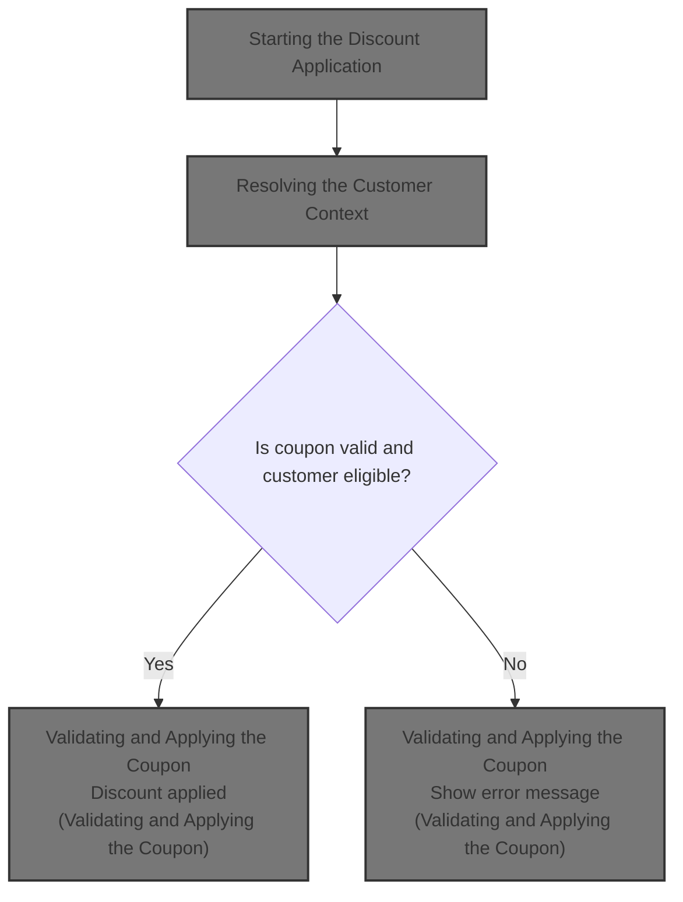

This document describes how users can apply a discount coupon to their shopping cart during checkout. The system determines the user's context, validates the coupon, and updates the cart with the discount if eligible. The user receives feedback on the outcome.



# Starting the Discount Application

This section ensures that before any discount logic is executed, the coupon code is properly formatted and the correct customer context is established. This is critical because discounts and cart contents are customer-specific, and any operations must be performed with the right user and sanitized input.

| Category        | Rule Name                      | Description                                                                                                                                                                             |
| --------------- | ------------------------------ | --------------------------------------------------------------------------------------------------------------------------------------------------------------------------------------- |
| Data validation | Coupon code sanitization       | The coupon code must be trimmed of any leading or trailing whitespace before it is used for discount validation or application.                                                         |
| Business logic  | Customer context establishment | The current customer must be identified and set as the context for all discount and cart operations, regardless of their authentication status (authenticated, guest, or impersonated). |

<SwmSnippet path="/src/Presentation/Nop.Web/Controllers/ShoppingCartController.cs" line="1342">

---

In <SwmToken path="src/Presentation/Nop.Web/Controllers/ShoppingCartController.cs" pos="1342:12:12" line-data="    public virtual async Task&lt;IActionResult&gt; ApplyDiscountCoupon(string discountcouponcode, IFormCollection form)">`ApplyDiscountCoupon`</SwmToken>, we start by trimming the coupon code and immediately fetching the current customer. This sets up the context for all subsequent cart and discount operations, since everything about discounts and cart contents depends on who the customer is. We need to call <SwmToken path="src/Presentation/Nop.Web.Framework/WebWorkContext.cs" pos="27:6:6" line-data="public partial class WebWorkContext : IWorkContext">`WebWorkContext`</SwmToken> next to resolve the customer (authenticated, guest, impersonated, etc.) before we can do anything meaningful with the cart or discounts.

```c#
    public virtual async Task<IActionResult> ApplyDiscountCoupon(string discountcouponcode, IFormCollection form)
    {
        //trim
        if (discountcouponcode != null)
            discountcouponcode = discountcouponcode.Trim();

        //cart
        var customer = await _workContext.GetCurrentCustomerAsync();
```

---

</SwmSnippet>

## Resolving the Customer Context

This section ensures that every request or operation in the application has access to a valid customer context, which is essential for personalization, security, and business logic throughout the platform.

<SwmSnippet path="/src/Presentation/Nop.Web.Framework/WebWorkContext.cs" line="196">

---

<SwmToken path="src/Presentation/Nop.Web.Framework/WebWorkContext.cs" pos="196:12:12" line-data="    public virtual async Task&lt;Customer&gt; GetCurrentCustomerAsync()">`GetCurrentCustomerAsync`</SwmToken> either returns a cached customer or triggers customer resolution if needed, so we always have a valid customer for the flow.

```c#
    public virtual async Task<Customer> GetCurrentCustomerAsync()
    {
        //whether there is a cached value
        if (_cachedCustomer != null)
            return _cachedCustomer;

        await SetCurrentCustomerAsync();

        return _cachedCustomer;
    }
```

---

</SwmSnippet>

## Identifying the User Type

```mermaid
%%{init: {"flowchart": {"defaultRenderer": "elk"}} }%%
flowchart TD
    node1["Start: Set current customer"] --> node2{"Is customer provided?"}
    click node1 openCode "src/Presentation/Nop.Web.Framework/WebWorkContext.cs:212:213"
    node2 -->|"Yes"| node3{"Is customer valid (active, not deleted, no re-login)?"}
    click node2 openCode "src/Presentation/Nop.Web.Framework/WebWorkContext.cs:214:215"
    node2 -->|"No"| node4{"Is request from background task?"}
    click node4 openCode "src/Presentation/Nop.Web.Framework/WebWorkContext.cs:217:223"
    node4 -->|"Yes"| node5["Set background task customer"]
    click node5 openCode "src/Presentation/Nop.Web.Framework/WebWorkContext.cs:222:223"
    node4 -->|"No"| node6{"Is request from search engine?"}
    click node6 openCode "src/Presentation/Nop.Web.Framework/WebWorkContext.cs:228:230"
    node6 -->|"Yes"| node7["Set search engine customer"]
    click node7 openCode "src/Presentation/Nop.Web.Framework/WebWorkContext.cs:229:230"
    node6 -->|"No"| node8["Set authenticated customer"]
    click node8 openCode "src/Presentation/Nop.Web.Framework/WebWorkContext.cs:235:236"
    node3 -->|"Yes"| node9{"Is impersonation required?"}
    click node9 openCode "src/Presentation/Nop.Web.Framework/WebWorkContext.cs:241:253"
    node9 -->|"Yes"| node10["Set impersonated customer"]
    click node10 openCode "src/Presentation/Nop.Web.Framework/WebWorkContext.cs:245:253"
    node9 -->|"No"| node11["Proceed with customer"]
    click node11 openCode "src/Presentation/Nop.Web.Framework/WebWorkContext.cs:238:255"
    node3 -->|"No"| node12{"Is customer registered?"}
    click node12 openCode "src/Presentation/Nop.Web.Framework/WebWorkContext.cs:258:267"
    node12 -->|"No"| node13{"Is customer found by cookie?"}
    click node13 openCode "src/Presentation/Nop.Web.Framework/WebWorkContext.cs:260:267"
    node13 -->|"Yes"| node14["Set customer from cookie"]
    click node14 openCode "src/Presentation/Nop.Web.Framework/WebWorkContext.cs:264:267"
    node13 -->|"No"| node15["Create guest customer"]
    click node15 openCode "src/Presentation/Nop.Web.Framework/WebWorkContext.cs:273:274"
    node11 --> node16["Set customer cookie and cache"]
    click node16 openCode "src/Presentation/Nop.Web.Framework/WebWorkContext.cs:280:284"
    node10 --> node16
    node14 --> node16
    node15 --> node16
    node5 --> node16
    node7 --> node16
    node8 --> node16

classDef HeadingStyle fill:#777777,stroke:#333,stroke-width:2px;

%% Swimm:
%% %%{init: {"flowchart": {"defaultRenderer": "elk"}} }%%
%% flowchart TD
%%     node1["Start: Set current customer"] --> node2{"Is customer provided?"}
%%     click node1 openCode "<SwmPath>[src/…/Nop.Web.Framework/WebWorkContext.cs](src/Presentation/Nop.Web.Framework/WebWorkContext.cs)</SwmPath>:212:213"
%%     node2 -->|"Yes"| node3{"Is customer valid (active, not deleted, no <SwmToken path="src/Libraries/Nop.Services/Authentication/CookieAuthenticationService.cs" pos="133:10:12" line-data="        //require a customer to re-login after password changing">`re-login`</SwmToken>)?"}
%%     click node2 openCode "<SwmPath>[src/…/Nop.Web.Framework/WebWorkContext.cs](src/Presentation/Nop.Web.Framework/WebWorkContext.cs)</SwmPath>:214:215"
%%     node2 -->|"No"| node4{"Is request from background task?"}
%%     click node4 openCode "<SwmPath>[src/…/Nop.Web.Framework/WebWorkContext.cs](src/Presentation/Nop.Web.Framework/WebWorkContext.cs)</SwmPath>:217:223"
%%     node4 -->|"Yes"| node5["Set background task customer"]
%%     click node5 openCode "<SwmPath>[src/…/Nop.Web.Framework/WebWorkContext.cs](src/Presentation/Nop.Web.Framework/WebWorkContext.cs)</SwmPath>:222:223"
%%     node4 -->|"No"| node6{"Is request from search engine?"}
%%     click node6 openCode "<SwmPath>[src/…/Nop.Web.Framework/WebWorkContext.cs](src/Presentation/Nop.Web.Framework/WebWorkContext.cs)</SwmPath>:228:230"
%%     node6 -->|"Yes"| node7["Set search engine customer"]
%%     click node7 openCode "<SwmPath>[src/…/Nop.Web.Framework/WebWorkContext.cs](src/Presentation/Nop.Web.Framework/WebWorkContext.cs)</SwmPath>:229:230"
%%     node6 -->|"No"| node8["Set authenticated customer"]
%%     click node8 openCode "<SwmPath>[src/…/Nop.Web.Framework/WebWorkContext.cs](src/Presentation/Nop.Web.Framework/WebWorkContext.cs)</SwmPath>:235:236"
%%     node3 -->|"Yes"| node9{"Is impersonation required?"}
%%     click node9 openCode "<SwmPath>[src/…/Nop.Web.Framework/WebWorkContext.cs](src/Presentation/Nop.Web.Framework/WebWorkContext.cs)</SwmPath>:241:253"
%%     node9 -->|"Yes"| node10["Set impersonated customer"]
%%     click node10 openCode "<SwmPath>[src/…/Nop.Web.Framework/WebWorkContext.cs](src/Presentation/Nop.Web.Framework/WebWorkContext.cs)</SwmPath>:245:253"
%%     node9 -->|"No"| node11["Proceed with customer"]
%%     click node11 openCode "<SwmPath>[src/…/Nop.Web.Framework/WebWorkContext.cs](src/Presentation/Nop.Web.Framework/WebWorkContext.cs)</SwmPath>:238:255"
%%     node3 -->|"No"| node12{"Is customer registered?"}
%%     click node12 openCode "<SwmPath>[src/…/Nop.Web.Framework/WebWorkContext.cs](src/Presentation/Nop.Web.Framework/WebWorkContext.cs)</SwmPath>:258:267"
%%     node12 -->|"No"| node13{"Is customer found by cookie?"}
%%     click node13 openCode "<SwmPath>[src/…/Nop.Web.Framework/WebWorkContext.cs](src/Presentation/Nop.Web.Framework/WebWorkContext.cs)</SwmPath>:260:267"
%%     node13 -->|"Yes"| node14["Set customer from cookie"]
%%     click node14 openCode "<SwmPath>[src/…/Nop.Web.Framework/WebWorkContext.cs](src/Presentation/Nop.Web.Framework/WebWorkContext.cs)</SwmPath>:264:267"
%%     node13 -->|"No"| node15["Create guest customer"]
%%     click node15 openCode "<SwmPath>[src/…/Nop.Web.Framework/WebWorkContext.cs](src/Presentation/Nop.Web.Framework/WebWorkContext.cs)</SwmPath>:273:274"
%%     node11 --> node16["Set customer cookie and cache"]
%%     click node16 openCode "<SwmPath>[src/…/Nop.Web.Framework/WebWorkContext.cs](src/Presentation/Nop.Web.Framework/WebWorkContext.cs)</SwmPath>:280:284"
%%     node10 --> node16
%%     node14 --> node16
%%     node15 --> node16
%%     node5 --> node16
%%     node7 --> node16
%%     node8 --> node16
%% 
%% classDef HeadingStyle fill:#777777,stroke:#333,stroke-width:2px;
```



This section ensures that every request to the nopCommerce platform is associated with the correct user type. Correct identification of the user type is essential for applying business logic such as discounts, cart actions, and permissions.

| Category        | Rule Name                            | Description                                                                                                                                                                                                                                                                                                                                                                                                      |
| --------------- | ------------------------------------ | ---------------------------------------------------------------------------------------------------------------------------------------------------------------------------------------------------------------------------------------------------------------------------------------------------------------------------------------------------------------------------------------------------------------- |
| Data validation | Customer Validity Enforcement        | A customer must not be considered valid if they are deleted, inactive, or require <SwmToken path="src/Libraries/Nop.Services/Authentication/CookieAuthenticationService.cs" pos="133:10:12" line-data="        //require a customer to re-login after password changing">`re-login`</SwmToken>. Such customers cannot be set as the current user.                                                                |
| Data validation | Password Change Re-Login Requirement | If the system is configured to require <SwmToken path="src/Libraries/Nop.Services/Authentication/CookieAuthenticationService.cs" pos="133:10:12" line-data="        //require a customer to re-login after password changing">`re-login`</SwmToken> after a password change, and the customer's password was changed after their last authentication, the customer must not be considered valid for the session. |
| Business logic  | Background Task User Assignment      | If the request is made by a background task, the user must be set as the <SwmToken path="src/Presentation/Nop.Web.Framework/WebWorkContext.cs" pos="221:10:12" line-data="                //in this case return built-in customer record for background task">`built-in`</SwmToken> background task customer.                                                                                                    |
| Business logic  | Search Engine User Assignment        | If the request is identified as coming from a search engine, the user must be set as the <SwmToken path="src/Presentation/Nop.Web.Framework/WebWorkContext.cs" pos="221:10:12" line-data="                //in this case return built-in customer record for background task">`built-in`</SwmToken> search engine customer.                                                                                      |
| Business logic  | Authenticated Customer Recognition   | If a valid, active, and non-deleted customer is authenticated, that customer must be set as the current user for the request.                                                                                                                                                                                                                                                                                    |
| Business logic  | Impersonation Handling               | If the authenticated customer is set to impersonate another customer, and the impersonated customer is valid, the impersonated customer must be used as the current user.                                                                                                                                                                                                                                        |
| Business logic  | Guest Cookie Recognition             | If no valid customer is found, but a customer cookie exists and refers to a non-registered customer, that customer must be set as the current user.                                                                                                                                                                                                                                                              |
| Business logic  | Guest Customer Creation              | If no valid customer is found by any other means, a new guest customer must be created and set as the current user.                                                                                                                                                                                                                                                                                              |
| Business logic  | Customer Context Persistence         | Once a valid customer is identified, their context must be cached and a customer cookie must be set for the session.                                                                                                                                                                                                                                                                                             |

<SwmSnippet path="/src/Presentation/Nop.Web.Framework/WebWorkContext.cs" line="212">

---

In <SwmToken path="src/Presentation/Nop.Web.Framework/WebWorkContext.cs" pos="212:9:9" line-data="    public virtual async Task SetCurrentCustomerAsync(Customer customer = null)">`SetCurrentCustomerAsync`</SwmToken>, we run through a bunch of checks to figure out what kind of user is making the request—background task, search engine, authenticated, impersonated, or guest. If we get to the authenticated user check, we call the authentication service next to see if there's a <SwmToken path="src/Presentation/Nop.Web.Framework/WebWorkContext.cs" pos="293:12:14" line-data="    /// Gets the current vendor (logged-in manager)">`logged-in`</SwmToken> customer. This step is needed because only an authenticated user can have discounts or cart actions tied to their account.

```c#
    public virtual async Task SetCurrentCustomerAsync(Customer customer = null)
    {
        if (customer == null)
        {
            //check whether request is made by a background (schedule) task
            if (_httpContextAccessor.HttpContext?.Request
                    ?.Path.Equals(new PathString($"/{NopTaskDefaults.ScheduleTaskPath}"), StringComparison.InvariantCultureIgnoreCase)
                ?? true)
            {
                //in this case return built-in customer record for background task
                customer = await _customerService.GetOrCreateBackgroundTaskUserAsync();
            }

            if (customer == null || customer.Deleted || !customer.Active || customer.RequireReLogin)
            {
                //check whether request is made by a search engine, in this case return built-in customer record for search engines
                if (_userAgentHelper.IsSearchEngine())
                    customer = await _customerService.GetOrCreateSearchEngineUserAsync();
            }

            if (customer == null || customer.Deleted || !customer.Active || customer.RequireReLogin)
            {
                //try to get registered user
                customer = await _authenticationService.GetAuthenticatedCustomerAsync();
            }

```

---

</SwmSnippet>

<SwmSnippet path="/src/Libraries/Nop.Services/Authentication/CookieAuthenticationService.cs" line="96">

---

<SwmToken path="src/Libraries/Nop.Services/Authentication/CookieAuthenticationService.cs" pos="96:12:12" line-data="    public virtual async Task&lt;Customer&gt; GetAuthenticatedCustomerAsync()">`GetAuthenticatedCustomerAsync`</SwmToken> authenticates the HTTP context, extracts either username or email from claims (based on settings), validates the customer's status, and enforces <SwmToken path="src/Libraries/Nop.Services/Authentication/CookieAuthenticationService.cs" pos="133:10:12" line-data="        //require a customer to re-login after password changing">`re-login`</SwmToken> if the password was changed after login. If everything checks out, it caches and returns the customer. This is how we figure out if there's a valid <SwmToken path="src/Presentation/Nop.Web.Framework/WebWorkContext.cs" pos="293:12:14" line-data="    /// Gets the current vendor (logged-in manager)">`logged-in`</SwmToken> user for the request.

```c#
    public virtual async Task<Customer> GetAuthenticatedCustomerAsync()
    {
        //whether there is a cached customer
        if (_cachedCustomer != null)
            return _cachedCustomer;

        //try to get authenticated user identity
        var authenticateResult = await _httpContextAccessor.HttpContext.AuthenticateAsync(NopAuthenticationDefaults.AuthenticationScheme);
        if (!authenticateResult.Succeeded)
            return null;

        Customer customer = null;
        if (_customerSettings.UsernamesEnabled)
        {
            //try to get customer by username
            var usernameClaim = authenticateResult.Principal.FindFirst(claim => claim.Type == ClaimTypes.Name
                && claim.Issuer.Equals(NopAuthenticationDefaults.ClaimsIssuer, StringComparison.InvariantCultureIgnoreCase));
            if (usernameClaim != null)
                customer = await _customerService.GetCustomerByUsernameAsync(usernameClaim.Value);
        }
        else
        {
            //try to get customer by email
            var emailClaim = authenticateResult.Principal.FindFirst(claim => claim.Type == ClaimTypes.Email
                                                                             && claim.Issuer.Equals(NopAuthenticationDefaults.ClaimsIssuer, StringComparison.InvariantCultureIgnoreCase));
            if (emailClaim != null)
                customer = await _customerService.GetCustomerByEmailAsync(emailClaim.Value);
        }

        //whether the found customer is available
        if (customer == null || !customer.Active || customer.RequireReLogin || customer.Deleted || !await _customerService.IsRegisteredAsync(customer))
            return null;
            
        static DateTime trimMilliseconds(DateTime dt) => new(dt.Year, dt.Month, dt.Day, dt.Hour, dt.Minute, dt.Second, 0, dt.Kind);

        //get the latest password
        var customerPassword = await _customerService.GetCurrentPasswordAsync(customer.Id);
        //require a customer to re-login after password changing
        var isPasswordChange = trimMilliseconds(customerPassword.CreatedOnUtc).CompareTo(trimMilliseconds(authenticateResult.Properties.IssuedUtc?.DateTime ?? DateTime.UtcNow)) > 0;
        if (_customerSettings.RequiredReLoginAfterPasswordChange && isPasswordChange)
            return null;

        //cache authenticated customer
        _cachedCustomer = customer;

        return _cachedCustomer;
    }
```

---

</SwmSnippet>

<SwmSnippet path="/src/Presentation/Nop.Web.Framework/WebWorkContext.cs" line="238">

---

Back in <SwmToken path="src/Presentation/Nop.Web.Framework/WebWorkContext.cs" pos="202:3:3" line-data="        await SetCurrentCustomerAsync();">`SetCurrentCustomerAsync`</SwmToken>, after authentication, we handle impersonation and guest fallback, then set the cookie and cache the customer.

```c#
            if (customer != null && !customer.Deleted && customer.Active && !customer.RequireReLogin)
            {
                //get impersonate user if required
                var impersonatedCustomerId = await _genericAttributeService
                    .GetAttributeAsync<int?>(customer, NopCustomerDefaults.ImpersonatedCustomerIdAttribute);
                if (impersonatedCustomerId.HasValue && impersonatedCustomerId.Value > 0)
                {
                    var impersonatedCustomer = await _customerService.GetCustomerByIdAsync(impersonatedCustomerId.Value);
                    if (impersonatedCustomer != null && !impersonatedCustomer.Deleted &&
                        impersonatedCustomer.Active &&
                        !impersonatedCustomer.RequireReLogin)
                    {
                        //set impersonated customer
                        _originalCustomerIfImpersonated = customer;
                        customer = impersonatedCustomer;
                    }
                }
            }

            if (customer == null || customer.Deleted || !customer.Active || customer.RequireReLogin)
            {
                //get guest customer
                var customerCookie = GetCustomerCookie();
                if (Guid.TryParse(customerCookie, out var customerGuid))
                {
                    //get customer from cookie (should not be registered)
                    var customerByCookie = await _customerService.GetCustomerByGuidAsync(customerGuid);
                    if (customerByCookie != null && !await _customerService.IsRegisteredAsync(customerByCookie))
                        customer = customerByCookie;
                }
            }

            if (customer == null || customer.Deleted || !customer.Active || customer.RequireReLogin)
            {
                //create guest if not exists
                customer = await _customerService.InsertGuestCustomerAsync();
            }
        }

        if (!customer.Deleted && customer.Active && !customer.RequireReLogin)
        {
            //set customer cookie
            SetCustomerCookie(customer.CustomerGuid);

            //cache the found customer
            _cachedCustomer = customer;
        }
    }
```

---

</SwmSnippet>

## Validating and Applying the Coupon

```mermaid
%%{init: {"flowchart": {"defaultRenderer": "elk"}} }%%
flowchart TD
    node1["User submits discount coupon code"] --> node2{"Is coupon code empty?"}
    click node1 openCode "src/Presentation/Nop.Web/Controllers/ShoppingCartController.cs:1357:1357"
    node2 -->|"Yes"| node3["Show message: Coupon code is empty"]
    click node2 openCode "src/Presentation/Nop.Web/Controllers/ShoppingCartController.cs:1357:1357"
    click node3 openCode "src/Presentation/Nop.Web/Controllers/ShoppingCartController.cs:1397:1397"
    node2 -->|"No"| node4{"Are there discounts for coupon code?"}
    click node4 openCode "src/Presentation/Nop.Web/Controllers/ShoppingCartController.cs:1363:1363"
    node4 -->|"No"| node5["Show message: Coupon cannot be found"]
    click node5 openCode "src/Presentation/Nop.Web/Controllers/ShoppingCartController.cs:1393:1393"
    node4 -->|"Yes"| node6["Validate discounts"]
    click node6 openCode "src/Presentation/Nop.Web/Controllers/ShoppingCartController.cs:1366:1372"
    subgraph loop1["For each discount found"]
        node6 --> node7["Validate discount and collect errors"]
        click node7 openCode "src/Presentation/Nop.Web/Controllers/ShoppingCartController.cs:1368:1371"
    end
    node7 --> node8{"Is any discount valid?"}
    click node8 openCode "src/Presentation/Nop.Web/Controllers/ShoppingCartController.cs:1374:1374"
    node8 -->|"Yes"| node9["Apply discount and show success message"]
    click node9 openCode "src/Presentation/Nop.Web/Controllers/ShoppingCartController.cs:1377:1379"
    node8 -->|"No"| node10{"Are there user errors?"}
    click node10 openCode "src/Presentation/Nop.Web/Controllers/ShoppingCartController.cs:1383:1383"
    node10 -->|"Yes"| node11["Show user error messages"]
    click node11 openCode "src/Presentation/Nop.Web/Controllers/ShoppingCartController.cs:1385:1385"
    node10 -->|"No"| node12["Show general error message"]
    click node12 openCode "src/Presentation/Nop.Web/Controllers/ShoppingCartController.cs:1388:1388"
    node9 --> node13["Prepare shopping cart model"]
    node11 --> node13
    node12 --> node13
    node5 --> node13
    node3 --> node13
    click node13 openCode "src/Presentation/Nop.Web/Controllers/ShoppingCartController.cs:1399:1399"
    node13 --> node14["Show shopping cart view"]
    click node14 openCode "src/Presentation/Nop.Web/Controllers/ShoppingCartController.cs:1401:1401"
classDef HeadingStyle fill:#777777,stroke:#333,stroke-width:2px;

%% Swimm:
%% %%{init: {"flowchart": {"defaultRenderer": "elk"}} }%%
%% flowchart TD
%%     node1["User submits discount coupon code"] --> node2{"Is coupon code empty?"}
%%     click node1 openCode "<SwmPath>[src/…/Controllers/ShoppingCartController.cs](src/Presentation/Nop.Web/Controllers/ShoppingCartController.cs)</SwmPath>:1357:1357"
%%     node2 -->|"Yes"| node3["Show message: Coupon code is empty"]
%%     click node2 openCode "<SwmPath>[src/…/Controllers/ShoppingCartController.cs](src/Presentation/Nop.Web/Controllers/ShoppingCartController.cs)</SwmPath>:1357:1357"
%%     click node3 openCode "<SwmPath>[src/…/Controllers/ShoppingCartController.cs](src/Presentation/Nop.Web/Controllers/ShoppingCartController.cs)</SwmPath>:1397:1397"
%%     node2 -->|"No"| node4{"Are there discounts for coupon code?"}
%%     click node4 openCode "<SwmPath>[src/…/Controllers/ShoppingCartController.cs](src/Presentation/Nop.Web/Controllers/ShoppingCartController.cs)</SwmPath>:1363:1363"
%%     node4 -->|"No"| node5["Show message: Coupon cannot be found"]
%%     click node5 openCode "<SwmPath>[src/…/Controllers/ShoppingCartController.cs](src/Presentation/Nop.Web/Controllers/ShoppingCartController.cs)</SwmPath>:1393:1393"
%%     node4 -->|"Yes"| node6["Validate discounts"]
%%     click node6 openCode "<SwmPath>[src/…/Controllers/ShoppingCartController.cs](src/Presentation/Nop.Web/Controllers/ShoppingCartController.cs)</SwmPath>:1366:1372"
%%     subgraph loop1["For each discount found"]
%%         node6 --> node7["Validate discount and collect errors"]
%%         click node7 openCode "<SwmPath>[src/…/Controllers/ShoppingCartController.cs](src/Presentation/Nop.Web/Controllers/ShoppingCartController.cs)</SwmPath>:1368:1371"
%%     end
%%     node7 --> node8{"Is any discount valid?"}
%%     click node8 openCode "<SwmPath>[src/…/Controllers/ShoppingCartController.cs](src/Presentation/Nop.Web/Controllers/ShoppingCartController.cs)</SwmPath>:1374:1374"
%%     node8 -->|"Yes"| node9["Apply discount and show success message"]
%%     click node9 openCode "<SwmPath>[src/…/Controllers/ShoppingCartController.cs](src/Presentation/Nop.Web/Controllers/ShoppingCartController.cs)</SwmPath>:1377:1379"
%%     node8 -->|"No"| node10{"Are there user errors?"}
%%     click node10 openCode "<SwmPath>[src/…/Controllers/ShoppingCartController.cs](src/Presentation/Nop.Web/Controllers/ShoppingCartController.cs)</SwmPath>:1383:1383"
%%     node10 -->|"Yes"| node11["Show user error messages"]
%%     click node11 openCode "<SwmPath>[src/…/Controllers/ShoppingCartController.cs](src/Presentation/Nop.Web/Controllers/ShoppingCartController.cs)</SwmPath>:1385:1385"
%%     node10 -->|"No"| node12["Show general error message"]
%%     click node12 openCode "<SwmPath>[src/…/Controllers/ShoppingCartController.cs](src/Presentation/Nop.Web/Controllers/ShoppingCartController.cs)</SwmPath>:1388:1388"
%%     node9 --> node13["Prepare shopping cart model"]
%%     node11 --> node13
%%     node12 --> node13
%%     node5 --> node13
%%     node3 --> node13
%%     click node13 openCode "<SwmPath>[src/…/Controllers/ShoppingCartController.cs](src/Presentation/Nop.Web/Controllers/ShoppingCartController.cs)</SwmPath>:1399:1399"
%%     node13 --> node14["Show shopping cart view"]
%%     click node14 openCode "<SwmPath>[src/…/Controllers/ShoppingCartController.cs](src/Presentation/Nop.Web/Controllers/ShoppingCartController.cs)</SwmPath>:1401:1401"
%% classDef HeadingStyle fill:#777777,stroke:#333,stroke-width:2px;
```



<SwmSnippet path="/src/Presentation/Nop.Web/Controllers/ShoppingCartController.cs" line="1350">

---

Back in <SwmToken path="src/Presentation/Nop.Web/Controllers/ShoppingCartController.cs" pos="1342:12:12" line-data="    public virtual async Task&lt;IActionResult&gt; ApplyDiscountCoupon(string discountcouponcode, IFormCollection form)">`ApplyDiscountCoupon`</SwmToken>, now that we've got the customer context from <SwmToken path="src/Presentation/Nop.Web.Framework/WebWorkContext.cs" pos="27:6:6" line-data="public partial class WebWorkContext : IWorkContext">`WebWorkContext`</SwmToken>, we fetch the store and cart, parse checkout attributes, and run the discount validation logic. The customer object we resolved earlier is used for all discount checks and application, so eligibility and error handling are tied to that context. The result is then prepared for the UI.

```c#
        var store = await _storeContext.GetCurrentStoreAsync();
        var cart = await _shoppingCartService.GetShoppingCartAsync(customer, ShoppingCartType.ShoppingCart, store.Id);

        //parse and save checkout attributes
        await ParseAndSaveCheckoutAttributesAsync(cart, form);

        var model = new ShoppingCartModel();
        if (!string.IsNullOrWhiteSpace(discountcouponcode))
        {
            //we find even hidden records here. this way we can display a user-friendly message if it's expired
            var discounts = (await _discountService.GetAllDiscountsAsync(couponCode: discountcouponcode, showHidden: true))
                .Where(d => d.RequiresCouponCode)
                .ToList();
            if (discounts.Any())
            {
                var userErrors = new List<string>();
                var anyValidDiscount = await discounts.AnyAwaitAsync(async discount =>
                {
                    var validationResult = await _discountService.ValidateDiscountAsync(discount, customer, [discountcouponcode]);
                    userErrors.AddRange(validationResult.Errors);

                    return validationResult.IsValid;
                });

                if (anyValidDiscount)
                {
                    //valid
                    await _customerService.ApplyDiscountCouponCodeAsync(customer, discountcouponcode);
                    model.DiscountBox.Messages.Add(await _localizationService.GetResourceAsync("ShoppingCart.DiscountCouponCode.Applied"));
                    model.DiscountBox.IsApplied = true;
                }
                else
                {
                    if (userErrors.Any())
                        //some user errors
                        model.DiscountBox.Messages = userErrors;
                    else
                        //general error text
                        model.DiscountBox.Messages.Add(await _localizationService.GetResourceAsync("ShoppingCart.DiscountCouponCode.WrongDiscount"));
                }
            }
            else
                //discount cannot be found
                model.DiscountBox.Messages.Add(await _localizationService.GetResourceAsync("ShoppingCart.DiscountCouponCode.CannotBeFound"));
        }
        else
            //empty coupon code
            model.DiscountBox.Messages.Add(await _localizationService.GetResourceAsync("ShoppingCart.DiscountCouponCode.Empty"));

        model = await _shoppingCartModelFactory.PrepareShoppingCartModelAsync(model, cart);

        return View(model);
    }
```

---

</SwmSnippet>

&nbsp;

*This is an auto-generated document by Swimm 🌊 and has not yet been verified by a human*

<SwmMeta version="3.0.0" repo-id="Z2l0aHViJTNBJTNBY3NoYXJwLW5vcENvbW1lcmNlJTNBJTNBcmljYXJkb2xvcGV6Zw==" repo-name="csharp-nopCommerce"><sup>Powered by [Swimm](https://app.swimm.io/)</sup></SwmMeta>
