This document describes how users can apply a gift card to their shopping cart. The system sanitizes the code, identifies the current customer, validates the code, and updates the cart with feedback for the user.

# Starting Gift Card Application

This section initiates the process of applying a gift card to a customer's shopping cart. It ensures the input is sanitized and determines which customer is making the request, setting the stage for subsequent business logic.

| Category        | Rule Name                       | Description                                                                                                           |
| --------------- | ------------------------------- | --------------------------------------------------------------------------------------------------------------------- |
| Data validation | Gift Card Code Sanitization     | If a gift card coupon code is provided, any leading or trailing whitespace must be removed before further processing. |
| Business logic  | Customer Context Identification | The current customer context must be identified before any gift card application logic can proceed.                   |

<SwmSnippet path="/src/Presentation/Nop.Web/Controllers/ShoppingCartController.cs" line="1406">

---

In <SwmToken path="src/Presentation/Nop.Web/Controllers/ShoppingCartController.cs" pos="1406:12:12" line-data="    public virtual async Task&lt;IActionResult&gt; ApplyGiftCard(string giftcardcouponcode, IFormCollection form)">`ApplyGiftCard`</SwmToken>, we kick off by cleaning up the input and immediately grabbing the current customer context. This is needed because everything that follows—cart lookup, validation, and applying the code—depends on knowing which customer is active. That's why we call into <SwmToken path="src/Presentation/Nop.Web.Framework/WebWorkContext.cs" pos="27:6:6" line-data="public partial class WebWorkContext : IWorkContext">`WebWorkContext`</SwmToken> next: it figures out who the customer is for this request.

```c#
    public virtual async Task<IActionResult> ApplyGiftCard(string giftcardcouponcode, IFormCollection form)
    {
        //trim
        if (giftcardcouponcode != null)
            giftcardcouponcode = giftcardcouponcode.Trim();

        //cart
        var customer = await _workContext.GetCurrentCustomerAsync();
```

---

</SwmSnippet>

## Resolving Customer Context

This section is responsible for identifying and resolving the correct customer context for each incoming request. It ensures that every request is associated with the appropriate customer, whether that is a background task user, a bot, a registered user, an impersonated user, a guest user, or a newly created guest. The resolved customer is cached for the duration of the request to optimize performance and consistency.

| Category        | Rule Name                       | Description                                                                                                                                                                                                                                                                                                                             |
| --------------- | ------------------------------- | --------------------------------------------------------------------------------------------------------------------------------------------------------------------------------------------------------------------------------------------------------------------------------------------------------------------------------------- |
| Data validation | Authenticated User Assignment   | If a registered user is authenticated, the customer context must be set to that user unless they are deleted, inactive, or require re-login.                                                                                                                                                                                            |
| Business logic  | Background Task User Assignment | If the request is made by a background (scheduled) task, the customer context must be set to the <SwmToken path="src/Presentation/Nop.Web.Framework/WebWorkContext.cs" pos="221:10:12" line-data="                //in this case return built-in customer record for background task">`built-in`</SwmToken> background task user.       |
| Business logic  | Search Engine Bot Assignment    | If the request is identified as coming from a search engine bot, the customer context must be set to the <SwmToken path="src/Presentation/Nop.Web.Framework/WebWorkContext.cs" pos="221:10:12" line-data="                //in this case return built-in customer record for background task">`built-in`</SwmToken> search engine user. |
| Business logic  | Impersonation Handling          | If the authenticated user is impersonating another user, the customer context must be switched to the impersonated user, provided the impersonated user is valid.                                                                                                                                                                       |
| Business logic  | Guest User Cookie Assignment    | If no valid registered or impersonated user is found, and a customer cookie is present, the customer context must be set to the guest user identified by the cookie, provided they are not registered.                                                                                                                                  |
| Business logic  | New Guest Creation              | If no valid customer context can be resolved from any source, a new guest customer must be created and assigned as the customer context.                                                                                                                                                                                                |

<SwmSnippet path="/src/Presentation/Nop.Web.Framework/WebWorkContext.cs" line="196">

---

We resolve and cache the customer so all later steps use the same user info without extra lookups.

```c#
    public virtual async Task<Customer> GetCurrentCustomerAsync()
    {
        //whether there is a cached value
        if (_cachedCustomer != null)
            return _cachedCustomer;

        await SetCurrentCustomerAsync();

        return _cachedCustomer;
    }
```

---

</SwmSnippet>

<SwmSnippet path="/src/Presentation/Nop.Web.Framework/WebWorkContext.cs" line="212">

---

<SwmToken path="src/Presentation/Nop.Web.Framework/WebWorkContext.cs" pos="212:9:9" line-data="    public virtual async Task SetCurrentCustomerAsync(Customer customer = null)">`SetCurrentCustomerAsync`</SwmToken> runs through a bunch of checks to figure out who the customer is: background task, bot, <SwmToken path="src/Presentation/Nop.Web.Framework/WebWorkContext.cs" pos="293:12:14" line-data="    /// Gets the current vendor (logged-in manager)">`logged-in`</SwmToken> user, impersonation, guest from cookie, or just creates a new guest if nothing matches. This way, every request gets the right customer context, no matter where it comes from.

```c#
    public virtual async Task SetCurrentCustomerAsync(Customer customer = null)
    {
        if (customer == null)
        {
            //check whether request is made by a background (schedule) task
            if (_httpContextAccessor.HttpContext?.Request
                    ?.Path.Equals(new PathString($"/{NopTaskDefaults.ScheduleTaskPath}"), StringComparison.InvariantCultureIgnoreCase)
                ?? true)
            {
                //in this case return built-in customer record for background task
                customer = await _customerService.GetOrCreateBackgroundTaskUserAsync();
            }

            if (customer == null || customer.Deleted || !customer.Active || customer.RequireReLogin)
            {
                //check whether request is made by a search engine, in this case return built-in customer record for search engines
                if (_userAgentHelper.IsSearchEngine())
                    customer = await _customerService.GetOrCreateSearchEngineUserAsync();
            }

            if (customer == null || customer.Deleted || !customer.Active || customer.RequireReLogin)
            {
                //try to get registered user
                customer = await _authenticationService.GetAuthenticatedCustomerAsync();
            }

            if (customer != null && !customer.Deleted && customer.Active && !customer.RequireReLogin)
            {
                //get impersonate user if required
                var impersonatedCustomerId = await _genericAttributeService
                    .GetAttributeAsync<int?>(customer, NopCustomerDefaults.ImpersonatedCustomerIdAttribute);
                if (impersonatedCustomerId.HasValue && impersonatedCustomerId.Value > 0)
                {
                    var impersonatedCustomer = await _customerService.GetCustomerByIdAsync(impersonatedCustomerId.Value);
                    if (impersonatedCustomer != null && !impersonatedCustomer.Deleted &&
                        impersonatedCustomer.Active &&
                        !impersonatedCustomer.RequireReLogin)
                    {
                        //set impersonated customer
                        _originalCustomerIfImpersonated = customer;
                        customer = impersonatedCustomer;
                    }
                }
            }

            if (customer == null || customer.Deleted || !customer.Active || customer.RequireReLogin)
            {
                //get guest customer
                var customerCookie = GetCustomerCookie();
                if (Guid.TryParse(customerCookie, out var customerGuid))
                {
                    //get customer from cookie (should not be registered)
                    var customerByCookie = await _customerService.GetCustomerByGuidAsync(customerGuid);
                    if (customerByCookie != null && !await _customerService.IsRegisteredAsync(customerByCookie))
                        customer = customerByCookie;
                }
            }

            if (customer == null || customer.Deleted || !customer.Active || customer.RequireReLogin)
            {
                //create guest if not exists
                customer = await _customerService.InsertGuestCustomerAsync();
            }
        }

        if (!customer.Deleted && customer.Active && !customer.RequireReLogin)
        {
            //set customer cookie
            SetCustomerCookie(customer.CustomerGuid);

            //cache the found customer
            _cachedCustomer = customer;
        }
    }
```

---

</SwmSnippet>

## Applying and Validating Gift Card

```mermaid
%%{init: {"flowchart": {"defaultRenderer": "elk"}} }%%
flowchart TD
    node1["User submits gift card code"]
    click node1 openCode "src/Presentation/Nop.Web/Controllers/ShoppingCartController.cs:1414:1416"
    node1 --> node2["Validate gift card code for cart"]
    click node2 openCode "src/Presentation/Nop.Web/Controllers/ShoppingCartController.cs:1422:1423"
    node2 --> node3{"Is code valid?"}
    click node3 openCode "src/Presentation/Nop.Web/Controllers/ShoppingCartController.cs:1424:1434"
    node3 -->|"Valid"| node4["Apply gift card, show success message, set IsApplied = true"]
    click node4 openCode "src/Presentation/Nop.Web/Controllers/ShoppingCartController.cs:1426:1429"
    node3 -->|"Invalid"| node5["Show error message, set IsApplied = false"]
    click node5 openCode "src/Presentation/Nop.Web/Controllers/ShoppingCartController.cs:1432:1434"
    node4 --> node6["Update and display cart"]
    node5 --> node6
    click node6 openCode "src/Presentation/Nop.Web/Controllers/ShoppingCartController.cs:1436:1437"

classDef HeadingStyle fill:#777777,stroke:#333,stroke-width:2px;

%% Swimm:
%% %%{init: {"flowchart": {"defaultRenderer": "elk"}} }%%
%% flowchart TD
%%     node1["User submits gift card code"]
%%     click node1 openCode "<SwmPath>[src/…/Controllers/ShoppingCartController.cs](src/Presentation/Nop.Web/Controllers/ShoppingCartController.cs)</SwmPath>:1414:1416"
%%     node1 --> node2["Validate gift card code for cart"]
%%     click node2 openCode "<SwmPath>[src/…/Controllers/ShoppingCartController.cs](src/Presentation/Nop.Web/Controllers/ShoppingCartController.cs)</SwmPath>:1422:1423"
%%     node2 --> node3{"Is code valid?"}
%%     click node3 openCode "<SwmPath>[src/…/Controllers/ShoppingCartController.cs](src/Presentation/Nop.Web/Controllers/ShoppingCartController.cs)</SwmPath>:1424:1434"
%%     node3 -->|"Valid"| node4["Apply gift card, show success message, set <SwmToken path="src/Presentation/Nop.Web/Controllers/ShoppingCartController.cs" pos="1428:5:5" line-data="            model.GiftCardBox.IsApplied = true;">`IsApplied`</SwmToken> = true"]
%%     click node4 openCode "<SwmPath>[src/…/Controllers/ShoppingCartController.cs](src/Presentation/Nop.Web/Controllers/ShoppingCartController.cs)</SwmPath>:1426:1429"
%%     node3 -->|"Invalid"| node5["Show error message, set <SwmToken path="src/Presentation/Nop.Web/Controllers/ShoppingCartController.cs" pos="1428:5:5" line-data="            model.GiftCardBox.IsApplied = true;">`IsApplied`</SwmToken> = false"]
%%     click node5 openCode "<SwmPath>[src/…/Controllers/ShoppingCartController.cs](src/Presentation/Nop.Web/Controllers/ShoppingCartController.cs)</SwmPath>:1432:1434"
%%     node4 --> node6["Update and display cart"]
%%     node5 --> node6
%%     click node6 openCode "<SwmPath>[src/…/Controllers/ShoppingCartController.cs](src/Presentation/Nop.Web/Controllers/ShoppingCartController.cs)</SwmPath>:1436:1437"
%% 
%% classDef HeadingStyle fill:#777777,stroke:#333,stroke-width:2px;
```



<SwmSnippet path="/src/Presentation/Nop.Web/Controllers/ShoppingCartController.cs" line="1414">

---

Back in <SwmToken path="src/Presentation/Nop.Web/Controllers/ShoppingCartController.cs" pos="1406:12:12" line-data="    public virtual async Task&lt;IActionResult&gt; ApplyGiftCard(string giftcardcouponcode, IFormCollection form)">`ApplyGiftCard`</SwmToken>, now that we've got the customer from <SwmToken path="src/Presentation/Nop.Web.Framework/WebWorkContext.cs" pos="27:6:6" line-data="public partial class WebWorkContext : IWorkContext">`WebWorkContext`</SwmToken>, we grab their cart, validate the gift card code, and update the cart model with the result. The customer context from earlier makes sure we're working with the right cart and session.

```c#
        var store = await _storeContext.GetCurrentStoreAsync();
        var cart = await _shoppingCartService.GetShoppingCartAsync(customer, ShoppingCartType.ShoppingCart, store.Id);

        //parse and save checkout attributes
        await ParseAndSaveCheckoutAttributesAsync(cart, form);

        var model = new ShoppingCartModel();

        var validationError = await GetGiftCardValidationErrorAsync(cart, giftcardcouponcode);

        if (string.IsNullOrEmpty(validationError))
        {
            await _customerService.ApplyGiftCardCouponCodeAsync(customer, giftcardcouponcode);
            model.GiftCardBox.Message = await _localizationService.GetResourceAsync("ShoppingCart.GiftCardCouponCode.Applied");
            model.GiftCardBox.IsApplied = true;
        }
        else
        {
            model.GiftCardBox.Message = validationError;
            model.GiftCardBox.IsApplied = false;
        }

        model = await _shoppingCartModelFactory.PrepareShoppingCartModelAsync(model, cart);
        return View(model);
    }
```

---

</SwmSnippet>

&nbsp;

*This is an auto-generated document by Swimm 🌊 and has not yet been verified by a human*

<SwmMeta version="3.0.0" repo-id="Z2l0aHViJTNBJTNBY3NoYXJwLW5vcENvbW1lcmNlJTNBJTNBcmljYXJkb2xvcGV6Zw==" repo-name="csharp-nopCommerce"><sup>Powered by [Swimm](https://app.swimm.io/)</sup></SwmMeta>
