This document describes how shipments are created from order items. Store administrators or vendors select eligible products and quantities, assign warehouses, and initiate shipment creation. The system validates eligibility, processes shipment data, saves the shipment, updates order notes, publishes events, and notifies the user.

# Processing Shipment Creation from Order Items

```mermaid
%%{init: {"flowchart": {"defaultRenderer": "elk"}} }%%
flowchart TD
    node1["Start Add Shipment"] --> node2{"Is order valid and vendor has access?"}
    click node1 openCode "src/Presentation/Nop.Web/Areas/Admin/Controllers/OrderController.cs:1869:1872"
    node2 -->|"No"| node3["Redirect to order list"]
    click node2 openCode "src/Presentation/Nop.Web/Areas/Admin/Controllers/OrderController.cs:1873:1879"
    node2 -->|"Yes"| node4["Process order items for shipment"]
    click node4 openCode "src/Presentation/Nop.Web/Areas/Admin/Controllers/OrderController.cs:1881:1886"

    subgraph loop1["For each order item"]
        node4 --> node5{"Can product be shipped and quantity > 0?"}
        click node5 openCode "src/Presentation/Nop.Web/Areas/Admin/Controllers/OrderController.cs:1901:1939"
        node5 -->|"No"| node4
        node5 -->|"Yes"| node6["Determine warehouse and calculate weight"]
        click node6 openCode "src/Presentation/Nop.Web/Areas/Admin/Controllers/OrderController.cs:1918:1951"
        node6 --> node7["Add shipment item"]
        click node7 openCode "src/Presentation/Nop.Web/Areas/Admin/Controllers/OrderController.cs:1953:1959"
        node7 --> node4
    end

    node4 --> node8{"Are there shipment items?"}
    click node8 openCode "src/Presentation/Nop.Web/Areas/Admin/Controllers/OrderController.cs:1963:1964"
    node8 -->|"No"| node9["Show error notification"]
    click node9 openCode "src/Presentation/Nop.Web/Areas/Admin/Controllers/OrderController.cs:2007:2008"
    node9 --> node10["Redirect to Add Shipment"]
    click node10 openCode "src/Presentation/Nop.Web/Areas/Admin/Controllers/OrderController.cs:2009:2010"
    node8 -->|"Yes"| node11["Save shipment"]
    click node11 openCode "src/Presentation/Nop.Web/Areas/Admin/Controllers/OrderController.cs:1965:1966"

    subgraph loop2["For each shipment item"]
        node11 --> node12["Assign shipment ID and save item"]
        click node12 openCode "src/Presentation/Nop.Web/Areas/Admin/Controllers/OrderController.cs:1968:1972"
        node12 --> node11
    end

    node11 --> node13["Add order note and publish shipment events"]
    click node13 openCode "src/Presentation/Nop.Web/Areas/Admin/Controllers/OrderController.cs:1974:1986"
    node13 --> node14{"Shipment status update"}
    click node14 openCode "src/Presentation/Nop.Web/Areas/Admin/Controllers/OrderController.cs:1988:1997"
    node14 -->|"Can ship"| node15["Ship shipment"]
    click node15 openCode "src/Presentation/Nop.Web/Areas/Admin/Controllers/OrderController.cs:1989:1990"
    node15 --> node18
    node14 -->|"Can mark as ready for pickup"| node16["Mark shipment as ready for pickup"]
    click node16 openCode "src/Presentation/Nop.Web/Areas/Admin/Controllers/OrderController.cs:1993:1994"
    node16 --> node18
    node14 -->|"Can deliver (after ship or ready for pickup)"| node17["Deliver shipment"]
    click node17 openCode "src/Presentation/Nop.Web/Areas/Admin/Controllers/OrderController.cs:1996:1997"
    node17 --> node18
    node14 -->|"None"| node18["Log order edit and show success notification"]
    click node18 openCode "src/Presentation/Nop.Web/Areas/Admin/Controllers/OrderController.cs:1999:2001"
    node18 --> node19{"Continue editing?"}
    click node19 openCode "src/Presentation/Nop.Web/Areas/Admin/Controllers/OrderController.cs:2002:2005"
    node19 -->|"Yes"| node20["Redirect to shipment details"]
    click node20 openCode "src/Presentation/Nop.Web/Areas/Admin/Controllers/OrderController.cs:2003:2004"
    node19 -->|"No"| node21["Redirect to order edit"]
    click node21 openCode "src/Presentation/Nop.Web/Areas/Admin/Controllers/OrderController.cs:2004:2005"

classDef HeadingStyle fill:#777777,stroke:#333,stroke-width:2px;

%% Swimm:
%% %%{init: {"flowchart": {"defaultRenderer": "elk"}} }%%
%% flowchart TD
%%     node1["Start Add Shipment"] --> node2{"Is order valid and vendor has access?"}
%%     click node1 openCode "<SwmPath>[src/…/Controllers/OrderController.cs](src/Presentation/Nop.Web/Areas/Admin/Controllers/OrderController.cs)</SwmPath>:1869:1872"
%%     node2 -->|"No"| node3["Redirect to order list"]
%%     click node2 openCode "<SwmPath>[src/…/Controllers/OrderController.cs](src/Presentation/Nop.Web/Areas/Admin/Controllers/OrderController.cs)</SwmPath>:1873:1879"
%%     node2 -->|"Yes"| node4["Process order items for shipment"]
%%     click node4 openCode "<SwmPath>[src/…/Controllers/OrderController.cs](src/Presentation/Nop.Web/Areas/Admin/Controllers/OrderController.cs)</SwmPath>:1881:1886"
%% 
%%     subgraph loop1["For each order item"]
%%         node4 --> node5{"Can product be shipped and quantity > 0?"}
%%         click node5 openCode "<SwmPath>[src/…/Controllers/OrderController.cs](src/Presentation/Nop.Web/Areas/Admin/Controllers/OrderController.cs)</SwmPath>:1901:1939"
%%         node5 -->|"No"| node4
%%         node5 -->|"Yes"| node6["Determine warehouse and calculate weight"]
%%         click node6 openCode "<SwmPath>[src/…/Controllers/OrderController.cs](src/Presentation/Nop.Web/Areas/Admin/Controllers/OrderController.cs)</SwmPath>:1918:1951"
%%         node6 --> node7["Add shipment item"]
%%         click node7 openCode "<SwmPath>[src/…/Controllers/OrderController.cs](src/Presentation/Nop.Web/Areas/Admin/Controllers/OrderController.cs)</SwmPath>:1953:1959"
%%         node7 --> node4
%%     end
%% 
%%     node4 --> node8{"Are there shipment items?"}
%%     click node8 openCode "<SwmPath>[src/…/Controllers/OrderController.cs](src/Presentation/Nop.Web/Areas/Admin/Controllers/OrderController.cs)</SwmPath>:1963:1964"
%%     node8 -->|"No"| node9["Show error notification"]
%%     click node9 openCode "<SwmPath>[src/…/Controllers/OrderController.cs](src/Presentation/Nop.Web/Areas/Admin/Controllers/OrderController.cs)</SwmPath>:2007:2008"
%%     node9 --> node10["Redirect to Add Shipment"]
%%     click node10 openCode "<SwmPath>[src/…/Controllers/OrderController.cs](src/Presentation/Nop.Web/Areas/Admin/Controllers/OrderController.cs)</SwmPath>:2009:2010"
%%     node8 -->|"Yes"| node11["Save shipment"]
%%     click node11 openCode "<SwmPath>[src/…/Controllers/OrderController.cs](src/Presentation/Nop.Web/Areas/Admin/Controllers/OrderController.cs)</SwmPath>:1965:1966"
%% 
%%     subgraph loop2["For each shipment item"]
%%         node11 --> node12["Assign shipment ID and save item"]
%%         click node12 openCode "<SwmPath>[src/…/Controllers/OrderController.cs](src/Presentation/Nop.Web/Areas/Admin/Controllers/OrderController.cs)</SwmPath>:1968:1972"
%%         node12 --> node11
%%     end
%% 
%%     node11 --> node13["Add order note and publish shipment events"]
%%     click node13 openCode "<SwmPath>[src/…/Controllers/OrderController.cs](src/Presentation/Nop.Web/Areas/Admin/Controllers/OrderController.cs)</SwmPath>:1974:1986"
%%     node13 --> node14{"Shipment status update"}
%%     click node14 openCode "<SwmPath>[src/…/Controllers/OrderController.cs](src/Presentation/Nop.Web/Areas/Admin/Controllers/OrderController.cs)</SwmPath>:1988:1997"
%%     node14 -->|"Can ship"| node15["Ship shipment"]
%%     click node15 openCode "<SwmPath>[src/…/Controllers/OrderController.cs](src/Presentation/Nop.Web/Areas/Admin/Controllers/OrderController.cs)</SwmPath>:1989:1990"
%%     node15 --> node18
%%     node14 -->|"Can mark as ready for pickup"| node16["Mark shipment as ready for pickup"]
%%     click node16 openCode "<SwmPath>[src/…/Controllers/OrderController.cs](src/Presentation/Nop.Web/Areas/Admin/Controllers/OrderController.cs)</SwmPath>:1993:1994"
%%     node16 --> node18
%%     node14 -->|"Can deliver (after ship or ready for pickup)"| node17["Deliver shipment"]
%%     click node17 openCode "<SwmPath>[src/…/Controllers/OrderController.cs](src/Presentation/Nop.Web/Areas/Admin/Controllers/OrderController.cs)</SwmPath>:1996:1997"
%%     node17 --> node18
%%     node14 -->|"None"| node18["Log order edit and show success notification"]
%%     click node18 openCode "<SwmPath>[src/…/Controllers/OrderController.cs](src/Presentation/Nop.Web/Areas/Admin/Controllers/OrderController.cs)</SwmPath>:1999:2001"
%%     node18 --> node19{"Continue editing?"}
%%     click node19 openCode "<SwmPath>[src/…/Controllers/OrderController.cs](src/Presentation/Nop.Web/Areas/Admin/Controllers/OrderController.cs)</SwmPath>:2002:2005"
%%     node19 -->|"Yes"| node20["Redirect to shipment details"]
%%     click node20 openCode "<SwmPath>[src/…/Controllers/OrderController.cs](src/Presentation/Nop.Web/Areas/Admin/Controllers/OrderController.cs)</SwmPath>:2003:2004"
%%     node19 -->|"No"| node21["Redirect to order edit"]
%%     click node21 openCode "<SwmPath>[src/…/Controllers/OrderController.cs](src/Presentation/Nop.Web/Areas/Admin/Controllers/OrderController.cs)</SwmPath>:2004:2005"
%% 
%% classDef HeadingStyle fill:#777777,stroke:#333,stroke-width:2px;
```



This section governs the business logic for creating a shipment from order items, ensuring only valid, shippable items are included, and that all necessary shipment data is captured and processed according to business rules.

| Category        | Rule Name                                  | Description                                                                                                                                      |
| --------------- | ------------------------------------------ | ------------------------------------------------------------------------------------------------------------------------------------------------ |
| Data validation | Order and Vendor Access Validation         | A shipment can only be created if the order exists and the vendor has access to the order.                                                       |
| Data validation | Shippable Item Eligibility                 | Only order items that are shippable and have a quantity greater than zero can be included in a shipment.                                         |
| Data validation | Maximum Shippable Quantity Enforcement     | The quantity to add for each shipment item must not exceed the maximum number of items that can be shipped for that order item.                  |
| Data validation | Minimum Shipment Item Requirement          | A shipment is only created if at least one shipment item passes all eligibility checks.                                                          |
| Business logic  | Warehouse Assignment                       | The warehouse for each shipment item is determined by product settings or form input, supporting multiple warehouses if enabled.                 |
| Business logic  | Shipment Weight Calculation                | The total weight of the shipment is calculated as the sum of the weights of all shipment items.                                                  |
| Business logic  | Order Note and Event Publication           | After saving the shipment and its items, an order note is added and shipment-related events are published.                                       |
| Business logic  | Shipment Status Update                     | Shipment status is updated based on order type and form input: shipments can be shipped, marked as ready for pickup, or delivered.               |
| Business logic  | Post-Creation Notification and Redirection | After successful shipment creation, the user is notified and redirected to either the shipment details or order edit page based on their choice. |

<SwmSnippet path="/src/Presentation/Nop.Web/Areas/Admin/Controllers/OrderController.cs" line="1869">

---

In <SwmToken path="src/Presentation/Nop.Web/Areas/Admin/Controllers/OrderController.cs" pos="1869:12:12" line-data="    public virtual async Task&lt;IActionResult&gt; AddShipment(ShipmentModel model, IFormCollection form, bool continueEditing)">`AddShipment`</SwmToken>, we start by fetching the order and its shippable items, checking vendor access, and prepping the shipment object. The function expects the form to use keys like '<SwmToken path="src/Presentation/Nop.Web/Areas/Admin/Controllers/OrderController.cs" pos="1910:3:3" line-data="            var qtyToAdd = 0; //parse quantity">`qtyToAdd`</SwmToken>{[orderItem.Id](http://orderItem.Id)}' and 'warehouse\_{[orderItem.Id](http://orderItem.Id)}' to extract quantities and warehouse IDs for each item. It loops through eligible order items, gets product info, validates quantities, figures out the warehouse (based on product settings or form input), and builds up the shipment items and total weight. No shipment is created unless at least one item passes these checks.

```c#
    public virtual async Task<IActionResult> AddShipment(ShipmentModel model, IFormCollection form, bool continueEditing)
    {
        //try to get an order with the specified id
        var order = await _orderService.GetOrderByIdAsync(model.OrderId);
        if (order == null)
            return RedirectToAction("List");

        //a vendor should have access only to his products
        var currentVendor = await _workContext.GetCurrentVendorAsync();
        if (currentVendor != null && !await HasAccessToOrderAsync(order))
            return RedirectToAction("List");

        var orderItems = await _orderService.GetOrderItemsAsync(order.Id, isShipEnabled: true);
        //a vendor should have access only to his products
        if (currentVendor != null)
        {
            orderItems = await orderItems.WhereAwait(HasAccessToProductAsync).ToListAsync();
        }

        var shipment = new Shipment
        {
            OrderId = order.Id,
            TrackingNumber = model.TrackingNumber,
            TotalWeight = null,
            AdminComment = model.AdminComment,
            CreatedOnUtc = DateTime.UtcNow
        };

        var shipmentItems = new List<ShipmentItem>();

        decimal? totalWeight = null;

        foreach (var orderItem in orderItems)
        {
            var product = await _productService.GetProductByIdAsync(orderItem.ProductId);

            //ensure that this product can be shipped (have at least one item to ship)
            var maxQtyToAdd = await _orderService.GetTotalNumberOfItemsCanBeAddedToShipmentAsync(orderItem);
            if (maxQtyToAdd <= 0)
                continue;

            var qtyToAdd = 0; //parse quantity
            foreach (var formKey in form.Keys)
                if (formKey.Equals($"qtyToAdd{orderItem.Id}", StringComparison.InvariantCultureIgnoreCase))
                {
                    _ = int.TryParse(form[formKey], out qtyToAdd);
                    break;
                }

            var warehouseId = 0;
            if (product.ManageInventoryMethod == ManageInventoryMethod.ManageStock &&
                product.UseMultipleWarehouses)
            {
                //multiple warehouses supported
                //warehouse is chosen by a store owner
                foreach (var formKey in form.Keys)
                    if (formKey.Equals($"warehouse_{orderItem.Id}", StringComparison.InvariantCultureIgnoreCase))
                    {
                        _ = int.TryParse(form[formKey], out warehouseId);
                        break;
                    }
            }
            else
            {
                //multiple warehouses are not supported
                warehouseId = product.WarehouseId;
            }

            //validate quantity
            if (qtyToAdd <= 0)
                continue;
            if (qtyToAdd > maxQtyToAdd)
                qtyToAdd = maxQtyToAdd;

            //ok. we have at least one item. let's create a shipment (if it does not exist)

            var orderItemTotalWeight = orderItem.ItemWeight * qtyToAdd;
            if (orderItemTotalWeight.HasValue)
            {
                if (!totalWeight.HasValue)
                    totalWeight = 0;
                totalWeight += orderItemTotalWeight.Value;
            }

            //create a shipment item
            shipmentItems.Add(new ShipmentItem
            {
                OrderItemId = orderItem.Id,
                Quantity = qtyToAdd,
                WarehouseId = warehouseId
            });
        }
```

---

</SwmSnippet>

<SwmSnippet path="/src/Presentation/Nop.Web/Areas/Admin/Controllers/OrderController.cs" line="1962">

---

Once shipment items are built, if there's at least one, we set the shipment's total weight, save the shipment, and then save each shipment item with the shipment's ID. This connects the items to the shipment and moves the flow forward to post-save actions.

```c#
        //if we have at least one item in the shipment, then save it
        if (shipmentItems.Any())
        {
            shipment.TotalWeight = totalWeight;
            await _shipmentService.InsertShipmentAsync(shipment);

            foreach (var shipmentItem in shipmentItems)
            {
                shipmentItem.ShipmentId = shipment.Id;
                await _shipmentService.InsertShipmentItemAsync(shipmentItem);
            }
```

---

</SwmSnippet>

<SwmSnippet path="/src/Presentation/Nop.Web/Areas/Admin/Controllers/OrderController.cs" line="1974">

---

After saving the shipment and its items, the function adds an order note, publishes shipment events, updates shipment status if needed, logs the edit, and shows a success notification. It then redirects to the shipment details or order edit page. If no shipment items were created, it shows an error and redirects back to <SwmToken path="src/Presentation/Nop.Web/Areas/Admin/Controllers/OrderController.cs" pos="2009:6:6" line-data="        return RedirectToAction(&quot;AddShipment&quot;, model);">`AddShipment`</SwmToken>.

```c#
            //add a note
            await _orderService.InsertOrderNoteAsync(new OrderNote
            {
                OrderId = order.Id,
                Note = "A shipment has been added",
                DisplayToCustomer = false,
                CreatedOnUtc = DateTime.UtcNow
            });

            await _eventPublisher.PublishAsync(new ShipmentCreatedEvent(shipment));

            if (!string.IsNullOrWhiteSpace(shipment.TrackingNumber))
                await _eventPublisher.PublishAsync(new ShipmentTrackingNumberSetEvent(shipment));

            var canShip = !order.PickupInStore && model.CanShip;
            if (canShip)
                await _orderProcessingService.ShipAsync(shipment, true);

            var canMarkAsReadyForPickup = order.PickupInStore && model.CanMarkAsReadyForPickup;
            if (canMarkAsReadyForPickup)
                await _orderProcessingService.ReadyForPickupAsync(shipment, true);

            if ((canShip || canMarkAsReadyForPickup) && model.CanDeliver)
                await _orderProcessingService.DeliverAsync(shipment, true);

            await LogEditOrderAsync(order.Id);

            _notificationService.SuccessNotification(await _localizationService.GetResourceAsync("Admin.Orders.Shipments.Added"));
            return continueEditing
                ? RedirectToAction("ShipmentDetails", new { id = shipment.Id })
                : RedirectToAction("Edit", new { id = model.OrderId });
        }

        _notificationService.ErrorNotification(await _localizationService.GetResourceAsync("Admin.Orders.Shipments.NoProductsSelected"));

        return RedirectToAction("AddShipment", model);
    }
```

---

</SwmSnippet>

&nbsp;

*This is an auto-generated document by Swimm 🌊 and has not yet been verified by a human*

<SwmMeta version="3.0.0" repo-id="Z2l0aHViJTNBJTNBY3NoYXJwLW5vcENvbW1lcmNlJTNBJTNBcmljYXJkb2xvcGV6Zw==" repo-name="csharp-nopCommerce"><sup>Powered by [Swimm](https://app.swimm.io/)</sup></SwmMeta>
