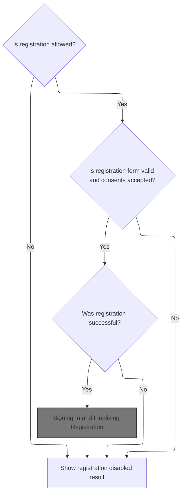
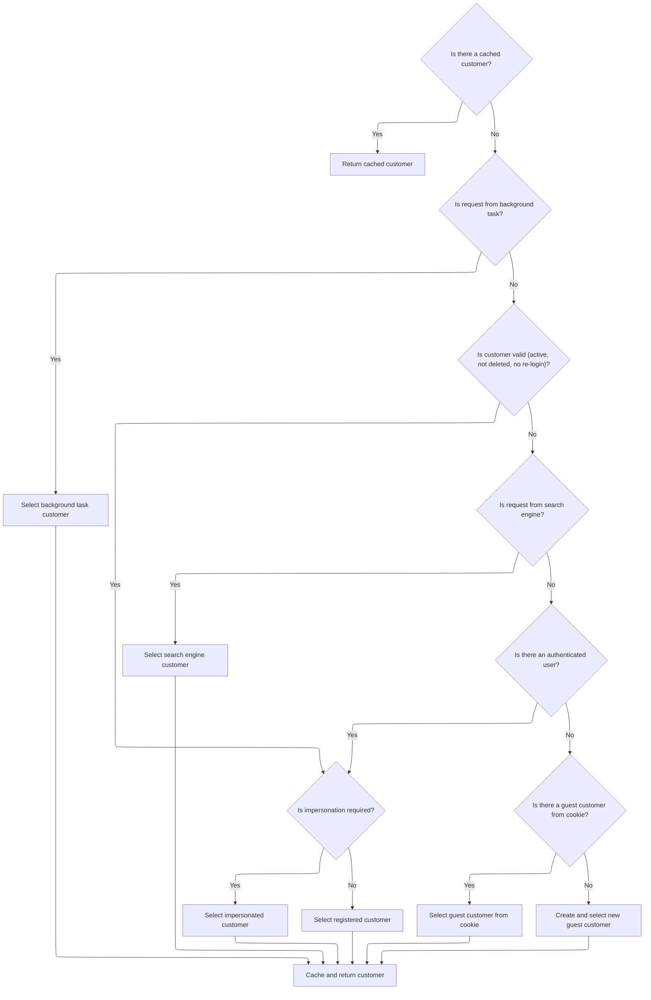

This document describes the customer registration flow, enabling users to create a new account. The process checks registration eligibility, resolves customer context, validates required information and consents, and manages the outcome based on registration type. Registration form data is received, resulting in account creation, sign-in or redirection, and logging of consents and subscriptions.

# Starting Customer Registration



This section governs the initial steps of customer registration, ensuring that only eligible users can register, that all required information and consents are provided, and that the registration outcome is handled appropriately.

| Category        | Rule Name                     | Description                                                                                                                                                                            |
| --------------- | ----------------------------- | -------------------------------------------------------------------------------------------------------------------------------------------------------------------------------------- |
| Data validation | Registration Permission Check | Customer registration must be allowed according to the configured registration type. If registration is disabled, the user cannot proceed and is shown a registration disabled result. |
| Data validation | Form and Consent Validation   | The registration form must be valid and all required consents must be accepted before proceeding with registration.                                                                    |
| Business logic  | Registration Success Handling | If registration is successful, the customer is signed in and registration is finalized. If registration fails, the user is shown a registration disabled result.                       |

<SwmSnippet path="/src/Presentation/Nop.Web/Controllers/CustomerController.cs" line="790">

---

In <SwmToken path="src/Presentation/Nop.Web/Controllers/CustomerController.cs" pos="790:12:12" line-data="    public virtual async Task&lt;IActionResult&gt; Register(RegisterModel model, string returnUrl, bool captchaValid, IFormCollection form)">`Register`</SwmToken>, we kick off by checking if registration is allowed based on the configured registration type. If it's disabled, we bail out early and redirect. Right after, we grab the current store and customer context, which sets us up for handling registration logic tailored to the user's state (guest, registered, impersonated, etc.). We need to call into <SwmToken path="src/Presentation/Nop.Web.Framework/WebWorkContext.cs" pos="27:6:6" line-data="public partial class WebWorkContext : IWorkContext">`WebWorkContext`</SwmToken> next to get the actual customer context, which drives the rest of the registration flow.

```c#
    public virtual async Task<IActionResult> Register(RegisterModel model, string returnUrl, bool captchaValid, IFormCollection form)
    {
        //check whether registration is allowed
        if (_customerSettings.UserRegistrationType == UserRegistrationType.Disabled)
            return RedirectToRoute(NopRouteNames.Standard.REGISTER_RESULT, new { resultId = (int)UserRegistrationType.Disabled, returnUrl });

        var store = await _storeContext.GetCurrentStoreAsync();
        var customer = await _workContext.GetCurrentCustomerAsync();
```

---

</SwmSnippet>

## Resolving Customer Context



The main product role of this section is to ensure that every request in the nopCommerce platform is associated with a valid customer context. This enables personalized experiences, accurate tracking, and correct business logic execution for both authenticated and anonymous users.

| Category        | Rule Name                        | Description                                                                                                                                                                                                                                                                                                                                            |
| --------------- | -------------------------------- | ------------------------------------------------------------------------------------------------------------------------------------------------------------------------------------------------------------------------------------------------------------------------------------------------------------------------------------------------------ |
| Data validation | Customer validity requirements   | Only customers who are active, not deleted, and do not require re-login can be used as the resolved customer context for a request.                                                                                                                                                                                                                    |
| Business logic  | Request-level customer caching   | If a customer has already been resolved and cached for the current request, that customer must be returned for all subsequent customer context queries within the same request.                                                                                                                                                                        |
| Business logic  | Background task customer context | If the request is identified as originating from a background task, the customer context must be set to a special <SwmToken path="src/Presentation/Nop.Web.Framework/WebWorkContext.cs" pos="221:10:12" line-data="                //in this case return built-in customer record for background task">`built-in`</SwmToken> background task customer. |
| Business logic  | Search engine customer context   | If the request is identified as coming from a search engine, the customer context must be set to a special <SwmToken path="src/Presentation/Nop.Web.Framework/WebWorkContext.cs" pos="221:10:12" line-data="                //in this case return built-in customer record for background task">`built-in`</SwmToken> search engine customer.          |
| Business logic  | Impersonation handling           | If an authenticated user is present, and impersonation is required, the customer context must be set to the impersonated customer, provided that customer is valid (active, not deleted, does not require re-login).                                                                                                                                   |
| Business logic  | Authenticated customer context   | If an authenticated user is present and no impersonation is required, the customer context must be set to the authenticated registered customer, provided the customer is valid (active, not deleted, does not require re-login).                                                                                                                      |
| Business logic  | Guest customer from cookie       | If no authenticated user is present, but a guest customer identifier is found in the request cookie, and the corresponding customer is not registered, the customer context must be set to this guest customer if valid (active, not deleted, does not require re-login).                                                                              |
| Business logic  | Create new guest customer        | If no valid customer context can be resolved from cache, background task, search engine, authenticated user, impersonation, or guest cookie, a new guest customer must be created and used as the customer context for the request.                                                                                                                    |
| Business logic  | Persist customer context         | Once a valid customer context is resolved, the customer identifier must be stored in a cookie for future requests, and the customer must be cached for the duration of the current request.                                                                                                                                                            |

<SwmSnippet path="/src/Presentation/Nop.Web.Framework/WebWorkContext.cs" line="196">

---

<SwmToken path="src/Presentation/Nop.Web.Framework/WebWorkContext.cs" pos="196:12:12" line-data="    public virtual async Task&lt;Customer&gt; GetCurrentCustomerAsync()">`GetCurrentCustomerAsync`</SwmToken> checks if we've already cached the customer for this request. If not, it runs the full context resolution via <SwmToken path="src/Presentation/Nop.Web.Framework/WebWorkContext.cs" pos="202:3:3" line-data="        await SetCurrentCustomerAsync();">`SetCurrentCustomerAsync`</SwmToken>, which figures out who the customer actually is (background task, search engine, authenticated, impersonated, guest, etc.). This is needed so the registration flow knows exactly who it's working with.

```c#
    public virtual async Task<Customer> GetCurrentCustomerAsync()
    {
        //whether there is a cached value
        if (_cachedCustomer != null)
            return _cachedCustomer;

        await SetCurrentCustomerAsync();

        return _cachedCustomer;
    }
```

---

</SwmSnippet>

<SwmSnippet path="/src/Presentation/Nop.Web.Framework/WebWorkContext.cs" line="212">

---

<SwmToken path="src/Presentation/Nop.Web.Framework/WebWorkContext.cs" pos="212:9:9" line-data="    public virtual async Task SetCurrentCustomerAsync(Customer customer = null)">`SetCurrentCustomerAsync`</SwmToken> runs through a bunch of checks to figure out the right customer context: background task, search engine, authenticated user, impersonation, guest from cookie, or creates a new guest. It uses various services and attributes to do this, and always ends up with a valid customer for the request.

```c#
    public virtual async Task SetCurrentCustomerAsync(Customer customer = null)
    {
        if (customer == null)
        {
            //check whether request is made by a background (schedule) task
            if (_httpContextAccessor.HttpContext?.Request
                    ?.Path.Equals(new PathString($"/{NopTaskDefaults.ScheduleTaskPath}"), StringComparison.InvariantCultureIgnoreCase)
                ?? true)
            {
                //in this case return built-in customer record for background task
                customer = await _customerService.GetOrCreateBackgroundTaskUserAsync();
            }

            if (customer == null || customer.Deleted || !customer.Active || customer.RequireReLogin)
            {
                //check whether request is made by a search engine, in this case return built-in customer record for search engines
                if (_userAgentHelper.IsSearchEngine())
                    customer = await _customerService.GetOrCreateSearchEngineUserAsync();
            }

            if (customer == null || customer.Deleted || !customer.Active || customer.RequireReLogin)
            {
                //try to get registered user
                customer = await _authenticationService.GetAuthenticatedCustomerAsync();
            }

            if (customer != null && !customer.Deleted && customer.Active && !customer.RequireReLogin)
            {
                //get impersonate user if required
                var impersonatedCustomerId = await _genericAttributeService
                    .GetAttributeAsync<int?>(customer, NopCustomerDefaults.ImpersonatedCustomerIdAttribute);
                if (impersonatedCustomerId.HasValue && impersonatedCustomerId.Value > 0)
                {
                    var impersonatedCustomer = await _customerService.GetCustomerByIdAsync(impersonatedCustomerId.Value);
                    if (impersonatedCustomer != null && !impersonatedCustomer.Deleted &&
                        impersonatedCustomer.Active &&
                        !impersonatedCustomer.RequireReLogin)
                    {
                        //set impersonated customer
                        _originalCustomerIfImpersonated = customer;
                        customer = impersonatedCustomer;
                    }
                }
            }

            if (customer == null || customer.Deleted || !customer.Active || customer.RequireReLogin)
            {
                //get guest customer
                var customerCookie = GetCustomerCookie();
                if (Guid.TryParse(customerCookie, out var customerGuid))
                {
                    //get customer from cookie (should not be registered)
                    var customerByCookie = await _customerService.GetCustomerByGuidAsync(customerGuid);
                    if (customerByCookie != null && !await _customerService.IsRegisteredAsync(customerByCookie))
                        customer = customerByCookie;
                }
            }

            if (customer == null || customer.Deleted || !customer.Active || customer.RequireReLogin)
            {
                //create guest if not exists
                customer = await _customerService.InsertGuestCustomerAsync();
            }
        }

        if (!customer.Deleted && customer.Active && !customer.RequireReLogin)
        {
            //set customer cookie
            SetCustomerCookie(customer.CustomerGuid);

            //cache the found customer
            _cachedCustomer = customer;
        }
    }
```

---

</SwmSnippet>

## Handling Existing Registrations

```mermaid
%%{init: {"flowchart": {"defaultRenderer": "elk"}} }%%
flowchart TD
    node1["Start customer registration"]
    click node1 openCode "src/Presentation/Nop.Web/Controllers/CustomerController.cs:798:799"
    node1 --> node2{"Is customer already registered?"}
    click node2 openCode "src/Presentation/Nop.Web/Controllers/CustomerController.cs:800:812"
    node2 -->|"Yes"| node3["Sign out and create guest customer"]
    click node3 openCode "src/Presentation/Nop.Web/Controllers/CustomerController.cs:803:812"
    node2 -->|"No"| node4["Continue registration"]
    click node4 openCode "src/Presentation/Nop.Web/Controllers/CustomerController.cs:814:823"
    node3 --> node4
    node4 --> node5{"Are custom attributes and CAPTCHA valid?"}
    click node5 openCode "src/Presentation/Nop.Web/Controllers/CustomerController.cs:817:828"
    node5 -->|"No"| node6["Show registration errors"]
    click node6 openCode "src/Presentation/Nop.Web/Controllers/CustomerController.cs:821:822"
    node5 -->|"Yes"| node7{"Are all required GDPR consents provided?"}
    click node7 openCode "src/Presentation/Nop.Web/Controllers/CustomerController.cs:831:837"
    node7 -->|"No"| node6
    node7 -->|"Yes"| node8{"Is registration data valid?"}
    click node8 openCode "src/Presentation/Nop.Web/Controllers/CustomerController.cs:839:852"
    node8 -->|"No"| node6
    node8 -->|"Yes"| node9["Process registration request"]
    click node9 openCode "src/Presentation/Nop.Web/Controllers/CustomerController.cs:845:852"
    node9 --> node10{"Was registration successful?"}
    click node10 openCode "src/Presentation/Nop.Web/Controllers/CustomerController.cs:853:854"
    node10 -->|"No"| node6
    node10 -->|"Yes"| node11["Set customer profile and save attributes"]
    click node11 openCode "src/Presentation/Nop.Web/Controllers/CustomerController.cs:856:904"
    node11 --> node12{"Is newsletter enabled?"}
    click node12 openCode "src/Presentation/Nop.Web/Controllers/CustomerController.cs:906:943"
    node12 -->|"Yes"| node13["Process newsletter subscriptions"]
    click node13 openCode "src/Presentation/Nop.Web/Controllers/CustomerController.cs:909:943"
    node12 -->|"No"| node14["Skip newsletter"]
    node13 --> node14
    subgraph loop1["For each newsletter subscription"]
      node13 --> node15{"Is subscription active?"}
      click node15 openCode "src/Presentation/Nop.Web/Controllers/CustomerController.cs:910:943"
      node15 -->|"Existing"| node16["Activate subscription"]
      click node16 openCode "src/Presentation/Nop.Web/Controllers/CustomerController.cs:922:927"
      node15 -->|"New"| node17["Create subscription"]
      click node17 openCode "src/Presentation/Nop.Web/Controllers/CustomerController.cs:931:942"
    end
    node14 --> node18{"Is privacy policy required?"}
    click node18 openCode "src/Presentation/Nop.Web/Controllers/CustomerController.cs:972:979"
    node18 -->|"Yes"| node19["Log privacy policy consent"]
    click node19 openCode "src/Presentation/Nop.Web/Controllers/CustomerController.cs:976:979"
    node18 -->|"No"| node20["Skip privacy policy"]
    node19 --> node20
    node20 --> node21{"Is GDPR enabled?"}
    click node21 openCode "src/Presentation/Nop.Web/Controllers/CustomerController.cs:983:1000"
    node21 -->|"Yes"| node22["Log GDPR consents"]
    click node22 openCode "src/Presentation/Nop.Web/Controllers/CustomerController.cs:985:1000"
    node21 -->|"No"| node23["Skip GDPR"]
    subgraph loop2["For each GDPR consent"]
      node22 --> node24{"Did customer agree?"}
      click node24 openCode "src/Presentation/Nop.Web/Controllers/CustomerController.cs:990:999"
      node24 -->|"Yes"| node25["Log consent agree"]
      click node25 openCode "src/Presentation/Nop.Web/Controllers/CustomerController.cs:993:994"
      node24 -->|"No"| node26["Log consent disagree"]
      click node26 openCode "src/Presentation/Nop.Web/Controllers/CustomerController.cs:998:999"
    end
    node22 --> node23
    node23 --> node27{"Is address valid?"}
    click node27 openCode "src/Presentation/Nop.Web/Controllers/CustomerController.cs:1003:1043"
    node27 -->|"Yes"| node28["Create and assign address"]
    click node28 openCode "src/Presentation/Nop.Web/Controllers/CustomerController.cs:1035:1042"
    node27 -->|"No"| node29["Skip address"]
    node28 --> node29
    node29 --> node30["Send notifications"]
    click node30 openCode "src/Presentation/Nop.Web/Controllers/CustomerController.cs:1046:1052"
    node30 --> node31{"Registration type?"}
    click node31 openCode "src/Presentation/Nop.Web/Controllers/CustomerController.cs:1053:1078"
    node31 -->|EmailValidation| node32["Send email validation"]
    click node32 openCode "src/Presentation/Nop.Web/Controllers/CustomerController.cs:1057:1061"
    node31 -->|AdminApproval| node33["Redirect to admin approval result"]
    click node33 openCode "src/Presentation/Nop.Web/Controllers/CustomerController.cs:1064:1065"
    node31 -->|"Standard"| node34["Send welcome message and sign in"]
    click node34 openCode "src/Presentation/Nop.Web/Controllers/CustomerController.cs:1068:1074"
    node31 -->|"Other"| node35["Redirect to homepage"]
    click node35 openCode "src/Presentation/Nop.Web/Controllers/CustomerController.cs:1077:1078"
classDef HeadingStyle fill:#777777,stroke:#333,stroke-width:2px;

%% Swimm:
%% %%{init: {"flowchart": {"defaultRenderer": "elk"}} }%%
%% flowchart TD
%%     node1["Start customer registration"]
%%     click node1 openCode "<SwmPath>[src/…/Controllers/CustomerController.cs](src/Presentation/Nop.Web/Controllers/CustomerController.cs)</SwmPath>:798:799"
%%     node1 --> node2{"Is customer already registered?"}
%%     click node2 openCode "<SwmPath>[src/…/Controllers/CustomerController.cs](src/Presentation/Nop.Web/Controllers/CustomerController.cs)</SwmPath>:800:812"
%%     node2 -->|"Yes"| node3["Sign out and create guest customer"]
%%     click node3 openCode "<SwmPath>[src/…/Controllers/CustomerController.cs](src/Presentation/Nop.Web/Controllers/CustomerController.cs)</SwmPath>:803:812"
%%     node2 -->|"No"| node4["Continue registration"]
%%     click node4 openCode "<SwmPath>[src/…/Controllers/CustomerController.cs](src/Presentation/Nop.Web/Controllers/CustomerController.cs)</SwmPath>:814:823"
%%     node3 --> node4
%%     node4 --> node5{"Are custom attributes and CAPTCHA valid?"}
%%     click node5 openCode "<SwmPath>[src/…/Controllers/CustomerController.cs](src/Presentation/Nop.Web/Controllers/CustomerController.cs)</SwmPath>:817:828"
%%     node5 -->|"No"| node6["Show registration errors"]
%%     click node6 openCode "<SwmPath>[src/…/Controllers/CustomerController.cs](src/Presentation/Nop.Web/Controllers/CustomerController.cs)</SwmPath>:821:822"
%%     node5 -->|"Yes"| node7{"Are all required GDPR consents provided?"}
%%     click node7 openCode "<SwmPath>[src/…/Controllers/CustomerController.cs](src/Presentation/Nop.Web/Controllers/CustomerController.cs)</SwmPath>:831:837"
%%     node7 -->|"No"| node6
%%     node7 -->|"Yes"| node8{"Is registration data valid?"}
%%     click node8 openCode "<SwmPath>[src/…/Controllers/CustomerController.cs](src/Presentation/Nop.Web/Controllers/CustomerController.cs)</SwmPath>:839:852"
%%     node8 -->|"No"| node6
%%     node8 -->|"Yes"| node9["Process registration request"]
%%     click node9 openCode "<SwmPath>[src/…/Controllers/CustomerController.cs](src/Presentation/Nop.Web/Controllers/CustomerController.cs)</SwmPath>:845:852"
%%     node9 --> node10{"Was registration successful?"}
%%     click node10 openCode "<SwmPath>[src/…/Controllers/CustomerController.cs](src/Presentation/Nop.Web/Controllers/CustomerController.cs)</SwmPath>:853:854"
%%     node10 -->|"No"| node6
%%     node10 -->|"Yes"| node11["Set customer profile and save attributes"]
%%     click node11 openCode "<SwmPath>[src/…/Controllers/CustomerController.cs](src/Presentation/Nop.Web/Controllers/CustomerController.cs)</SwmPath>:856:904"
%%     node11 --> node12{"Is newsletter enabled?"}
%%     click node12 openCode "<SwmPath>[src/…/Controllers/CustomerController.cs](src/Presentation/Nop.Web/Controllers/CustomerController.cs)</SwmPath>:906:943"
%%     node12 -->|"Yes"| node13["Process newsletter subscriptions"]
%%     click node13 openCode "<SwmPath>[src/…/Controllers/CustomerController.cs](src/Presentation/Nop.Web/Controllers/CustomerController.cs)</SwmPath>:909:943"
%%     node12 -->|"No"| node14["Skip newsletter"]
%%     node13 --> node14
%%     subgraph loop1["For each newsletter subscription"]
%%       node13 --> node15{"Is subscription active?"}
%%       click node15 openCode "<SwmPath>[src/…/Controllers/CustomerController.cs](src/Presentation/Nop.Web/Controllers/CustomerController.cs)</SwmPath>:910:943"
%%       node15 -->|"Existing"| node16["Activate subscription"]
%%       click node16 openCode "<SwmPath>[src/…/Controllers/CustomerController.cs](src/Presentation/Nop.Web/Controllers/CustomerController.cs)</SwmPath>:922:927"
%%       node15 -->|"New"| node17["Create subscription"]
%%       click node17 openCode "<SwmPath>[src/…/Controllers/CustomerController.cs](src/Presentation/Nop.Web/Controllers/CustomerController.cs)</SwmPath>:931:942"
%%     end
%%     node14 --> node18{"Is privacy policy required?"}
%%     click node18 openCode "<SwmPath>[src/…/Controllers/CustomerController.cs](src/Presentation/Nop.Web/Controllers/CustomerController.cs)</SwmPath>:972:979"
%%     node18 -->|"Yes"| node19["Log privacy policy consent"]
%%     click node19 openCode "<SwmPath>[src/…/Controllers/CustomerController.cs](src/Presentation/Nop.Web/Controllers/CustomerController.cs)</SwmPath>:976:979"
%%     node18 -->|"No"| node20["Skip privacy policy"]
%%     node19 --> node20
%%     node20 --> node21{"Is GDPR enabled?"}
%%     click node21 openCode "<SwmPath>[src/…/Controllers/CustomerController.cs](src/Presentation/Nop.Web/Controllers/CustomerController.cs)</SwmPath>:983:1000"
%%     node21 -->|"Yes"| node22["Log GDPR consents"]
%%     click node22 openCode "<SwmPath>[src/…/Controllers/CustomerController.cs](src/Presentation/Nop.Web/Controllers/CustomerController.cs)</SwmPath>:985:1000"
%%     node21 -->|"No"| node23["Skip GDPR"]
%%     subgraph loop2["For each GDPR consent"]
%%       node22 --> node24{"Did customer agree?"}
%%       click node24 openCode "<SwmPath>[src/…/Controllers/CustomerController.cs](src/Presentation/Nop.Web/Controllers/CustomerController.cs)</SwmPath>:990:999"
%%       node24 -->|"Yes"| node25["Log consent agree"]
%%       click node25 openCode "<SwmPath>[src/…/Controllers/CustomerController.cs](src/Presentation/Nop.Web/Controllers/CustomerController.cs)</SwmPath>:993:994"
%%       node24 -->|"No"| node26["Log consent disagree"]
%%       click node26 openCode "<SwmPath>[src/…/Controllers/CustomerController.cs](src/Presentation/Nop.Web/Controllers/CustomerController.cs)</SwmPath>:998:999"
%%     end
%%     node22 --> node23
%%     node23 --> node27{"Is address valid?"}
%%     click node27 openCode "<SwmPath>[src/…/Controllers/CustomerController.cs](src/Presentation/Nop.Web/Controllers/CustomerController.cs)</SwmPath>:1003:1043"
%%     node27 -->|"Yes"| node28["Create and assign address"]
%%     click node28 openCode "<SwmPath>[src/…/Controllers/CustomerController.cs](src/Presentation/Nop.Web/Controllers/CustomerController.cs)</SwmPath>:1035:1042"
%%     node27 -->|"No"| node29["Skip address"]
%%     node28 --> node29
%%     node29 --> node30["Send notifications"]
%%     click node30 openCode "<SwmPath>[src/…/Controllers/CustomerController.cs](src/Presentation/Nop.Web/Controllers/CustomerController.cs)</SwmPath>:1046:1052"
%%     node30 --> node31{"Registration type?"}
%%     click node31 openCode "<SwmPath>[src/…/Controllers/CustomerController.cs](src/Presentation/Nop.Web/Controllers/CustomerController.cs)</SwmPath>:1053:1078"
%%     node31 -->|<SwmToken path="src/Presentation/Nop.Web/Controllers/CustomerController.cs" pos="909:15:15" line-data="                    var isNewsletterActive = _customerSettings.UserRegistrationType != UserRegistrationType.EmailValidation;">`EmailValidation`</SwmToken>| node32["Send email validation"]
%%     click node32 openCode "<SwmPath>[src/…/Controllers/CustomerController.cs](src/Presentation/Nop.Web/Controllers/CustomerController.cs)</SwmPath>:1057:1061"
%%     node31 -->|<SwmToken path="src/Presentation/Nop.Web/Controllers/CustomerController.cs" pos="1063:5:5" line-data="                    case UserRegistrationType.AdminApproval:">`AdminApproval`</SwmToken>| node33["Redirect to admin approval result"]
%%     click node33 openCode "<SwmPath>[src/…/Controllers/CustomerController.cs](src/Presentation/Nop.Web/Controllers/CustomerController.cs)</SwmPath>:1064:1065"
%%     node31 -->|"Standard"| node34["Send welcome message and sign in"]
%%     click node34 openCode "<SwmPath>[src/…/Controllers/CustomerController.cs](src/Presentation/Nop.Web/Controllers/CustomerController.cs)</SwmPath>:1068:1074"
%%     node31 -->|"Other"| node35["Redirect to homepage"]
%%     click node35 openCode "<SwmPath>[src/…/Controllers/CustomerController.cs](src/Presentation/Nop.Web/Controllers/CustomerController.cs)</SwmPath>:1077:1078"
%% classDef HeadingStyle fill:#777777,stroke:#333,stroke-width:2px;
```



<SwmSnippet path="/src/Presentation/Nop.Web/Controllers/CustomerController.cs" line="798">

---

Back in `CustomerController.Register`, after resolving the customer context, we check if the user is already registered. If so, we sign them out, log the logout event, create a new guest customer, and set that as the current context. This keeps registration clean and avoids conflicts.

```c#
        var language = await _workContext.GetWorkingLanguageAsync();

        if (await _customerService.IsRegisteredAsync(customer))
        {
            //Already registered customer. 
            await _authenticationService.SignOutAsync();

            //raise logged out event       
            await _eventPublisher.PublishAsync(new CustomerLoggedOutEvent(customer));

            customer = await _customerService.InsertGuestCustomerAsync();

            //Save a new record
            await _workContext.SetCurrentCustomerAsync(customer);
        }

```

---

</SwmSnippet>

<SwmSnippet path="/src/Presentation/Nop.Web/Controllers/CustomerController.cs" line="814">

---

After resolving the customer context in `CustomerController.Register`, we validate custom attributes and CAPTCHA, log GDPR consents, and build the registration request. If registration succeeds, we update the customer profile and handle newsletter subscriptions. This keeps the registration process compliant and complete.

```c#
        customer.RegisteredInStoreId = store.Id;

        //custom customer attributes
        var customerAttributesXml = await ParseCustomCustomerAttributesAsync(form);
        var customerAttributeWarnings = await _customerAttributeParser.GetAttributeWarningsAsync(customerAttributesXml);
        foreach (var error in customerAttributeWarnings)
        {
            ModelState.AddModelError("", error);
        }

        //validate CAPTCHA
        if (_captchaSettings.Enabled && _captchaSettings.ShowOnRegistrationPage && !captchaValid)
        {
            ModelState.AddModelError("", await _localizationService.GetResourceAsync("Common.WrongCaptchaMessage"));
        }

        //GDPR
        if (_gdprSettings.GdprEnabled)
        {
            var consents = (await _gdprService
                .GetAllConsentsAsync()).Where(consent => consent.DisplayDuringRegistration && consent.IsRequired).ToList();

            ValidateRequiredConsents(consents, form);
        }

        if (ModelState.IsValid)
        {
            var customerUserName = model.Username;
            var customerEmail = model.Email;

            var isApproved = _customerSettings.UserRegistrationType == UserRegistrationType.Standard;
            var registrationRequest = new CustomerRegistrationRequest(customer,
                customerEmail,
                _customerSettings.UsernamesEnabled ? customerUserName : customerEmail,
                model.Password,
                _customerSettings.DefaultPasswordFormat,
                store.Id,
                isApproved);
            var registrationResult = await _customerRegistrationService.RegisterCustomerAsync(registrationRequest);
            if (registrationResult.Success)
            {
                //properties
                if (_dateTimeSettings.AllowCustomersToSetTimeZone)
                    customer.TimeZoneId = model.TimeZoneId;

                //VAT number
                if (_taxSettings.EuVatEnabled)
                {
                    customer.VatNumber = model.VatNumber;

                    var (vatNumberStatus, _, vatAddress) = await _taxService.GetVatNumberStatusAsync(model.VatNumber);
                    customer.VatNumberStatusId = (int)vatNumberStatus;
                    //send VAT number admin notification
                    if (!string.IsNullOrEmpty(model.VatNumber) && _taxSettings.EuVatEmailAdminWhenNewVatSubmitted)
                        await _workflowMessageService.SendNewVatSubmittedStoreOwnerNotificationAsync(customer, model.VatNumber, vatAddress, _localizationSettings.DefaultAdminLanguageId);
                }

                //form fields
                if (_customerSettings.GenderEnabled)
                    customer.Gender = model.Gender;
                if (_customerSettings.FirstNameEnabled)
                    customer.FirstName = model.FirstName;
                if (_customerSettings.LastNameEnabled)
                    customer.LastName = model.LastName;
                if (_customerSettings.DateOfBirthEnabled)
                    customer.DateOfBirth = model.ParseDateOfBirth();
                if (_customerSettings.CompanyEnabled)
                    customer.Company = model.Company;
                if (_customerSettings.StreetAddressEnabled)
                    customer.StreetAddress = model.StreetAddress;
                if (_customerSettings.StreetAddress2Enabled)
                    customer.StreetAddress2 = model.StreetAddress2;
                if (_customerSettings.ZipPostalCodeEnabled)
                    customer.ZipPostalCode = model.ZipPostalCode;
                if (_customerSettings.CityEnabled)
                    customer.City = model.City;
                if (_customerSettings.CountyEnabled)
                    customer.County = model.County;
                if (_customerSettings.CountryEnabled)
                    customer.CountryId = model.CountryId;
                if (_customerSettings.CountryEnabled && _customerSettings.StateProvinceEnabled)
                    customer.StateProvinceId = model.StateProvinceId;
                if (_customerSettings.PhoneEnabled)
                    customer.Phone = model.Phone;
                if (_customerSettings.FaxEnabled)
                    customer.Fax = model.Fax;

                //save customer attributes
                customer.CustomCustomerAttributesXML = customerAttributesXml;
                await _customerService.UpdateCustomerAsync(customer);

                //newsletter subscriptions
                if (_customerSettings.NewsletterEnabled)
                {
                    var anyNewSubscriptions = false;
                    var isNewsletterActive = _customerSettings.UserRegistrationType != UserRegistrationType.EmailValidation;
                    var activeSubscriptions = model.NewsLetterSubscriptions.Where(subscriptionModel => subscriptionModel.IsActive);
                    var currentSubscriptions = await _newsLetterSubscriptionService
                        .GetNewsLetterSubscriptionsByEmailAsync(customerEmail, storeId: store.Id);
                    if (currentSubscriptions.Any())
                    {
                        var subscriptionGuid = currentSubscriptions.FirstOrDefault().NewsLetterSubscriptionGuid;
                        foreach (var activeSubscription in activeSubscriptions)
                        {
                            var existingSubscription = currentSubscriptions
                                ?.FirstOrDefault(subscription => subscription.TypeId == activeSubscription.TypeId);
                            if (existingSubscription is not null)
                            {
                                if (!existingSubscription.Active && isNewsletterActive)
                                {
                                    existingSubscription.Active = true;
                                    existingSubscription.LanguageId = customer.LanguageId ?? language.Id;
                                    await _newsLetterSubscriptionService.UpdateNewsLetterSubscriptionAsync(existingSubscription);
                                }
                            }
                            else
                            {
                                await _newsLetterSubscriptionService.InsertNewsLetterSubscriptionAsync(new()
                                {
                                    NewsLetterSubscriptionGuid = subscriptionGuid,
                                    Email = customer.Email,
                                    Active = isNewsletterActive,
                                    TypeId = activeSubscription.TypeId,
                                    StoreId = store.Id,
                                    LanguageId = customer.LanguageId ?? language.Id,
                                    CreatedOnUtc = DateTime.UtcNow
                                });
                                anyNewSubscriptions = true;
                            }
                        }
```

---

</SwmSnippet>

<SwmSnippet path="/src/Presentation/Nop.Web/Controllers/CustomerController.cs" line="947">

---

Here we handle cases where there are no existing newsletter subscriptions for the customer. We generate a new GUID and insert new subscriptions for each active type, prepping for GDPR logging and further registration steps.

```c#
                        var subscriptionGuid = Guid.NewGuid();
                        foreach (var activeSubscription in activeSubscriptions)
                        {
                            await _newsLetterSubscriptionService.InsertNewsLetterSubscriptionAsync(new()
                            {
                                NewsLetterSubscriptionGuid = subscriptionGuid,
                                Email = customer.Email,
                                Active = isNewsletterActive,
                                TypeId = activeSubscription.TypeId,
                                StoreId = store.Id,
                                LanguageId = customer.LanguageId ?? language.Id,
                                CreatedOnUtc = DateTime.UtcNow
                            });
                            anyNewSubscriptions = true;
                        }
```

---

</SwmSnippet>

<SwmSnippet path="/src/Presentation/Nop.Web/Controllers/CustomerController.cs" line="964">

---

After inserting or updating newsletter subscriptions, we log GDPR consent for newsletters and privacy policy if enabled. We also loop through all consents shown during registration and log whether the user agreed or disagreed, prepping for address creation and notifications.

```c#
                    //GDPR
                    if (anyNewSubscriptions && _gdprSettings.GdprEnabled && _gdprSettings.LogNewsletterConsent)
                    {
                        var consentMessage = await _localizationService.GetResourceAsync("Gdpr.Consent.Newsletter");
                        await _gdprService.InsertLogAsync(customer, 0, GdprRequestType.ConsentAgree, consentMessage);
                    }
                }

                if (_customerSettings.AcceptPrivacyPolicyEnabled)
                {
                    //privacy policy is required
                    //GDPR
                    if (_gdprSettings.GdprEnabled && _gdprSettings.LogPrivacyPolicyConsent)
                    {
                        await _gdprService.InsertLogAsync(customer, 0, GdprRequestType.ConsentAgree, await _localizationService.GetResourceAsync("Gdpr.Consent.PrivacyPolicy"));
                    }
                }

                //GDPR
                if (_gdprSettings.GdprEnabled)
                {
                    var consents = (await _gdprService.GetAllConsentsAsync()).Where(consent => consent.DisplayDuringRegistration).ToList();
                    foreach (var consent in consents)
                    {
                        var controlId = $"consent{consent.Id}";
                        var cbConsent = form[controlId];
                        if (!StringValues.IsNullOrEmpty(cbConsent) && cbConsent.ToString().Equals("on"))
                        {
                            //agree
                            await _gdprService.InsertLogAsync(customer, consent.Id, GdprRequestType.ConsentAgree, consent.Message);
                        }
                        else
                        {
                            //disagree
                            await _gdprService.InsertLogAsync(customer, consent.Id, GdprRequestType.ConsentDisagree, consent.Message);
                        }
                    }
```

---

</SwmSnippet>

<SwmSnippet path="/src/Presentation/Nop.Web/Controllers/CustomerController.cs" line="1003">

---

After logging consents, we build and validate the default address, associate it with the customer, and send notifications. Depending on the registration type, we either send validation emails, wait for admin approval, or sign in the customer and redirect. Next, we call into <SwmToken path="src/Libraries/Nop.Services/Customers/CustomerRegistrationService.cs" pos="22:6:6" line-data="public partial class CustomerRegistrationService : ICustomerRegistrationService">`CustomerRegistrationService`</SwmToken> to handle sign-in and final redirection.

```c#
                //insert default address (if possible)
                var defaultAddress = new Address
                {
                    FirstName = customer.FirstName,
                    LastName = customer.LastName,
                    Email = customer.Email,
                    Company = customer.Company,
                    CountryId = customer.CountryId > 0
                        ? (int?)customer.CountryId
                        : null,
                    StateProvinceId = customer.StateProvinceId > 0
                        ? (int?)customer.StateProvinceId
                        : null,
                    County = customer.County,
                    City = customer.City,
                    Address1 = customer.StreetAddress,
                    Address2 = customer.StreetAddress2,
                    ZipPostalCode = customer.ZipPostalCode,
                    PhoneNumber = customer.Phone,
                    FaxNumber = customer.Fax,
                    CreatedOnUtc = customer.CreatedOnUtc
                };
                if (await _addressService.IsAddressValidAsync(defaultAddress))
                {
                    //some validation
                    if (defaultAddress.CountryId == 0)
                        defaultAddress.CountryId = null;
                    if (defaultAddress.StateProvinceId == 0)
                        defaultAddress.StateProvinceId = null;
                    //set default address
                    //customer.Addresses.Add(defaultAddress);

                    await _addressService.InsertAddressAsync(defaultAddress);

                    await _customerService.InsertCustomerAddressAsync(customer, defaultAddress);

                    customer.BillingAddressId = defaultAddress.Id;
                    customer.ShippingAddressId = defaultAddress.Id;

                    await _customerService.UpdateCustomerAsync(customer);
                }

                //notifications
                if (_customerSettings.NotifyNewCustomerRegistration)
                    await _workflowMessageService.SendCustomerRegisteredStoreOwnerNotificationMessageAsync(customer,
                        _localizationSettings.DefaultAdminLanguageId);

                //raise event       
                await _eventPublisher.PublishAsync(new CustomerRegisteredEvent(customer));

                switch (_customerSettings.UserRegistrationType)
                {
                    case UserRegistrationType.EmailValidation:
                        //email validation message
                        await _genericAttributeService.SaveAttributeAsync(customer, NopCustomerDefaults.AccountActivationTokenAttribute, Guid.NewGuid().ToString());
                        await _workflowMessageService.SendCustomerEmailValidationMessageAsync(customer, language.Id);

                        //result
                        return RedirectToRoute(NopRouteNames.Standard.REGISTER_RESULT, new { resultId = (int)UserRegistrationType.EmailValidation, returnUrl });

                    case UserRegistrationType.AdminApproval:
                        return RedirectToRoute(NopRouteNames.Standard.REGISTER_RESULT, new { resultId = (int)UserRegistrationType.AdminApproval, returnUrl });

                    case UserRegistrationType.Standard:
                        //send customer welcome message
                        await _workflowMessageService.SendCustomerWelcomeMessageAsync(customer, language.Id);

                        //raise event       
                        await _eventPublisher.PublishAsync(new CustomerActivatedEvent(customer));

                        returnUrl = Url.RouteUrl(NopRouteNames.Standard.REGISTER_RESULT, new { resultId = (int)UserRegistrationType.Standard, returnUrl });
                        return await _customerRegistrationService.SignInCustomerAsync(customer, returnUrl, true);

                    default:
                        return RedirectToRoute(NopRouteNames.General.HOMEPAGE);
                }
            }

            //errors
            foreach (var error in registrationResult.Errors)
                ModelState.AddModelError("", error);
        }

```

---

</SwmSnippet>

## Signing In and Finalizing Registration

```mermaid
%%{init: {"flowchart": {"defaultRenderer": "elk"}} }%%
flowchart TD
    node1["Start sign-in process"]
    click node1 openCode "src/Libraries/Nop.Services/Customers/CustomerRegistrationService.cs:426:427"
    node1 --> node2{"Is current customer different from signing-in customer?"}
    click node2 openCode "src/Libraries/Nop.Services/Customers/CustomerRegistrationService.cs:429:430"
    node2 -->|"Yes"| node3["Transfer affiliate ID if present and migrate shopping cart"]
    click node3 openCode "src/Libraries/Nop.Services/Customers/CustomerRegistrationService.cs:431:437"
    node3 --> node4["Set current customer"]
    click node4 openCode "src/Libraries/Nop.Services/Customers/CustomerRegistrationService.cs:439:440"
    node2 -->|"No"| node5["Sign in customer"]
    click node5 openCode "src/Libraries/Nop.Services/Customers/CustomerRegistrationService.cs:443:443"
    node4 --> node5
    node5 --> node6["Raise login event and log activity"]
    click node6 openCode "src/Libraries/Nop.Services/Customers/CustomerRegistrationService.cs:446:451"
    node6 --> node7{"Is valid return URL specified?"}
    click node7 openCode "src/Libraries/Nop.Services/Customers/CustomerRegistrationService.cs:456:457"
    node7 -->|"Yes"| node8["Redirect to return URL"]
    click node8 openCode "src/Libraries/Nop.Services/Customers/CustomerRegistrationService.cs:457:457"
    node7 -->|"No"| node9["Redirect to homepage"]
    click node9 openCode "src/Libraries/Nop.Services/Customers/CustomerRegistrationService.cs:459:459"

classDef HeadingStyle fill:#777777,stroke:#333,stroke-width:2px;

%% Swimm:
%% %%{init: {"flowchart": {"defaultRenderer": "elk"}} }%%
%% flowchart TD
%%     node1["Start sign-in process"]
%%     click node1 openCode "<SwmPath>[src/…/Customers/CustomerRegistrationService.cs](src/Libraries/Nop.Services/Customers/CustomerRegistrationService.cs)</SwmPath>:426:427"
%%     node1 --> node2{"Is current customer different from signing-in customer?"}
%%     click node2 openCode "<SwmPath>[src/…/Customers/CustomerRegistrationService.cs](src/Libraries/Nop.Services/Customers/CustomerRegistrationService.cs)</SwmPath>:429:430"
%%     node2 -->|"Yes"| node3["Transfer affiliate ID if present and migrate shopping cart"]
%%     click node3 openCode "<SwmPath>[src/…/Customers/CustomerRegistrationService.cs](src/Libraries/Nop.Services/Customers/CustomerRegistrationService.cs)</SwmPath>:431:437"
%%     node3 --> node4["Set current customer"]
%%     click node4 openCode "<SwmPath>[src/…/Customers/CustomerRegistrationService.cs](src/Libraries/Nop.Services/Customers/CustomerRegistrationService.cs)</SwmPath>:439:440"
%%     node2 -->|"No"| node5["Sign in customer"]
%%     click node5 openCode "<SwmPath>[src/…/Customers/CustomerRegistrationService.cs](src/Libraries/Nop.Services/Customers/CustomerRegistrationService.cs)</SwmPath>:443:443"
%%     node4 --> node5
%%     node5 --> node6["Raise login event and log activity"]
%%     click node6 openCode "<SwmPath>[src/…/Customers/CustomerRegistrationService.cs](src/Libraries/Nop.Services/Customers/CustomerRegistrationService.cs)</SwmPath>:446:451"
%%     node6 --> node7{"Is valid return URL specified?"}
%%     click node7 openCode "<SwmPath>[src/…/Customers/CustomerRegistrationService.cs](src/Libraries/Nop.Services/Customers/CustomerRegistrationService.cs)</SwmPath>:456:457"
%%     node7 -->|"Yes"| node8["Redirect to return URL"]
%%     click node8 openCode "<SwmPath>[src/…/Customers/CustomerRegistrationService.cs](src/Libraries/Nop.Services/Customers/CustomerRegistrationService.cs)</SwmPath>:457:457"
%%     node7 -->|"No"| node9["Redirect to homepage"]
%%     click node9 openCode "<SwmPath>[src/…/Customers/CustomerRegistrationService.cs](src/Libraries/Nop.Services/Customers/CustomerRegistrationService.cs)</SwmPath>:459:459"
%% 
%% classDef HeadingStyle fill:#777777,stroke:#333,stroke-width:2px;
```



This section governs the business rules for signing in a customer, ensuring that customer context, shopping cart, and affiliate information are correctly managed, and that the user is redirected appropriately after sign-in.

| Category       | Rule Name                        | Description                                                                                                                                                                                    |
| -------------- | -------------------------------- | ---------------------------------------------------------------------------------------------------------------------------------------------------------------------------------------------- |
| Business logic | Affiliate ID Transfer            | If the customer signing in is different from the current customer, transfer the affiliate ID from the current customer to the signing-in customer if the current customer has an affiliate ID. |
| Business logic | Shopping Cart Migration          | If the customer signing in is different from the current customer, migrate all shopping cart items from the current customer to the signing-in customer.                                       |
| Business logic | Customer Context Update          | After signing in, always update the current customer context to reflect the signed-in customer.                                                                                                |
| Business logic | Login Event and Activity Logging | After a successful sign-in, publish a login event and log the activity for auditing and analytics purposes.                                                                                    |
| Business logic | Post Sign-In Redirect            | If a return URL is specified and it is a local URL, redirect the user to that URL after sign-in. Otherwise, redirect the user to the homepage.                                                 |

<SwmSnippet path="/src/Libraries/Nop.Services/Customers/CustomerRegistrationService.cs" line="426">

---

In <SwmToken path="src/Libraries/Nop.Services/Customers/CustomerRegistrationService.cs" pos="426:12:12" line-data="    public virtual async Task&lt;IActionResult&gt; SignInCustomerAsync(Customer customer, string returnUrl, bool isPersist = false)">`SignInCustomerAsync`</SwmToken>, we check if we're switching customers. If so, we migrate affiliate IDs and shopping carts, then set the new customer context. This sets up the sign-in, event publishing, and activity logging that follows. We need to call <SwmToken path="src/Presentation/Nop.Web.Framework/WebWorkContext.cs" pos="27:6:6" line-data="public partial class WebWorkContext : IWorkContext">`WebWorkContext`</SwmToken> again to update the context for the signed-in user.

```c#
    public virtual async Task<IActionResult> SignInCustomerAsync(Customer customer, string returnUrl, bool isPersist = false)
    {
        var currentCustomer = await _workContext.GetCurrentCustomerAsync();
        if (currentCustomer?.Id != customer.Id)
        {
            if (currentCustomer.AffiliateId != 0)
            {
                customer.AffiliateId = currentCustomer.AffiliateId;
                await _customerService.UpdateCustomerAsync(customer);
            }
            //migrate shopping cart
            await _shoppingCartService.MigrateShoppingCartAsync(currentCustomer, customer, true);

            await _workContext.SetCurrentCustomerAsync(customer);
        }

```

---

</SwmSnippet>

<SwmSnippet path="/src/Libraries/Nop.Services/Customers/CustomerRegistrationService.cs" line="442">

---

After updating the customer context in <SwmToken path="src/Presentation/Nop.Web/Controllers/CustomerController.cs" pos="1074:7:7" line-data="                        return await _customerRegistrationService.SignInCustomerAsync(customer, returnUrl, true);">`SignInCustomerAsync`</SwmToken>, we sign in the user, publish login events, log the activity, and redirect. The redirect checks if the return URL is local to avoid security issues, otherwise it defaults to the homepage.

```c#
        //sign in new customer
        await _authenticationService.SignInAsync(customer, isPersist);

        //raise event
        var guestCustomer = await _customerService.IsGuestAsync(currentCustomer) && currentCustomer?.Id != customer.Id ? currentCustomer : null;
        await _eventPublisher.PublishAsync(new CustomerLoggedinEvent(customer, guestCustomer));

        //activity log
        await _customerActivityService.InsertActivityAsync(customer, "PublicStore.SuccessfulLogin",
            await _localizationService.GetResourceAsync("ActivityLog.PublicStore.Login.Success"), customer);

        var urlHelper = _urlHelperFactory.GetUrlHelper(_actionContextAccessor.ActionContext);

        //redirect to the return URL if it's specified
        if (!string.IsNullOrEmpty(returnUrl) && urlHelper.IsLocalUrl(returnUrl))
            return new RedirectResult(returnUrl);

        return new RedirectToRouteResult(NopRouteNames.General.HOMEPAGE, null);
    }
```

---

</SwmSnippet>

## Handling Registration Errors

<SwmSnippet path="/src/Presentation/Nop.Web/Controllers/CustomerController.cs" line="1086">

---

After coming back from `CustomerRegistrationService.SignInCustomerAsync`, if registration didn't succeed, we rebuild the registration model and show the form again with errors for the user to fix.

```c#
        //If we got this far, something failed, redisplay form
        model = await _customerModelFactory.PrepareRegisterModelAsync(model, true, customerAttributesXml);

        return View(model);
    }
```

---

</SwmSnippet>

&nbsp;

*This is an auto-generated document by Swimm 🌊 and has not yet been verified by a human*

<SwmMeta version="3.0.0" repo-id="Z2l0aHViJTNBJTNBY3NoYXJwLW5vcENvbW1lcmNlJTNBJTNBcmljYXJkb2xvcGV6Zw==" repo-name="csharp-nopCommerce"><sup>Powered by [Swimm](https://app.swimm.io/)</sup></SwmMeta>
