This document describes the flow for displaying order totals to users, ensuring that the totals are accurate for the current store and customer. The system enforces the store context, resolves the current customer, and builds the order totals model to support personalized shopping experiences.

# Starting the Order Totals Component

This section ensures that the Order Totals component always operates on the correct store and customer context, so that the shopping cart and order totals reflect the accurate data for the user currently interacting with the store.

| Category       | Rule Name                         | Description                                                                                                                                                                                                                                                                                                                                                               |
| -------------- | --------------------------------- | ------------------------------------------------------------------------------------------------------------------------------------------------------------------------------------------------------------------------------------------------------------------------------------------------------------------------------------------------------------------------- |
| Business logic | Current store context enforcement | The Order Totals component must always use the currently active store context to ensure that all calculations and displays are relevant to the store the user is interacting with.                                                                                                                                                                                        |
| Business logic | Current customer resolution       | The Order Totals component must always resolve and use the current customer context before accessing the shopping cart, ensuring that the cart and totals are specific to the <SwmToken path="src/Presentation/Nop.Web.Framework/WebWorkContext.cs" pos="293:12:14" line-data="    /// Gets the current vendor (logged-in manager)">`logged-in`</SwmToken> or guest user. |

<SwmSnippet path="/src/Presentation/Nop.Web/Components/OrderTotalsViewComponent.cs" line="28">

---

We start by getting the store and then need to resolve the current customer before we can load their cart. That's why we call into the work context next.

```c#
    public async Task<IViewComponentResult> InvokeAsync(bool isEditable)
    {
        var store = await _storeContext.GetCurrentStoreAsync();
        var cart = await _shoppingCartService.GetShoppingCartAsync(await _workContext.GetCurrentCustomerAsync(), ShoppingCartType.ShoppingCart, store.Id);

```

---

</SwmSnippet>

## Resolving the Current Customer

```mermaid
%%{init: {"flowchart": {"defaultRenderer": "elk"}} }%%
flowchart TD
    node1["Is there a cached customer?"]
    click node1 openCode "src/Presentation/Nop.Web.Framework/WebWorkContext.cs:199:200"
    node1 -->|"Yes"| node2["Return cached customer"]
    click node2 openCode "src/Presentation/Nop.Web.Framework/WebWorkContext.cs:200:201"
    node1 -->|"No"| node3{"Request type"}
    click node3 openCode "src/Presentation/Nop.Web.Framework/WebWorkContext.cs:217:223"
    node3 -->|"Background task"| node4["Return background task customer"]
    click node4 openCode "src/Presentation/Nop.Web.Framework/WebWorkContext.cs:222:223"
    node3 -->|"Search engine"| node5["Return search engine customer"]
    click node5 openCode "src/Presentation/Nop.Web.Framework/WebWorkContext.cs:229:230"
    node3 -->|"Standard"| node6{"Is there an authenticated customer?"}
    click node6 openCode "src/Presentation/Nop.Web.Framework/WebWorkContext.cs:235:236"
    node6 -->|"Yes"| node7{"Impersonation required?"}
    click node7 openCode "src/Presentation/Nop.Web.Framework/WebWorkContext.cs:241:253"
    node7 -->|"Yes"| node8["Return impersonated customer"]
    click node8 openCode "src/Presentation/Nop.Web.Framework/WebWorkContext.cs:245:253"
    node7 -->|"No"| node9["Return authenticated customer"]
    click node9 openCode "src/Presentation/Nop.Web.Framework/WebWorkContext.cs:235:236"
    node6 -->|"No"| node10{"Is there a guest customer from cookie?"}
    click node10 openCode "src/Presentation/Nop.Web.Framework/WebWorkContext.cs:264:267"
    node10 -->|"Yes"| node11["Return guest customer from cookie"]
    click node11 openCode "src/Presentation/Nop.Web.Framework/WebWorkContext.cs:264:267"
    node10 -->|"No"| node12["Return new guest customer"]
    click node12 openCode "src/Presentation/Nop.Web.Framework/WebWorkContext.cs:273:274"

classDef HeadingStyle fill:#777777,stroke:#333,stroke-width:2px;

%% Swimm:
%% %%{init: {"flowchart": {"defaultRenderer": "elk"}} }%%
%% flowchart TD
%%     node1["Is there a cached customer?"]
%%     click node1 openCode "<SwmPath>[src/…/Nop.Web.Framework/WebWorkContext.cs](src/Presentation/Nop.Web.Framework/WebWorkContext.cs)</SwmPath>:199:200"
%%     node1 -->|"Yes"| node2["Return cached customer"]
%%     click node2 openCode "<SwmPath>[src/…/Nop.Web.Framework/WebWorkContext.cs](src/Presentation/Nop.Web.Framework/WebWorkContext.cs)</SwmPath>:200:201"
%%     node1 -->|"No"| node3{"Request type"}
%%     click node3 openCode "<SwmPath>[src/…/Nop.Web.Framework/WebWorkContext.cs](src/Presentation/Nop.Web.Framework/WebWorkContext.cs)</SwmPath>:217:223"
%%     node3 -->|"Background task"| node4["Return background task customer"]
%%     click node4 openCode "<SwmPath>[src/…/Nop.Web.Framework/WebWorkContext.cs](src/Presentation/Nop.Web.Framework/WebWorkContext.cs)</SwmPath>:222:223"
%%     node3 -->|"Search engine"| node5["Return search engine customer"]
%%     click node5 openCode "<SwmPath>[src/…/Nop.Web.Framework/WebWorkContext.cs](src/Presentation/Nop.Web.Framework/WebWorkContext.cs)</SwmPath>:229:230"
%%     node3 -->|"Standard"| node6{"Is there an authenticated customer?"}
%%     click node6 openCode "<SwmPath>[src/…/Nop.Web.Framework/WebWorkContext.cs](src/Presentation/Nop.Web.Framework/WebWorkContext.cs)</SwmPath>:235:236"
%%     node6 -->|"Yes"| node7{"Impersonation required?"}
%%     click node7 openCode "<SwmPath>[src/…/Nop.Web.Framework/WebWorkContext.cs](src/Presentation/Nop.Web.Framework/WebWorkContext.cs)</SwmPath>:241:253"
%%     node7 -->|"Yes"| node8["Return impersonated customer"]
%%     click node8 openCode "<SwmPath>[src/…/Nop.Web.Framework/WebWorkContext.cs](src/Presentation/Nop.Web.Framework/WebWorkContext.cs)</SwmPath>:245:253"
%%     node7 -->|"No"| node9["Return authenticated customer"]
%%     click node9 openCode "<SwmPath>[src/…/Nop.Web.Framework/WebWorkContext.cs](src/Presentation/Nop.Web.Framework/WebWorkContext.cs)</SwmPath>:235:236"
%%     node6 -->|"No"| node10{"Is there a guest customer from cookie?"}
%%     click node10 openCode "<SwmPath>[src/…/Nop.Web.Framework/WebWorkContext.cs](src/Presentation/Nop.Web.Framework/WebWorkContext.cs)</SwmPath>:264:267"
%%     node10 -->|"Yes"| node11["Return guest customer from cookie"]
%%     click node11 openCode "<SwmPath>[src/…/Nop.Web.Framework/WebWorkContext.cs](src/Presentation/Nop.Web.Framework/WebWorkContext.cs)</SwmPath>:264:267"
%%     node10 -->|"No"| node12["Return new guest customer"]
%%     click node12 openCode "<SwmPath>[src/…/Nop.Web.Framework/WebWorkContext.cs](src/Presentation/Nop.Web.Framework/WebWorkContext.cs)</SwmPath>:273:274"
%% 
%% classDef HeadingStyle fill:#777777,stroke:#333,stroke-width:2px;
```



This section is responsible for identifying and resolving the current customer for each web request, ensuring that the correct customer context is used for all operations and personalization.

| Category        | Rule Name                           | Description                                                                                                                                                                                                                                                                                                                     |
| --------------- | ----------------------------------- | ------------------------------------------------------------------------------------------------------------------------------------------------------------------------------------------------------------------------------------------------------------------------------------------------------------------------------- |
| Data validation | Authenticated customer selection    | If an authenticated customer exists and is active, not deleted, and does not require re-login, use this customer as the current customer.                                                                                                                                                                                       |
| Data validation | Guest customer from cookie          | If no authenticated customer is found, but a guest customer exists in the cookie and is not registered, use the guest customer from the cookie.                                                                                                                                                                                 |
| Data validation | Customer eligibility for caching    | Only customers who are not deleted, are active, and do not require re-login are eligible to be set as the current customer and cached.                                                                                                                                                                                          |
| Business logic  | Cached customer preference          | If a cached customer exists for the current context, always use the cached customer and do not re-resolve.                                                                                                                                                                                                                      |
| Business logic  | Background task customer assignment | If the request is made by a background task, the customer must be set to the <SwmToken path="src/Presentation/Nop.Web.Framework/WebWorkContext.cs" pos="221:10:12" line-data="                //in this case return built-in customer record for background task">`built-in`</SwmToken> background task customer.               |
| Business logic  | Search engine customer assignment   | If the request is identified as coming from a search engine, the customer must be set to the <SwmToken path="src/Presentation/Nop.Web.Framework/WebWorkContext.cs" pos="221:10:12" line-data="                //in this case return built-in customer record for background task">`built-in`</SwmToken> search engine customer. |
| Business logic  | Impersonation handling              | If impersonation is required for an authenticated customer, and the impersonated customer is valid, use the impersonated customer as the current customer.                                                                                                                                                                      |
| Business logic  | New guest customer creation         | If no valid customer is found by any other means, create a new guest customer and use it as the current customer.                                                                                                                                                                                                               |

<SwmSnippet path="/src/Presentation/Nop.Web.Framework/WebWorkContext.cs" line="196">

---

<SwmToken path="src/Presentation/Nop.Web.Framework/WebWorkContext.cs" pos="196:12:12" line-data="    public virtual async Task&lt;Customer&gt; GetCurrentCustomerAsync()">`GetCurrentCustomerAsync`</SwmToken> checks if we've already figured out the customer; if not, it runs the logic to resolve and cache it.

```c#
    public virtual async Task<Customer> GetCurrentCustomerAsync()
    {
        //whether there is a cached value
        if (_cachedCustomer != null)
            return _cachedCustomer;

        await SetCurrentCustomerAsync();

        return _cachedCustomer;
    }
```

---

</SwmSnippet>

<SwmSnippet path="/src/Presentation/Nop.Web.Framework/WebWorkContext.cs" line="212">

---

<SwmToken path="src/Presentation/Nop.Web.Framework/WebWorkContext.cs" pos="212:9:9" line-data="    public virtual async Task SetCurrentCustomerAsync(Customer customer = null)">`SetCurrentCustomerAsync`</SwmToken> runs through a bunch of checks (background task, search engine, <SwmToken path="src/Presentation/Nop.Web.Framework/WebWorkContext.cs" pos="293:12:14" line-data="    /// Gets the current vendor (logged-in manager)">`logged-in`</SwmToken> user, impersonation, guest, or new guest) to figure out who the customer is, then caches it.

```c#
    public virtual async Task SetCurrentCustomerAsync(Customer customer = null)
    {
        if (customer == null)
        {
            //check whether request is made by a background (schedule) task
            if (_httpContextAccessor.HttpContext?.Request
                    ?.Path.Equals(new PathString($"/{NopTaskDefaults.ScheduleTaskPath}"), StringComparison.InvariantCultureIgnoreCase)
                ?? true)
            {
                //in this case return built-in customer record for background task
                customer = await _customerService.GetOrCreateBackgroundTaskUserAsync();
            }

            if (customer == null || customer.Deleted || !customer.Active || customer.RequireReLogin)
            {
                //check whether request is made by a search engine, in this case return built-in customer record for search engines
                if (_userAgentHelper.IsSearchEngine())
                    customer = await _customerService.GetOrCreateSearchEngineUserAsync();
            }

            if (customer == null || customer.Deleted || !customer.Active || customer.RequireReLogin)
            {
                //try to get registered user
                customer = await _authenticationService.GetAuthenticatedCustomerAsync();
            }

            if (customer != null && !customer.Deleted && customer.Active && !customer.RequireReLogin)
            {
                //get impersonate user if required
                var impersonatedCustomerId = await _genericAttributeService
                    .GetAttributeAsync<int?>(customer, NopCustomerDefaults.ImpersonatedCustomerIdAttribute);
                if (impersonatedCustomerId.HasValue && impersonatedCustomerId.Value > 0)
                {
                    var impersonatedCustomer = await _customerService.GetCustomerByIdAsync(impersonatedCustomerId.Value);
                    if (impersonatedCustomer != null && !impersonatedCustomer.Deleted &&
                        impersonatedCustomer.Active &&
                        !impersonatedCustomer.RequireReLogin)
                    {
                        //set impersonated customer
                        _originalCustomerIfImpersonated = customer;
                        customer = impersonatedCustomer;
                    }
                }
            }

            if (customer == null || customer.Deleted || !customer.Active || customer.RequireReLogin)
            {
                //get guest customer
                var customerCookie = GetCustomerCookie();
                if (Guid.TryParse(customerCookie, out var customerGuid))
                {
                    //get customer from cookie (should not be registered)
                    var customerByCookie = await _customerService.GetCustomerByGuidAsync(customerGuid);
                    if (customerByCookie != null && !await _customerService.IsRegisteredAsync(customerByCookie))
                        customer = customerByCookie;
                }
            }

            if (customer == null || customer.Deleted || !customer.Active || customer.RequireReLogin)
            {
                //create guest if not exists
                customer = await _customerService.InsertGuestCustomerAsync();
            }
        }

        if (!customer.Deleted && customer.Active && !customer.RequireReLogin)
        {
            //set customer cookie
            SetCustomerCookie(customer.CustomerGuid);

            //cache the found customer
            _cachedCustomer = customer;
        }
    }
```

---

</SwmSnippet>

## Building the Order Totals Model

<SwmSnippet path="/src/Presentation/Nop.Web/Components/OrderTotalsViewComponent.cs" line="33">

---

Now that we've got the customer and cart, we build the order totals model and return it; the customer context from before decides what data shows up.

```c#
        var model = await _shoppingCartModelFactory.PrepareOrderTotalsModelAsync(cart, isEditable);
        return View(model);
    }
```

---

</SwmSnippet>

&nbsp;

*This is an auto-generated document by Swimm 🌊 and has not yet been verified by a human*

<SwmMeta version="3.0.0" repo-id="Z2l0aHViJTNBJTNBY3NoYXJwLW5vcENvbW1lcmNlJTNBJTNBcmljYXJkb2xvcGV6Zw==" repo-name="csharp-nopCommerce"><sup>Powered by [Swimm](https://app.swimm.io/)</sup></SwmMeta>
