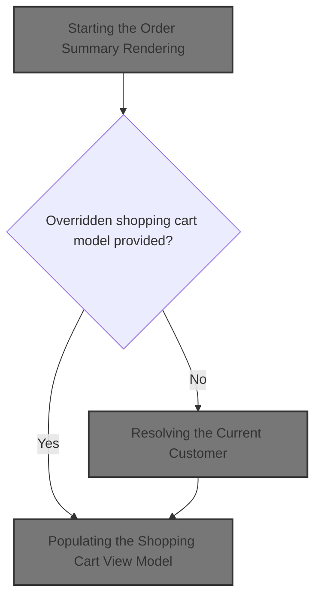
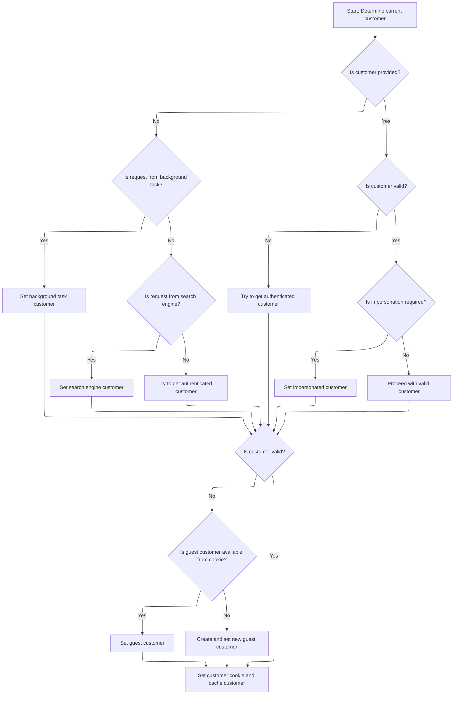

This document describes the flow for rendering the order summary for a customer. When a request is made, the system either uses an overridden shopping cart model or builds a new one by resolving the current store and customer context, determining the correct customer type, and assembling all relevant data for display.



# Starting the Order Summary Rendering

This section governs how the order summary is rendered for a customer, ensuring that either an overridden shopping cart model is used or a new one is built based on the current store and customer context.

| Category        | Rule Name                            | Description                                                                                                                                             |
| --------------- | ------------------------------------ | ------------------------------------------------------------------------------------------------------------------------------------------------------- |
| Data validation | Customer Context Resolution          | The current customer context must be resolved before retrieving the shopping cart for order summary rendering.                                          |
| Data validation | Cart Ownership and Store Association | The shopping cart used for the order summary must belong to the current customer and be associated with the current store.                              |
| Business logic  | Override Model Priority              | If an overridden shopping cart model is provided, it must be used for rendering the order summary instead of building a new model.                      |
| Business logic  | Default Model Construction           | If no overridden shopping cart model is provided, the order summary must be built using the shopping cart of the current customer in the current store. |

<SwmSnippet path="/src/Presentation/Nop.Web/Components/OrderSummaryViewComponent.cs" line="29">

---

In `OrderSummaryViewComponent.InvokeAsync`, we first check if an overridden shopping cart model is provided—if so, we just render that. If not, we start building a new model by getting the current store and then the shopping cart for the current customer in that store. To get the cart, we need to know who the customer is, so the next step is resolving the current customer context via <SwmToken path="src/Presentation/Nop.Web.Framework/WebWorkContext.cs" pos="27:6:6" line-data="public partial class WebWorkContext : IWorkContext">`WebWorkContext`</SwmToken>.

```c#
    public async Task<IViewComponentResult> InvokeAsync(bool? prepareAndDisplayOrderReviewData, ShoppingCartModel overriddenModel)
    {
        //use already prepared (shared) model
        if (overriddenModel != null)
            return View(overriddenModel);

        //if not passed, then create a new model
        var store = await _storeContext.GetCurrentStoreAsync();
        var cart = await _shoppingCartService.GetShoppingCartAsync(await _workContext.GetCurrentCustomerAsync(), ShoppingCartType.ShoppingCart, store.Id);

```

---

</SwmSnippet>

## Resolving the Current Customer

This section is responsible for identifying and providing the current customer for the web context, ensuring that the customer is only resolved once per request and reused if needed multiple times.

| Category        | Rule Name             | Description                                                                                                                                                                                                  |
| --------------- | --------------------- | ------------------------------------------------------------------------------------------------------------------------------------------------------------------------------------------------------------ |
| Data validation | Valid customer output | The resolved customer must be returned as a valid customer object, and if no customer can be resolved, the output must indicate this according to business requirements (e.g., anonymous customer or error). |
| Business logic  | Customer caching      | If a customer has already been resolved and cached for the current context, that customer must be returned for all subsequent requests within the same context.                                              |
| Business logic  | Customer resolution   | If the current customer has not been resolved, the system must determine the customer using the appropriate logic and cache the result for future use in the same context.                                   |

<SwmSnippet path="/src/Presentation/Nop.Web.Framework/WebWorkContext.cs" line="196">

---

<SwmToken path="src/Presentation/Nop.Web.Framework/WebWorkContext.cs" pos="196:12:12" line-data="    public virtual async Task&lt;Customer&gt; GetCurrentCustomerAsync()">`GetCurrentCustomerAsync`</SwmToken> checks if we've already resolved the customer for this context. If not, it runs the logic to figure out who the current customer is and caches the result. This avoids redundant work if the customer is needed again later in the flow.

```c#
    public virtual async Task<Customer> GetCurrentCustomerAsync()
    {
        //whether there is a cached value
        if (_cachedCustomer != null)
            return _cachedCustomer;

        await SetCurrentCustomerAsync();

        return _cachedCustomer;
    }
```

---

</SwmSnippet>

## Determining Customer Context



This section is responsible for determining and setting the current customer context for each request in nopCommerce. It ensures that the correct customer type is identified and validated, covering scenarios such as background tasks, search engines, authenticated users, impersonation, and guests.

| Category        | Rule Name                           | Description                                                                                                                                                                                                                                                                                                                                                                                                               |
| --------------- | ----------------------------------- | ------------------------------------------------------------------------------------------------------------------------------------------------------------------------------------------------------------------------------------------------------------------------------------------------------------------------------------------------------------------------------------------------------------------------- |
| Data validation | Authenticated Customer Validation   | If a customer is not provided, attempt to retrieve an authenticated customer using the authentication service. Only assign the customer if they are active, not deleted, do not require <SwmToken path="src/Libraries/Nop.Services/Authentication/CookieAuthenticationService.cs" pos="133:10:12" line-data="        //require a customer to re-login after password changing">`re-login`</SwmToken>, and are registered. |
| Data validation | Guest Customer from Cookie          | If no valid customer is found, attempt to retrieve a guest customer from the cookie. Only assign the guest customer if they are not registered.                                                                                                                                                                                                                                                                           |
| Business logic  | Background Task Customer Assignment | If a customer is not provided, and the request is from a background task, assign the <SwmToken path="src/Presentation/Nop.Web.Framework/WebWorkContext.cs" pos="221:10:12" line-data="                //in this case return built-in customer record for background task">`built-in`</SwmToken> background task customer as the current customer.                                                                         |
| Business logic  | Search Engine Customer Assignment   | If a customer is not provided, and the request is from a search engine, assign the <SwmToken path="src/Presentation/Nop.Web.Framework/WebWorkContext.cs" pos="221:10:12" line-data="                //in this case return built-in customer record for background task">`built-in`</SwmToken> search engine customer as the current customer.                                                                             |
| Business logic  | Impersonation Handling              | If impersonation is required for the authenticated customer, switch the context to the impersonated customer only if the impersonated customer is active, not deleted, and does not require <SwmToken path="src/Libraries/Nop.Services/Authentication/CookieAuthenticationService.cs" pos="133:10:12" line-data="        //require a customer to re-login after password changing">`re-login`</SwmToken>.                 |
| Business logic  | New Guest Customer Creation         | If no valid customer is found after all checks, create and assign a new guest customer.                                                                                                                                                                                                                                                                                                                                   |
| Technical step  | Customer Cookie and Caching         | Once a valid customer is determined, set a customer cookie and cache the customer context for future requests.                                                                                                                                                                                                                                                                                                            |

<SwmSnippet path="/src/Presentation/Nop.Web.Framework/WebWorkContext.cs" line="212">

---

In <SwmToken path="src/Presentation/Nop.Web.Framework/WebWorkContext.cs" pos="212:9:9" line-data="    public virtual async Task SetCurrentCustomerAsync(Customer customer = null)">`SetCurrentCustomerAsync`</SwmToken>, we run through a series of checks to figure out what kind of customer context we're dealing with—background task, search engine, authenticated user, impersonation, guest from cookie, or new guest. If we get to the authenticated user check, we need to call the authentication service to see if there's a <SwmToken path="src/Presentation/Nop.Web.Framework/WebWorkContext.cs" pos="293:12:14" line-data="    /// Gets the current vendor (logged-in manager)">`logged-in`</SwmToken> customer, which is why we jump to <SwmToken path="src/Libraries/Nop.Services/Authentication/CookieAuthenticationService.cs" pos="12:6:6" line-data="public partial class CookieAuthenticationService : IAuthenticationService">`CookieAuthenticationService`</SwmToken> next.

```c#
    public virtual async Task SetCurrentCustomerAsync(Customer customer = null)
    {
        if (customer == null)
        {
            //check whether request is made by a background (schedule) task
            if (_httpContextAccessor.HttpContext?.Request
                    ?.Path.Equals(new PathString($"/{NopTaskDefaults.ScheduleTaskPath}"), StringComparison.InvariantCultureIgnoreCase)
                ?? true)
            {
                //in this case return built-in customer record for background task
                customer = await _customerService.GetOrCreateBackgroundTaskUserAsync();
            }

            if (customer == null || customer.Deleted || !customer.Active || customer.RequireReLogin)
            {
                //check whether request is made by a search engine, in this case return built-in customer record for search engines
                if (_userAgentHelper.IsSearchEngine())
                    customer = await _customerService.GetOrCreateSearchEngineUserAsync();
            }

            if (customer == null || customer.Deleted || !customer.Active || customer.RequireReLogin)
            {
                //try to get registered user
                customer = await _authenticationService.GetAuthenticatedCustomerAsync();
            }

```

---

</SwmSnippet>

<SwmSnippet path="/src/Libraries/Nop.Services/Authentication/CookieAuthenticationService.cs" line="96">

---

<SwmToken path="src/Libraries/Nop.Services/Authentication/CookieAuthenticationService.cs" pos="96:12:12" line-data="    public virtual async Task&lt;Customer&gt; GetAuthenticatedCustomerAsync()">`GetAuthenticatedCustomerAsync`</SwmToken> checks for a cached authenticated customer first. If not found, it uses [ASP.NET](http://ASP.NET) Core's authentication middleware to see if the user is logged in, then fetches the customer by username or email depending on config. It validates the customer's status and checks if the password has changed since login (forcing <SwmToken path="src/Libraries/Nop.Services/Authentication/CookieAuthenticationService.cs" pos="133:10:12" line-data="        //require a customer to re-login after password changing">`re-login`</SwmToken> if needed). If all checks pass, it caches and returns the customer.

```c#
    public virtual async Task<Customer> GetAuthenticatedCustomerAsync()
    {
        //whether there is a cached customer
        if (_cachedCustomer != null)
            return _cachedCustomer;

        //try to get authenticated user identity
        var authenticateResult = await _httpContextAccessor.HttpContext.AuthenticateAsync(NopAuthenticationDefaults.AuthenticationScheme);
        if (!authenticateResult.Succeeded)
            return null;

        Customer customer = null;
        if (_customerSettings.UsernamesEnabled)
        {
            //try to get customer by username
            var usernameClaim = authenticateResult.Principal.FindFirst(claim => claim.Type == ClaimTypes.Name
                && claim.Issuer.Equals(NopAuthenticationDefaults.ClaimsIssuer, StringComparison.InvariantCultureIgnoreCase));
            if (usernameClaim != null)
                customer = await _customerService.GetCustomerByUsernameAsync(usernameClaim.Value);
        }
        else
        {
            //try to get customer by email
            var emailClaim = authenticateResult.Principal.FindFirst(claim => claim.Type == ClaimTypes.Email
                                                                             && claim.Issuer.Equals(NopAuthenticationDefaults.ClaimsIssuer, StringComparison.InvariantCultureIgnoreCase));
            if (emailClaim != null)
                customer = await _customerService.GetCustomerByEmailAsync(emailClaim.Value);
        }

        //whether the found customer is available
        if (customer == null || !customer.Active || customer.RequireReLogin || customer.Deleted || !await _customerService.IsRegisteredAsync(customer))
            return null;
            
        static DateTime trimMilliseconds(DateTime dt) => new(dt.Year, dt.Month, dt.Day, dt.Hour, dt.Minute, dt.Second, 0, dt.Kind);

        //get the latest password
        var customerPassword = await _customerService.GetCurrentPasswordAsync(customer.Id);
        //require a customer to re-login after password changing
        var isPasswordChange = trimMilliseconds(customerPassword.CreatedOnUtc).CompareTo(trimMilliseconds(authenticateResult.Properties.IssuedUtc?.DateTime ?? DateTime.UtcNow)) > 0;
        if (_customerSettings.RequiredReLoginAfterPasswordChange && isPasswordChange)
            return null;

        //cache authenticated customer
        _cachedCustomer = customer;

        return _cachedCustomer;
    }
```

---

</SwmSnippet>

<SwmSnippet path="/src/Presentation/Nop.Web.Framework/WebWorkContext.cs" line="238">

---

Back in <SwmToken path="src/Presentation/Nop.Web.Framework/WebWorkContext.cs" pos="202:3:3" line-data="        await SetCurrentCustomerAsync();">`SetCurrentCustomerAsync`</SwmToken>, after checking for an authenticated user, we handle impersonation by switching to the impersonated customer if needed. If still no valid customer, we try to resolve a guest from a cookie or create a new guest. Once a valid customer is found, we set the cookie and cache it. This covers all scenarios: admin impersonation, guests, background tasks, and search engines.

```c#
            if (customer != null && !customer.Deleted && customer.Active && !customer.RequireReLogin)
            {
                //get impersonate user if required
                var impersonatedCustomerId = await _genericAttributeService
                    .GetAttributeAsync<int?>(customer, NopCustomerDefaults.ImpersonatedCustomerIdAttribute);
                if (impersonatedCustomerId.HasValue && impersonatedCustomerId.Value > 0)
                {
                    var impersonatedCustomer = await _customerService.GetCustomerByIdAsync(impersonatedCustomerId.Value);
                    if (impersonatedCustomer != null && !impersonatedCustomer.Deleted &&
                        impersonatedCustomer.Active &&
                        !impersonatedCustomer.RequireReLogin)
                    {
                        //set impersonated customer
                        _originalCustomerIfImpersonated = customer;
                        customer = impersonatedCustomer;
                    }
                }
            }

            if (customer == null || customer.Deleted || !customer.Active || customer.RequireReLogin)
            {
                //get guest customer
                var customerCookie = GetCustomerCookie();
                if (Guid.TryParse(customerCookie, out var customerGuid))
                {
                    //get customer from cookie (should not be registered)
                    var customerByCookie = await _customerService.GetCustomerByGuidAsync(customerGuid);
                    if (customerByCookie != null && !await _customerService.IsRegisteredAsync(customerByCookie))
                        customer = customerByCookie;
                }
            }

            if (customer == null || customer.Deleted || !customer.Active || customer.RequireReLogin)
            {
                //create guest if not exists
                customer = await _customerService.InsertGuestCustomerAsync();
            }
        }

        if (!customer.Deleted && customer.Active && !customer.RequireReLogin)
        {
            //set customer cookie
            SetCustomerCookie(customer.CustomerGuid);

            //cache the found customer
            _cachedCustomer = customer;
        }
    }
```

---

</SwmSnippet>

## Building the Shopping Cart Model

<SwmSnippet path="/src/Presentation/Nop.Web/Components/OrderSummaryViewComponent.cs" line="39">

---

Back in `OrderSummaryViewComponent.InvokeAsync`, after resolving the customer and cart, we build the <SwmToken path="src/Presentation/Nop.Web/Components/OrderSummaryViewComponent.cs" pos="39:9:9" line-data="        var model = new ShoppingCartModel();">`ShoppingCartModel`</SwmToken> using the factory. This step pulls together all the info needed for the view, not just the cart items. That's why we call the <SwmToken path="src/Presentation/Nop.Web/Factories/ShoppingCartModelFactory.cs" pos="42:6:6" line-data="public partial class ShoppingCartModelFactory : IShoppingCartModelFactory">`ShoppingCartModelFactory`</SwmToken> next.

```c#
        var model = new ShoppingCartModel();
        model = await _shoppingCartModelFactory.PrepareShoppingCartModelAsync(model, cart,
            isEditable: false,
            prepareAndDisplayOrderReviewData: prepareAndDisplayOrderReviewData.GetValueOrDefault());
        return View(model);
    }
```

---

</SwmSnippet>

# Populating the Shopping Cart View Model

```mermaid
%%{init: {"flowchart": {"defaultRenderer": "elk"}} }%%
flowchart TD
  node1["Start: Prepare shopping cart model"]
  click node1 openCode "src/Presentation/Nop.Web/Factories/ShoppingCartModelFactory.cs:857:867"
  node1 --> node2{"Is cart empty?"}
  click node2 openCode "src/Presentation/Nop.Web/Factories/ShoppingCartModelFactory.cs:869:870"
  node2 -->|"Yes"| node3["Return model"]
  click node3 openCode "src/Presentation/Nop.Web/Factories/ShoppingCartModelFactory.cs:870:870"
  node2 -->|"No"| node4["Set basic cart properties"]
  click node4 openCode "src/Presentation/Nop.Web/Factories/ShoppingCartModelFactory.cs:867:876"
  node4 --> node5{"Meets minimum order subtotal?"}
  click node5 openCode "src/Presentation/Nop.Web/Factories/ShoppingCartModelFactory.cs:880:881"
  node5 -->|"No"| node6["Add minimum order subtotal warning"]
  click node6 openCode "src/Presentation/Nop.Web/Factories/ShoppingCartModelFactory.cs:883:885"
  node5 -->|"Yes"| node7["Show discount box"]
  click node7 openCode "src/Presentation/Nop.Web/Factories/ShoppingCartModelFactory.cs:893:893"
  node6 --> node7
  node7 --> node8["Show gift card box"]
  click node8 openCode "src/Presentation/Nop.Web/Factories/ShoppingCartModelFactory.cs:911:911"

  subgraph loop1["For each discount code"]
    node7 --> node9{"Is discount code valid?"}
    click node9 openCode "src/Presentation/Nop.Web/Factories/ShoppingCartModelFactory.cs:896:901"
    node9 -->|"Yes"| node10["Add discount to model"]
    click node10 openCode "src/Presentation/Nop.Web/Factories/ShoppingCartModelFactory.cs:903:908"
    node9 -->|"No"| node11["Skip discount"]
    click node11 openCode "src/Presentation/Nop.Web/Factories/ShoppingCartModelFactory.cs:901:901"
    node10 --> node8
    node11 --> node8
  end

  node8 --> node12["Get cart warnings"]
  click node12 openCode "src/Presentation/Nop.Web/Factories/ShoppingCartModelFactory.cs:914:914"
  subgraph loop2["For each cart warning"]
    node12 --> node13["Add warning to model"]
    click node13 openCode "src/Presentation/Nop.Web/Factories/ShoppingCartModelFactory.cs:916:916"
    node13 --> node14["Prepare checkout attributes"]
    click node14 openCode "src/Presentation/Nop.Web/Factories/ShoppingCartModelFactory.cs:919:919"
  end

  node14 --> node15["Prepare cart items"]
  click node15 openCode "src/Presentation/Nop.Web/Factories/ShoppingCartModelFactory.cs:921:926"
  subgraph loop3["For each cart item"]
    node15 --> node16["Prepare item model"]
    click node16 openCode "src/Presentation/Nop.Web/Factories/ShoppingCartModelFactory.cs:924:925"
    node16 --> node17["Add item to model"]
    click node17 openCode "src/Presentation/Nop.Web/Factories/ShoppingCartModelFactory.cs:925:925"
    node17 --> node18["Determine payment methods"]
    click node18 openCode "src/Presentation/Nop.Web/Factories/ShoppingCartModelFactory.cs:930:940"
  end

  node18 --> node19["Add button payment methods"]
  click node19 openCode "src/Presentation/Nop.Web/Factories/ShoppingCartModelFactory.cs:941:948"
  subgraph loop4["For each button payment method"]
    node19 --> node20["Add view component to model"]
    click node20 openCode "src/Presentation/Nop.Web/Factories/ShoppingCartModelFactory.cs:946:947"
    node20 --> node21{"Only button payment methods?"}
    click node21 openCode "src/Presentation/Nop.Web/Factories/ShoppingCartModelFactory.cs:950:950"
  end

  node21 -->|"Yes"| node22["Hide checkout button"]
  click node22 openCode "src/Presentation/Nop.Web/Factories/ShoppingCartModelFactory.cs:950:950"
  node21 -->|"No"| node23["Show checkout button"]
  click node23 openCode "src/Presentation/Nop.Web/Factories/ShoppingCartModelFactory.cs:950:950"
  node22 --> node24{"Show order review data?"}
  node23 --> node24
  click node24 openCode "src/Presentation/Nop.Web/Factories/ShoppingCartModelFactory.cs:953:954"
  node24 -->|"Yes"| node25["Prepare order review data"]
  click node25 openCode "src/Presentation/Nop.Web/Factories/ShoppingCartModelFactory.cs:955:956"
  node24 -->|"No"| node26["Skip order review data"]
  click node26 openCode "src/Presentation/Nop.Web/Factories/ShoppingCartModelFactory.cs:957:957"
  node25 --> node27["Return model"]
  click node27 openCode "src/Presentation/Nop.Web/Factories/ShoppingCartModelFactory.cs:958:959"
  node26 --> node27
classDef HeadingStyle fill:#777777,stroke:#333,stroke-width:2px;

%% Swimm:
%% %%{init: {"flowchart": {"defaultRenderer": "elk"}} }%%
%% flowchart TD
%%   node1["Start: Prepare shopping cart model"]
%%   click node1 openCode "<SwmPath>[src/…/Factories/ShoppingCartModelFactory.cs](src/Presentation/Nop.Web/Factories/ShoppingCartModelFactory.cs)</SwmPath>:857:867"
%%   node1 --> node2{"Is cart empty?"}
%%   click node2 openCode "<SwmPath>[src/…/Factories/ShoppingCartModelFactory.cs](src/Presentation/Nop.Web/Factories/ShoppingCartModelFactory.cs)</SwmPath>:869:870"
%%   node2 -->|"Yes"| node3["Return model"]
%%   click node3 openCode "<SwmPath>[src/…/Factories/ShoppingCartModelFactory.cs](src/Presentation/Nop.Web/Factories/ShoppingCartModelFactory.cs)</SwmPath>:870:870"
%%   node2 -->|"No"| node4["Set basic cart properties"]
%%   click node4 openCode "<SwmPath>[src/…/Factories/ShoppingCartModelFactory.cs](src/Presentation/Nop.Web/Factories/ShoppingCartModelFactory.cs)</SwmPath>:867:876"
%%   node4 --> node5{"Meets minimum order subtotal?"}
%%   click node5 openCode "<SwmPath>[src/…/Factories/ShoppingCartModelFactory.cs](src/Presentation/Nop.Web/Factories/ShoppingCartModelFactory.cs)</SwmPath>:880:881"
%%   node5 -->|"No"| node6["Add minimum order subtotal warning"]
%%   click node6 openCode "<SwmPath>[src/…/Factories/ShoppingCartModelFactory.cs](src/Presentation/Nop.Web/Factories/ShoppingCartModelFactory.cs)</SwmPath>:883:885"
%%   node5 -->|"Yes"| node7["Show discount box"]
%%   click node7 openCode "<SwmPath>[src/…/Factories/ShoppingCartModelFactory.cs](src/Presentation/Nop.Web/Factories/ShoppingCartModelFactory.cs)</SwmPath>:893:893"
%%   node6 --> node7
%%   node7 --> node8["Show gift card box"]
%%   click node8 openCode "<SwmPath>[src/…/Factories/ShoppingCartModelFactory.cs](src/Presentation/Nop.Web/Factories/ShoppingCartModelFactory.cs)</SwmPath>:911:911"
%% 
%%   subgraph loop1["For each discount code"]
%%     node7 --> node9{"Is discount code valid?"}
%%     click node9 openCode "<SwmPath>[src/…/Factories/ShoppingCartModelFactory.cs](src/Presentation/Nop.Web/Factories/ShoppingCartModelFactory.cs)</SwmPath>:896:901"
%%     node9 -->|"Yes"| node10["Add discount to model"]
%%     click node10 openCode "<SwmPath>[src/…/Factories/ShoppingCartModelFactory.cs](src/Presentation/Nop.Web/Factories/ShoppingCartModelFactory.cs)</SwmPath>:903:908"
%%     node9 -->|"No"| node11["Skip discount"]
%%     click node11 openCode "<SwmPath>[src/…/Factories/ShoppingCartModelFactory.cs](src/Presentation/Nop.Web/Factories/ShoppingCartModelFactory.cs)</SwmPath>:901:901"
%%     node10 --> node8
%%     node11 --> node8
%%   end
%% 
%%   node8 --> node12["Get cart warnings"]
%%   click node12 openCode "<SwmPath>[src/…/Factories/ShoppingCartModelFactory.cs](src/Presentation/Nop.Web/Factories/ShoppingCartModelFactory.cs)</SwmPath>:914:914"
%%   subgraph loop2["For each cart warning"]
%%     node12 --> node13["Add warning to model"]
%%     click node13 openCode "<SwmPath>[src/…/Factories/ShoppingCartModelFactory.cs](src/Presentation/Nop.Web/Factories/ShoppingCartModelFactory.cs)</SwmPath>:916:916"
%%     node13 --> node14["Prepare checkout attributes"]
%%     click node14 openCode "<SwmPath>[src/…/Factories/ShoppingCartModelFactory.cs](src/Presentation/Nop.Web/Factories/ShoppingCartModelFactory.cs)</SwmPath>:919:919"
%%   end
%% 
%%   node14 --> node15["Prepare cart items"]
%%   click node15 openCode "<SwmPath>[src/…/Factories/ShoppingCartModelFactory.cs](src/Presentation/Nop.Web/Factories/ShoppingCartModelFactory.cs)</SwmPath>:921:926"
%%   subgraph loop3["For each cart item"]
%%     node15 --> node16["Prepare item model"]
%%     click node16 openCode "<SwmPath>[src/…/Factories/ShoppingCartModelFactory.cs](src/Presentation/Nop.Web/Factories/ShoppingCartModelFactory.cs)</SwmPath>:924:925"
%%     node16 --> node17["Add item to model"]
%%     click node17 openCode "<SwmPath>[src/…/Factories/ShoppingCartModelFactory.cs](src/Presentation/Nop.Web/Factories/ShoppingCartModelFactory.cs)</SwmPath>:925:925"
%%     node17 --> node18["Determine payment methods"]
%%     click node18 openCode "<SwmPath>[src/…/Factories/ShoppingCartModelFactory.cs](src/Presentation/Nop.Web/Factories/ShoppingCartModelFactory.cs)</SwmPath>:930:940"
%%   end
%% 
%%   node18 --> node19["Add button payment methods"]
%%   click node19 openCode "<SwmPath>[src/…/Factories/ShoppingCartModelFactory.cs](src/Presentation/Nop.Web/Factories/ShoppingCartModelFactory.cs)</SwmPath>:941:948"
%%   subgraph loop4["For each button payment method"]
%%     node19 --> node20["Add view component to model"]
%%     click node20 openCode "<SwmPath>[src/…/Factories/ShoppingCartModelFactory.cs](src/Presentation/Nop.Web/Factories/ShoppingCartModelFactory.cs)</SwmPath>:946:947"
%%     node20 --> node21{"Only button payment methods?"}
%%     click node21 openCode "<SwmPath>[src/…/Factories/ShoppingCartModelFactory.cs](src/Presentation/Nop.Web/Factories/ShoppingCartModelFactory.cs)</SwmPath>:950:950"
%%   end
%% 
%%   node21 -->|"Yes"| node22["Hide checkout button"]
%%   click node22 openCode "<SwmPath>[src/…/Factories/ShoppingCartModelFactory.cs](src/Presentation/Nop.Web/Factories/ShoppingCartModelFactory.cs)</SwmPath>:950:950"
%%   node21 -->|"No"| node23["Show checkout button"]
%%   click node23 openCode "<SwmPath>[src/…/Factories/ShoppingCartModelFactory.cs](src/Presentation/Nop.Web/Factories/ShoppingCartModelFactory.cs)</SwmPath>:950:950"
%%   node22 --> node24{"Show order review data?"}
%%   node23 --> node24
%%   click node24 openCode "<SwmPath>[src/…/Factories/ShoppingCartModelFactory.cs](src/Presentation/Nop.Web/Factories/ShoppingCartModelFactory.cs)</SwmPath>:953:954"
%%   node24 -->|"Yes"| node25["Prepare order review data"]
%%   click node25 openCode "<SwmPath>[src/…/Factories/ShoppingCartModelFactory.cs](src/Presentation/Nop.Web/Factories/ShoppingCartModelFactory.cs)</SwmPath>:955:956"
%%   node24 -->|"No"| node26["Skip order review data"]
%%   click node26 openCode "<SwmPath>[src/…/Factories/ShoppingCartModelFactory.cs](src/Presentation/Nop.Web/Factories/ShoppingCartModelFactory.cs)</SwmPath>:957:957"
%%   node25 --> node27["Return model"]
%%   click node27 openCode "<SwmPath>[src/…/Factories/ShoppingCartModelFactory.cs](src/Presentation/Nop.Web/Factories/ShoppingCartModelFactory.cs)</SwmPath>:958:959"
%%   node26 --> node27
%% classDef HeadingStyle fill:#777777,stroke:#333,stroke-width:2px;
```



This section is responsible for assembling all the necessary data and settings into the <SwmToken path="src/Presentation/Nop.Web/Components/OrderSummaryViewComponent.cs" pos="29:18:18" line-data="    public async Task&lt;IViewComponentResult&gt; InvokeAsync(bool? prepareAndDisplayOrderReviewData, ShoppingCartModel overriddenModel)">`ShoppingCartModel`</SwmToken> so that the shopping cart page can display a complete and accurate representation of the user's cart, including items, discounts, warnings, payment options, and checkout attributes.

| Category       | Rule Name                           | Description                                                                                                                                            |
| -------------- | ----------------------------------- | ------------------------------------------------------------------------------------------------------------------------------------------------------ |
| Business logic | Empty cart shortcut                 | If the shopping cart is empty, the model is returned immediately without further population.                                                           |
| Business logic | Minimum order subtotal warning      | If the cart subtotal does not meet the minimum order requirement, a warning message is added to the model.                                             |
| Business logic | Discount box display and validation | The discount box is displayed if enabled in store settings, and only valid discount codes are added to the model.                                      |
| Business logic | Gift card box display               | The gift card box is displayed if enabled in store settings.                                                                                           |
| Business logic | Cart warnings display               | All cart warnings generated by the shopping cart service are added to the model for display to the user.                                               |
| Business logic | Checkout attributes population      | Checkout attributes are prepared and added to the model, including localization, price adjustments, and previously selected values.                    |
| Business logic | Cart items representation           | Each cart item is represented in the model with its details, ensuring all items are visible and editable as appropriate.                               |
| Business logic | Payment methods population          | All available payment methods are loaded and split into button and non-button types; button payment methods are added to the model for direct display. |
| Business logic | Checkout button visibility          | If only button payment methods are available, the checkout button is hidden; otherwise, it is shown.                                                   |
| Business logic | Order review data inclusion         | Order review data is prepared and added to the model only if requested by the input flag.                                                              |

<SwmSnippet path="/src/Presentation/Nop.Web/Factories/ShoppingCartModelFactory.cs" line="857">

---

In <SwmToken path="src/Presentation/Nop.Web/Factories/ShoppingCartModelFactory.cs" pos="857:12:12" line-data="    public virtual async Task&lt;ShoppingCartModel&gt; PrepareShoppingCartModelAsync(ShoppingCartModel model,">`PrepareShoppingCartModelAsync`</SwmToken>, we set up basic properties, check if the cart is empty (and bail if so), then start populating the model with settings, customer/store info, subtotal checks, and discount codes. This sets up the context for the rest of the model population.

```c#
    public virtual async Task<ShoppingCartModel> PrepareShoppingCartModelAsync(ShoppingCartModel model,
        IList<ShoppingCartItem> cart, bool isEditable = true,
        bool validateCheckoutAttributes = false,
        bool prepareAndDisplayOrderReviewData = false)
    {
        ArgumentNullException.ThrowIfNull(cart);

        ArgumentNullException.ThrowIfNull(model);

        //simple properties
        model.OnePageCheckoutEnabled = _orderSettings.OnePageCheckoutEnabled;

        if (!cart.Any())
            return model;

        model.IsEditable = isEditable;
        model.ShowProductImages = _shoppingCartSettings.ShowProductImagesOnShoppingCart;
        model.ShowSku = _catalogSettings.ShowSkuOnProductDetailsPage;
        model.ShowVendorName = _vendorSettings.ShowVendorOnOrderDetailsPage;
        var customer = await _workContext.GetCurrentCustomerAsync();
        var store = await _storeContext.GetCurrentStoreAsync();
        var checkoutAttributesXml = await _genericAttributeService.GetAttributeAsync<string>(customer,
            NopCustomerDefaults.CheckoutAttributes, store.Id);
        var minOrderSubtotalAmountOk = await _orderProcessingService.ValidateMinOrderSubtotalAmountAsync(cart);
        if (!minOrderSubtotalAmountOk)
        {
            var minOrderSubtotalAmount = await _currencyService.ConvertFromPrimaryStoreCurrencyAsync(_orderSettings.MinOrderSubtotalAmount, await _workContext.GetWorkingCurrencyAsync());
            model.MinOrderSubtotalWarning = string.Format(await _localizationService.GetResourceAsync("Checkout.MinOrderSubtotalAmount"), await _priceFormatter.FormatPriceAsync(minOrderSubtotalAmount, true, false));
        }

        model.TermsOfServiceOnShoppingCartPage = _orderSettings.TermsOfServiceOnShoppingCartPage;
        model.TermsOfServiceOnOrderConfirmPage = _orderSettings.TermsOfServiceOnOrderConfirmPage;
        model.TermsOfServicePopup = _commonSettings.PopupForTermsOfServiceLinks;
        model.DisplayTaxShippingInfo = _catalogSettings.DisplayTaxShippingInfoShoppingCart;

        //discount and gift card boxes
        model.DiscountBox.Display = _shoppingCartSettings.ShowDiscountBox;
        var discountCouponCodes = await _customerService.ParseAppliedDiscountCouponCodesAsync(customer);

        foreach (var couponCode in discountCouponCodes)
        {
            var discount = await (await _discountService.GetAllDiscountsAsync(couponCode: couponCode))
                .FirstOrDefaultAwaitAsync(async d => d.RequiresCouponCode && (await _discountService.ValidateDiscountAsync(d, customer, discountCouponCodes)).IsValid);

            if (discount != null)
            {
                model.DiscountBox.AppliedDiscountsWithCodes.Add(new ShoppingCartModel.DiscountBoxModel.DiscountInfoModel
                {
                    Id = discount.Id,
                    CouponCode = discount.CouponCode
                });
            }
        }
```

---

</SwmSnippet>

<SwmSnippet path="/src/Presentation/Nop.Web/Factories/ShoppingCartModelFactory.cs" line="911">

---

After setting up discounts, we show the gift card box if enabled and pull in any cart warnings from the shopping cart service. These warnings get added to the model for display.

```c#
        model.GiftCardBox.Display = _shoppingCartSettings.ShowGiftCardBox;

        //cart warnings
        var cartWarnings = await _shoppingCartService.GetShoppingCartWarningsAsync(cart, checkoutAttributesXml, validateCheckoutAttributes);
        foreach (var warning in cartWarnings)
            model.Warnings.Add(warning);
```

---

</SwmSnippet>

<SwmSnippet path="/src/Presentation/Nop.Web/Factories/ShoppingCartModelFactory.cs" line="916">

---

After handling warnings, we prepare checkout attributes using a separate method. This keeps the logic modular since checkout attributes can be pretty involved.

```c#
            model.Warnings.Add(warning);

        //checkout attributes
        model.CheckoutAttributes = await PrepareCheckoutAttributeModelsAsync(cart);

```

---

</SwmSnippet>

<SwmSnippet path="/src/Presentation/Nop.Web/Factories/ShoppingCartModelFactory.cs" line="214">

---

<SwmToken path="src/Presentation/Nop.Web/Factories/ShoppingCartModelFactory.cs" pos="214:16:16" line-data="    protected virtual async Task&lt;IList&lt;ShoppingCartModel.CheckoutAttributeModel&gt;&gt; PrepareCheckoutAttributeModelsAsync(">`PrepareCheckoutAttributeModelsAsync`</SwmToken> builds up the list of checkout attributes for the cart, handling localization, price adjustments, and remembering what the customer picked last time. It supports all the different attribute types, including files and dates.

```c#
    protected virtual async Task<IList<ShoppingCartModel.CheckoutAttributeModel>> PrepareCheckoutAttributeModelsAsync(
        IList<ShoppingCartItem> cart)
    {
        ArgumentNullException.ThrowIfNull(cart);

        var model = new List<ShoppingCartModel.CheckoutAttributeModel>();
        var store = await _storeContext.GetCurrentStoreAsync();
        var excludeShippableAttributes = !await _shoppingCartService.ShoppingCartRequiresShippingAsync(cart);
        var checkoutAttributes =
            await _checkoutAttributeService.GetAllAttributesAsync(_staticCacheManager, _storeMappingService, store.Id, excludeShippableAttributes);
        foreach (var attribute in checkoutAttributes)
        {
            var attributeModel = new ShoppingCartModel.CheckoutAttributeModel
            {
                Id = attribute.Id,
                Name = await _localizationService.GetLocalizedAsync(attribute, x => x.Name),
                TextPrompt = await _localizationService.GetLocalizedAsync(attribute, x => x.TextPrompt),
                IsRequired = attribute.IsRequired,
                AttributeControlType = attribute.AttributeControlType,
                DefaultValue = await _localizationService.GetLocalizedAsync(attribute, x => x.DefaultValue)
            };
            if (!string.IsNullOrEmpty(attribute.ValidationFileAllowedExtensions))
            {
                attributeModel.AllowedFileExtensions = attribute.ValidationFileAllowedExtensions
                    .Split(_separator, StringSplitOptions.RemoveEmptyEntries)
                    .ToList();
            }

            if (attribute.ShouldHaveValues)
            {
                //values
                var attributeValues = await _checkoutAttributeService.GetAttributeValuesAsync(attribute.Id);
                foreach (var attributeValue in attributeValues)
                {
                    var attributeValueModel = new ShoppingCartModel.CheckoutAttributeValueModel
                    {
                        Id = attributeValue.Id,
                        Name = await _localizationService.GetLocalizedAsync(attributeValue, x => x.Name),
                        ColorSquaresRgb = attributeValue.ColorSquaresRgb,
                        IsPreSelected = attributeValue.IsPreSelected,
                    };
                    attributeModel.Values.Add(attributeValueModel);

                    //display price if allowed
                    if (await _permissionService.AuthorizeAsync(StandardPermission.PublicStore.DISPLAY_PRICES))
                    {
                        var (priceAdjustmentBase, _) = await _taxService.GetCheckoutAttributePriceAsync(attribute, attributeValue);
                        var priceAdjustment =
                            await _currencyService.ConvertFromPrimaryStoreCurrencyAsync(priceAdjustmentBase,
                                await _workContext.GetWorkingCurrencyAsync());
                        if (priceAdjustmentBase > decimal.Zero)
                            attributeValueModel.PriceAdjustment =
                                "+" + await _priceFormatter.FormatPriceAsync(priceAdjustment);
                        else if (priceAdjustmentBase < decimal.Zero)
                            attributeValueModel.PriceAdjustment =
                                "-" + await _priceFormatter.FormatPriceAsync(-priceAdjustment);
                    }
                }
            }

            //set already selected attributes
            var selectedCheckoutAttributes = await _genericAttributeService.GetAttributeAsync<string>(
                await _workContext.GetCurrentCustomerAsync(),
                NopCustomerDefaults.CheckoutAttributes, store.Id);
            switch (attribute.AttributeControlType)
            {
                case AttributeControlType.DropdownList:
                case AttributeControlType.RadioList:
                case AttributeControlType.Checkboxes:
                case AttributeControlType.ColorSquares:
                case AttributeControlType.ImageSquares:
                {
                    if (!string.IsNullOrEmpty(selectedCheckoutAttributes))
                    {
                        //clear default selection
                        foreach (var item in attributeModel.Values)
                            item.IsPreSelected = false;

                        //select new values
                        var selectedValues =
                            _checkoutAttributeParser.ParseAttributeValues(selectedCheckoutAttributes);
                        foreach (var attributeValue in await selectedValues.SelectMany(x => x.values).ToListAsync())
                        foreach (var item in attributeModel.Values)
                            if (attributeValue.Id == item.Id)
                                item.IsPreSelected = true;
                    }
                }

                    break;
                case AttributeControlType.ReadonlyCheckboxes:
                {
                    //do nothing
                    //values are already pre-set
                }

                    break;
                case AttributeControlType.TextBox:
                case AttributeControlType.MultilineTextbox:
                {
                    if (!string.IsNullOrEmpty(selectedCheckoutAttributes))
                    {
                        var enteredText =
                            _checkoutAttributeParser.ParseValues(selectedCheckoutAttributes, attribute.Id);
                        if (enteredText.Any())
                            attributeModel.DefaultValue = enteredText[0];
                    }
                }

                    break;
                case AttributeControlType.Datepicker:
                {
                    //keep in mind my that the code below works only in the current culture
                    var selectedDateStr =
                        _checkoutAttributeParser.ParseValues(selectedCheckoutAttributes, attribute.Id);
                    if (selectedDateStr.Any())
                    {
                        if (DateTime.TryParseExact(selectedDateStr[0], "D", CultureInfo.CurrentCulture,
                                DateTimeStyles.None, out var selectedDate))
                        {
                            //successfully parsed
                            attributeModel.SelectedDay = selectedDate.Day;
                            attributeModel.SelectedMonth = selectedDate.Month;
                            attributeModel.SelectedYear = selectedDate.Year;
                        }
                    }
                }

                    break;
                case AttributeControlType.FileUpload:
                {
                    if (!string.IsNullOrEmpty(selectedCheckoutAttributes))
                    {
                        var downloadGuidStr = _checkoutAttributeParser
                            .ParseValues(selectedCheckoutAttributes, attribute.Id).FirstOrDefault();
                        _ = Guid.TryParse(downloadGuidStr, out var downloadGuid);
                        var download = await _downloadService.GetDownloadByGuidAsync(downloadGuid);
                        if (download != null)
                            attributeModel.DefaultValue = download.DownloadGuid.ToString();
                    }
                }

                    break;
                default:
                    break;
            }

            model.Add(attributeModel);
        }
```

---

</SwmSnippet>

<SwmSnippet path="/src/Presentation/Nop.Web/Factories/ShoppingCartModelFactory.cs" line="921">

---

Back in <SwmToken path="src/Presentation/Nop.Web/Components/OrderSummaryViewComponent.cs" pos="40:9:9" line-data="        model = await _shoppingCartModelFactory.PrepareShoppingCartModelAsync(model, cart,">`PrepareShoppingCartModelAsync`</SwmToken>, after building checkout attributes, we loop through the cart items and prepare a model for each one. This way, every item gets its own detailed representation for the view.

```c#
        //cart items
        foreach (var sci in cart)
        {
            var cartItemModel = await PrepareShoppingCartItemModelAsync(cart, sci);
            model.Items.Add(cartItemModel);
        }
```

---

</SwmSnippet>

<SwmSnippet path="/src/Presentation/Nop.Web/Factories/ShoppingCartModelFactory.cs" line="928">

---

After adding cart items, we load all payment methods, split them into button and non-button types, and add the button ones to the model for display. This lets the UI show things like PayPal buttons directly on the cart page.

```c#
        //payment methods
        //all payment methods (do not filter by country here as it could be not specified yet)
        var paymentMethods = await (await _paymentPluginManager
                .LoadActivePluginsAsync(customer, store.Id))
            .WhereAwait(async pm => !await pm.HidePaymentMethodAsync(cart)).ToListAsync();
        //payment methods displayed during checkout (not with "Button" type)
        var nonButtonPaymentMethods = paymentMethods
            .Where(pm => pm.PaymentMethodType != PaymentMethodType.Button)
            .ToList();
        //"button" payment methods(*displayed on the shopping cart page)
        var buttonPaymentMethods = paymentMethods
            .Where(pm => pm.PaymentMethodType == PaymentMethodType.Button)
            .ToList();
        foreach (var pm in buttonPaymentMethods)
        {
            if (await _shoppingCartService.ShoppingCartIsRecurringAsync(cart) && pm.RecurringPaymentType == RecurringPaymentType.NotSupported)
                continue;

            var viewComponent = pm.GetPublicViewComponent();
            model.ButtonPaymentMethodViewComponents.Add(viewComponent);
        }
```

---

</SwmSnippet>

<SwmSnippet path="/src/Presentation/Nop.Web/Factories/ShoppingCartModelFactory.cs" line="949">

---

Before returning the model, we hide the checkout button if needed and add order review data if requested. The final model is ready for the view at this point.

```c#
        //hide "Checkout" button if we have only "Button" payment methods
        model.HideCheckoutButton = !nonButtonPaymentMethods.Any() && model.ButtonPaymentMethodViewComponents.Any();

        //order review data
        if (prepareAndDisplayOrderReviewData)
        {
            model.OrderReviewData = await PrepareOrderReviewDataModelAsync(cart);
        }

        return model;
    }
```

---

</SwmSnippet>

&nbsp;

*This is an auto-generated document by Swimm 🌊 and has not yet been verified by a human*

<SwmMeta version="3.0.0" repo-id="Z2l0aHViJTNBJTNBY3NoYXJwLW5vcENvbW1lcmNlJTNBJTNBcmljYXJkb2xvcGV6Zw==" repo-name="csharp-nopCommerce"><sup>Powered by [Swimm](https://app.swimm.io/)</sup></SwmMeta>
