This document describes the process for placing a customer order, triggered by checkout or payment approval. It enforces business rules to prevent duplicate orders, requires a minimum interval between orders, and handles payment, discounts, notifications, and recurring orders. The input is a customer order request, and the output is a processed order with customer activity logged.


# Where is this flow used?

This flow is used multiple times in the codebase as represented in the following diagram:

```mermaid
graph TD;
      1164e74fa77e875d624c37ea113d022778742b7f0e10d44ef018b9a23b341c0b(src/…/Services/PayPalCommerceServiceManager.cs::PayPalCommerceServiceManager.PlaceOrderAsync) --> 279ea30ea3c3f128b61ceca4550d25ec736b049c362f70d31fe2afb614d81825(src/…/Orders/OrderProcessingService.cs::OrderProcessingService.PlaceOrderAsync)

720061ee0f1a07553dd8f526ab568c043749310dffddcae9d8f1933721eeb16d(src/…/Factories/PayPalCommerceModelFactory.cs::PayPalCommerceModelFactory.PrepareOrderCompletedModelAsync) --> 1164e74fa77e875d624c37ea113d022778742b7f0e10d44ef018b9a23b341c0b(src/…/Services/PayPalCommerceServiceManager.cs::PayPalCommerceServiceManager.PlaceOrderAsync)

1dcd4377393f79d843f85ebec341a304d3ccfb7a2a13c0a05c55875e4dd19f43(src/…/Controllers/PayPalCommercePublicController.cs::PayPalCommercePublicController.ApproveOrder) --> 720061ee0f1a07553dd8f526ab568c043749310dffddcae9d8f1933721eeb16d(src/…/Factories/PayPalCommerceModelFactory.cs::PayPalCommerceModelFactory.PrepareOrderCompletedModelAsync)

ee093853687538720ec9e4a1f225fb7b71b97d6e46daa52cbf62c27ac09a31a6(src/…/Controllers/PayPalCommercePublicController.cs::PayPalCommercePublicController.ConfirmOrderPost) --> 720061ee0f1a07553dd8f526ab568c043749310dffddcae9d8f1933721eeb16d(src/…/Factories/PayPalCommerceModelFactory.cs::PayPalCommerceModelFactory.PrepareOrderCompletedModelAsync)

81776b494118902aebc11353b391290437c8ca6ecc38af80b521d8afb5cc1d19(src/…/Controllers/PayPalCommercePublicController.cs::PayPalCommercePublicController.ApproveToken) --> 720061ee0f1a07553dd8f526ab568c043749310dffddcae9d8f1933721eeb16d(src/…/Factories/PayPalCommerceModelFactory.cs::PayPalCommerceModelFactory.PrepareOrderCompletedModelAsync)

4050016b4173fe19f415fdba7c31851affea85e93ef23617f54264f5789eefe4(src/…/Controllers/CheckoutController.cs::CheckoutController.ConfirmOrder) --> 279ea30ea3c3f128b61ceca4550d25ec736b049c362f70d31fe2afb614d81825(src/…/Orders/OrderProcessingService.cs::OrderProcessingService.PlaceOrderAsync)

a8d40e6ac925726e3fba2dc0cb05aa6f1779beb492a9ca82b323d2d736803be5(src/…/Controllers/CheckoutController.cs::CheckoutController.OpcConfirmOrder) --> 279ea30ea3c3f128b61ceca4550d25ec736b049c362f70d31fe2afb614d81825(src/…/Orders/OrderProcessingService.cs::OrderProcessingService.PlaceOrderAsync)


classDef mainFlowStyle color:#000000,fill:#7CB9F4
classDef rootsStyle color:#000000,fill:#00FFF4
classDef Style1 color:#000000,fill:#00FFAA
classDef Style2 color:#000000,fill:#FFFF00
classDef Style3 color:#000000,fill:#AA7CB9

%% Swimm:
%% graph TD;
%%       1164e74fa77e875d624c37ea113d022778742b7f0e10d44ef018b9a23b341c0b(<SwmPath>[src/…/Services/PayPalCommerceServiceManager.cs](src/Plugins/Nop.Plugin.Payments.PayPalCommerce/Services/PayPalCommerceServiceManager.cs)</SwmPath>::PayPalCommerceServiceManager.PlaceOrderAsync) --> 279ea30ea3c3f128b61ceca4550d25ec736b049c362f70d31fe2afb614d81825(<SwmPath>[src/…/Orders/OrderProcessingService.cs](src/Libraries/Nop.Services/Orders/OrderProcessingService.cs)</SwmPath>::OrderProcessingService.PlaceOrderAsync)
%% 
%% 720061ee0f1a07553dd8f526ab568c043749310dffddcae9d8f1933721eeb16d(<SwmPath>[src/…/Factories/PayPalCommerceModelFactory.cs](src/Plugins/Nop.Plugin.Payments.PayPalCommerce/Factories/PayPalCommerceModelFactory.cs)</SwmPath>::PayPalCommerceModelFactory.PrepareOrderCompletedModelAsync) --> 1164e74fa77e875d624c37ea113d022778742b7f0e10d44ef018b9a23b341c0b(<SwmPath>[src/…/Services/PayPalCommerceServiceManager.cs](src/Plugins/Nop.Plugin.Payments.PayPalCommerce/Services/PayPalCommerceServiceManager.cs)</SwmPath>::PayPalCommerceServiceManager.PlaceOrderAsync)
%% 
%% 1dcd4377393f79d843f85ebec341a304d3ccfb7a2a13c0a05c55875e4dd19f43(<SwmPath>[src/…/Controllers/PayPalCommercePublicController.cs](src/Plugins/Nop.Plugin.Payments.PayPalCommerce/Controllers/PayPalCommercePublicController.cs)</SwmPath>::PayPalCommercePublicController.ApproveOrder) --> 720061ee0f1a07553dd8f526ab568c043749310dffddcae9d8f1933721eeb16d(<SwmPath>[src/…/Factories/PayPalCommerceModelFactory.cs](src/Plugins/Nop.Plugin.Payments.PayPalCommerce/Factories/PayPalCommerceModelFactory.cs)</SwmPath>::PayPalCommerceModelFactory.PrepareOrderCompletedModelAsync)
%% 
%% ee093853687538720ec9e4a1f225fb7b71b97d6e46daa52cbf62c27ac09a31a6(<SwmPath>[src/…/Controllers/PayPalCommercePublicController.cs](src/Plugins/Nop.Plugin.Payments.PayPalCommerce/Controllers/PayPalCommercePublicController.cs)</SwmPath>::PayPalCommercePublicController.ConfirmOrderPost) --> 720061ee0f1a07553dd8f526ab568c043749310dffddcae9d8f1933721eeb16d(<SwmPath>[src/…/Factories/PayPalCommerceModelFactory.cs](src/Plugins/Nop.Plugin.Payments.PayPalCommerce/Factories/PayPalCommerceModelFactory.cs)</SwmPath>::PayPalCommerceModelFactory.PrepareOrderCompletedModelAsync)
%% 
%% 81776b494118902aebc11353b391290437c8ca6ecc38af80b521d8afb5cc1d19(<SwmPath>[src/…/Controllers/PayPalCommercePublicController.cs](src/Plugins/Nop.Plugin.Payments.PayPalCommerce/Controllers/PayPalCommercePublicController.cs)</SwmPath>::PayPalCommercePublicController.ApproveToken) --> 720061ee0f1a07553dd8f526ab568c043749310dffddcae9d8f1933721eeb16d(<SwmPath>[src/…/Factories/PayPalCommerceModelFactory.cs](src/Plugins/Nop.Plugin.Payments.PayPalCommerce/Factories/PayPalCommerceModelFactory.cs)</SwmPath>::PayPalCommerceModelFactory.PrepareOrderCompletedModelAsync)
%% 
%% 4050016b4173fe19f415fdba7c31851affea85e93ef23617f54264f5789eefe4(<SwmPath>[src/…/Controllers/CheckoutController.cs](src/Presentation/Nop.Web/Controllers/CheckoutController.cs)</SwmPath>::CheckoutController.ConfirmOrder) --> 279ea30ea3c3f128b61ceca4550d25ec736b049c362f70d31fe2afb614d81825(<SwmPath>[src/…/Orders/OrderProcessingService.cs](src/Libraries/Nop.Services/Orders/OrderProcessingService.cs)</SwmPath>::OrderProcessingService.PlaceOrderAsync)
%% 
%% a8d40e6ac925726e3fba2dc0cb05aa6f1779beb492a9ca82b323d2d736803be5(<SwmPath>[src/…/Controllers/CheckoutController.cs](src/Presentation/Nop.Web/Controllers/CheckoutController.cs)</SwmPath>::CheckoutController.OpcConfirmOrder) --> 279ea30ea3c3f128b61ceca4550d25ec736b049c362f70d31fe2afb614d81825(<SwmPath>[src/…/Orders/OrderProcessingService.cs](src/Libraries/Nop.Services/Orders/OrderProcessingService.cs)</SwmPath>::OrderProcessingService.PlaceOrderAsync)
%% 
%% 
%% classDef mainFlowStyle color:#000000,fill:#7CB9F4
%% classDef rootsStyle color:#000000,fill:#00FFF4
%% classDef Style1 color:#000000,fill:#00FFAA
%% classDef Style2 color:#000000,fill:#FFFF00
%% classDef Style3 color:#000000,fill:#AA7CB9
```



# Placing an Order with Concurrency and Activity Logging

```mermaid
%%{init: {"flowchart": {"defaultRenderer": "elk"}} }%%
flowchart TD
    node0{"Is Order GUID valid?"}
    click node0 openCode "src/Libraries/Nop.Services/Orders/OrderProcessingService.cs:1544:1545"
    node0 -->|"Yes"| node1{"Is order placement locked?"}
    click node1 openCode "src/Libraries/Nop.Services/Orders/OrderProcessingService.cs:1621:1622"
    node0 -->|"No"| node16["Return error"]
    click node16 openCode "src/Libraries/Nop.Services/Orders/OrderProcessingService.cs:1545:1545"
    node1 -->|"No"| node2["Prepare order details"]
    click node2 openCode "src/Libraries/Nop.Services/Orders/OrderProcessingService.cs:1548:1548"
    node1 -->|"Yes"| node3{"Is minimum interval met?"}
    click node3 openCode "src/Libraries/Nop.Services/Orders/OrderProcessingService.cs:1642:1645"
    node3 -->|"No"| node16
    node3 -->|"Yes"| node2
    node2 --> node4["Process payment"]
    click node4 openCode "src/Libraries/Nop.Services/Orders/OrderProcessingService.cs:1557:1558"
    node4 --> node5{"Is payment successful?"}
    click node5 openCode "src/Libraries/Nop.Services/Orders/OrderProcessingService.cs:1560:1561"
    node5 -->|"Yes"| node6["Save order details"]
    click node6 openCode "src/Libraries/Nop.Services/Orders/OrderProcessingService.cs:1562:1564"
    node6 --> node7["Move cart items to order items"]
    click node7 openCode "src/Libraries/Nop.Services/Orders/OrderProcessingService.cs:1567:1567"
    node7 --> node8["Apply discounts and gift cards"]
    click node8 openCode "src/Libraries/Nop.Services/Orders/OrderProcessingService.cs:1570:1573"
    node8 --> node9{"Is order recurring?"}
    click node9 openCode "src/Libraries/Nop.Services/Orders/OrderProcessingService.cs:1576:1577"
    node9 -->|"Yes"| node10["Create recurring payment"]
    click node10 openCode "src/Libraries/Nop.Services/Orders/OrderProcessingService.cs:1577:1577"
    node9 -->|"No"| node11["Send notifications"]
    click node11 openCode "src/Libraries/Nop.Services/Orders/OrderProcessingService.cs:1580:1581"
    node10 --> node11
    node11 --> node12["Reset checkout data"]
    click node12 openCode "src/Libraries/Nop.Services/Orders/OrderProcessingService.cs:1583:1584"
    node12 --> node13["Log activity and publish event"]
    click node13 openCode "src/Libraries/Nop.Services/Orders/OrderProcessingService.cs:1585:1590"
    node13 --> node14["Check order status"]
    click node14 openCode "src/Libraries/Nop.Services/Orders/OrderProcessingService.cs:1593:1593"
    node14 --> node15{"Is order paid?"}
    click node15 openCode "src/Libraries/Nop.Services/Orders/OrderProcessingService.cs:1595:1596"
    node15 -->|"Yes"| node19["Process paid order"]
    click node19 openCode "src/Libraries/Nop.Services/Orders/OrderProcessingService.cs:1596:1597"
    node15 -->|"No"| node17["Return result"]
    click node17 openCode "src/Libraries/Nop.Services/Orders/OrderProcessingService.cs:1610:1611"
    node5 -->|"No"| subgraph loop1["For each payment error"]
        node18["Add payment error"]
        click node18 openCode "src/Libraries/Nop.Services/Orders/OrderProcessingService.cs:1599:1601"
    end
    loop1 --> node20["Log errors and retrieve customer"]
    click node20 openCode "src/Libraries/Nop.Services/Orders/OrderProcessingService.cs:1613:1616"
    node20 --> node21["Log error"]
    click node21 openCode "src/Libraries/Nop.Services/Orders/OrderProcessingService.cs:1616:1617"
    node21 --> node17

classDef HeadingStyle fill:#777777,stroke:#333,stroke-width:2px;

%% Swimm:
%% %%{init: {"flowchart": {"defaultRenderer": "elk"}} }%%
%% flowchart TD
%%     node0{"Is Order GUID valid?"}
%%     click node0 openCode "<SwmPath>[src/…/Orders/OrderProcessingService.cs](src/Libraries/Nop.Services/Orders/OrderProcessingService.cs)</SwmPath>:1544:1545"
%%     node0 -->|"Yes"| node1{"Is order placement locked?"}
%%     click node1 openCode "<SwmPath>[src/…/Orders/OrderProcessingService.cs](src/Libraries/Nop.Services/Orders/OrderProcessingService.cs)</SwmPath>:1621:1622"
%%     node0 -->|"No"| node16["Return error"]
%%     click node16 openCode "<SwmPath>[src/…/Orders/OrderProcessingService.cs](src/Libraries/Nop.Services/Orders/OrderProcessingService.cs)</SwmPath>:1545:1545"
%%     node1 -->|"No"| node2["Prepare order details"]
%%     click node2 openCode "<SwmPath>[src/…/Orders/OrderProcessingService.cs](src/Libraries/Nop.Services/Orders/OrderProcessingService.cs)</SwmPath>:1548:1548"
%%     node1 -->|"Yes"| node3{"Is minimum interval met?"}
%%     click node3 openCode "<SwmPath>[src/…/Orders/OrderProcessingService.cs](src/Libraries/Nop.Services/Orders/OrderProcessingService.cs)</SwmPath>:1642:1645"
%%     node3 -->|"No"| node16
%%     node3 -->|"Yes"| node2
%%     node2 --> node4["Process payment"]
%%     click node4 openCode "<SwmPath>[src/…/Orders/OrderProcessingService.cs](src/Libraries/Nop.Services/Orders/OrderProcessingService.cs)</SwmPath>:1557:1558"
%%     node4 --> node5{"Is payment successful?"}
%%     click node5 openCode "<SwmPath>[src/…/Orders/OrderProcessingService.cs](src/Libraries/Nop.Services/Orders/OrderProcessingService.cs)</SwmPath>:1560:1561"
%%     node5 -->|"Yes"| node6["Save order details"]
%%     click node6 openCode "<SwmPath>[src/…/Orders/OrderProcessingService.cs](src/Libraries/Nop.Services/Orders/OrderProcessingService.cs)</SwmPath>:1562:1564"
%%     node6 --> node7["Move cart items to order items"]
%%     click node7 openCode "<SwmPath>[src/…/Orders/OrderProcessingService.cs](src/Libraries/Nop.Services/Orders/OrderProcessingService.cs)</SwmPath>:1567:1567"
%%     node7 --> node8["Apply discounts and gift cards"]
%%     click node8 openCode "<SwmPath>[src/…/Orders/OrderProcessingService.cs](src/Libraries/Nop.Services/Orders/OrderProcessingService.cs)</SwmPath>:1570:1573"
%%     node8 --> node9{"Is order recurring?"}
%%     click node9 openCode "<SwmPath>[src/…/Orders/OrderProcessingService.cs](src/Libraries/Nop.Services/Orders/OrderProcessingService.cs)</SwmPath>:1576:1577"
%%     node9 -->|"Yes"| node10["Create recurring payment"]
%%     click node10 openCode "<SwmPath>[src/…/Orders/OrderProcessingService.cs](src/Libraries/Nop.Services/Orders/OrderProcessingService.cs)</SwmPath>:1577:1577"
%%     node9 -->|"No"| node11["Send notifications"]
%%     click node11 openCode "<SwmPath>[src/…/Orders/OrderProcessingService.cs](src/Libraries/Nop.Services/Orders/OrderProcessingService.cs)</SwmPath>:1580:1581"
%%     node10 --> node11
%%     node11 --> node12["Reset checkout data"]
%%     click node12 openCode "<SwmPath>[src/…/Orders/OrderProcessingService.cs](src/Libraries/Nop.Services/Orders/OrderProcessingService.cs)</SwmPath>:1583:1584"
%%     node12 --> node13["Log activity and publish event"]
%%     click node13 openCode "<SwmPath>[src/…/Orders/OrderProcessingService.cs](src/Libraries/Nop.Services/Orders/OrderProcessingService.cs)</SwmPath>:1585:1590"
%%     node13 --> node14["Check order status"]
%%     click node14 openCode "<SwmPath>[src/…/Orders/OrderProcessingService.cs](src/Libraries/Nop.Services/Orders/OrderProcessingService.cs)</SwmPath>:1593:1593"
%%     node14 --> node15{"Is order paid?"}
%%     click node15 openCode "<SwmPath>[src/…/Orders/OrderProcessingService.cs](src/Libraries/Nop.Services/Orders/OrderProcessingService.cs)</SwmPath>:1595:1596"
%%     node15 -->|"Yes"| node19["Process paid order"]
%%     click node19 openCode "<SwmPath>[src/…/Orders/OrderProcessingService.cs](src/Libraries/Nop.Services/Orders/OrderProcessingService.cs)</SwmPath>:1596:1597"
%%     node15 -->|"No"| node17["Return result"]
%%     click node17 openCode "<SwmPath>[src/…/Orders/OrderProcessingService.cs](src/Libraries/Nop.Services/Orders/OrderProcessingService.cs)</SwmPath>:1610:1611"
%%     node5 -->|"No"| subgraph loop1["For each payment error"]
%%         node18["Add payment error"]
%%         click node18 openCode "<SwmPath>[src/…/Orders/OrderProcessingService.cs](src/Libraries/Nop.Services/Orders/OrderProcessingService.cs)</SwmPath>:1599:1601"
%%     end
%%     loop1 --> node20["Log errors and retrieve customer"]
%%     click node20 openCode "<SwmPath>[src/…/Orders/OrderProcessingService.cs](src/Libraries/Nop.Services/Orders/OrderProcessingService.cs)</SwmPath>:1613:1616"
%%     node20 --> node21["Log error"]
%%     click node21 openCode "<SwmPath>[src/…/Orders/OrderProcessingService.cs](src/Libraries/Nop.Services/Orders/OrderProcessingService.cs)</SwmPath>:1616:1617"
%%     node21 --> node17
%% 
%% classDef HeadingStyle fill:#777777,stroke:#333,stroke-width:2px;
```

This section governs the business process for placing an order in nopCommerce, ensuring that orders are validated, processed safely under concurrency, and that customer activity is logged for auditing. It also enforces business constraints such as minimum intervals between orders and proper error handling for payment and order placement issues.

| Category        | Rule Name                        | Description                                                                                                                                                                                                                                 |
| --------------- | -------------------------------- | ------------------------------------------------------------------------------------------------------------------------------------------------------------------------------------------------------------------------------------------- |
| Data validation | Order GUID Validation            | Every order must have a valid, non-empty GUID before processing can begin. If the GUID is missing or invalid, the order placement is rejected with an error.                                                                                |
| Business logic  | Order Placement Lock             | Order placement for a customer must be locked so that only one order can be placed at a time per customer, preventing duplicate or concurrent order submissions.                                                                            |
| Business logic  | Minimum Order Placement Interval | A minimum interval, as configured in the system settings, must elapse between two order placements by the same customer. If an order is attempted before this interval has passed, the order is rejected with an appropriate error message. |
| Business logic  | Customer Activity Logging        | After a successful order placement, customer activity must be logged, including the order ID, to provide an audit trail for support and compliance.                                                                                         |
| Business logic  | Paid Order Processing            | If the order is successfully placed and paid, the system must process the order as paid, triggering any post-payment business workflows.                                                                                                    |

<SwmSnippet path="/src/Libraries/Nop.Services/Orders/OrderProcessingService.cs" line="1540">

---

In <SwmToken path="src/Libraries/Nop.Services/Orders/OrderProcessingService.cs" pos="1540:12:12" line-data="    public virtual async Task&lt;PlaceOrderResult&gt; PlaceOrderAsync(ProcessPaymentRequest processPaymentRequest)">`PlaceOrderAsync`</SwmToken>, we validate input, prep order details, and use a nested function to handle the actual order placement steps. We log customer activity after checkout data is reset, so we have a record of the order action for auditing and support.

```c#
    public virtual async Task<PlaceOrderResult> PlaceOrderAsync(ProcessPaymentRequest processPaymentRequest)
    {
        ArgumentNullException.ThrowIfNull(processPaymentRequest);

        if (processPaymentRequest.OrderGuid == Guid.Empty)
            throw new Exception("Order GUID is not generated");

        //prepare order details
        var details = await PreparePlaceOrderDetailsAsync(processPaymentRequest);

        async Task<PlaceOrderResult> placeOrder(PlaceOrderContainer placeOrderContainer)
        {
            var result = new PlaceOrderResult();

            try
            {
                var processPaymentResult =
                    await GetProcessPaymentResultAsync(processPaymentRequest, placeOrderContainer)
                    ?? throw new NopException("processPaymentResult is not available");

                if (processPaymentResult.Success)
                {
                    var order = await SaveOrderDetailsAsync(processPaymentRequest, processPaymentResult,
                        placeOrderContainer);
                    result.PlacedOrder = order;

                    //move shopping cart items to order items
                    await MoveShoppingCartItemsToOrderItemsAsync(placeOrderContainer, order);

                    //discount usage history
                    await SaveDiscountUsageHistoryAsync(placeOrderContainer, order);

                    //gift card usage history
                    await SaveGiftCardUsageHistoryAsync(placeOrderContainer, order);

                    //recurring orders
                    if (placeOrderContainer.IsRecurringShoppingCart)
                        await CreateFirstRecurringPaymentAsync(processPaymentRequest, order);

                    //notifications
                    await SendNotificationsAndSaveNotesAsync(order);

                    //reset checkout data
                    await _customerService.ResetCheckoutDataAsync(placeOrderContainer.Customer,
                        processPaymentRequest.StoreId, clearCouponCodes: true, clearCheckoutAttributes: true);
                    await _customerActivityService.InsertActivityAsync("PublicStore.PlaceOrder",
                        string.Format(await _localizationService.GetResourceAsync("ActivityLog.PublicStore.PlaceOrder"),
                            order.Id), order);

```

---

</SwmSnippet>

<SwmSnippet path="/src/Libraries/Nop.Services/Logging/CustomerActivityService.cs" line="94">

---

<SwmToken path="src/Libraries/Nop.Services/Logging/CustomerActivityService.cs" pos="94:12:12" line-data="    public virtual async Task&lt;ActivityLog&gt; InsertActivityAsync(string systemKeyword, string comment, BaseEntity entity = null)">`InsertActivityAsync`</SwmToken> fetches the current customer from context and passes it to the real logging method, so you don't have to specify the customer every time you log an activity.

```c#
    public virtual async Task<ActivityLog> InsertActivityAsync(string systemKeyword, string comment, BaseEntity entity = null)
    {
        return await InsertActivityAsync(await _workContext.GetCurrentCustomerAsync(), systemKeyword, comment, entity);
    }
```

---

</SwmSnippet>

<SwmSnippet path="/src/Libraries/Nop.Services/Orders/OrderProcessingService.cs" line="1589">

---

Back in <SwmToken path="src/Libraries/Nop.Services/Orders/OrderProcessingService.cs" pos="1540:12:12" line-data="    public virtual async Task&lt;PlaceOrderResult&gt; PlaceOrderAsync(ProcessPaymentRequest processPaymentRequest)">`PlaceOrderAsync`</SwmToken>, after logging customer activity, the flow moves to concurrency and throttling. It uses a named mutex (by customer ID) to make sure only one order placement per customer runs at a time, preventing duplicates. Then it checks a cache to enforce a minimum interval between orders. If the cache says an order was just placed, it returns an error; otherwise, it proceeds and sets the cache flag if successful. This keeps order placement safe from race conditions and accidental double submissions.

```c#
                    //raise event       
                    await _eventPublisher.PublishAsync(new OrderPlacedEvent(order));

                    //check order status
                    await CheckOrderStatusAsync(order);

                    if (order.PaymentStatus == PaymentStatus.Paid)
                        await ProcessOrderPaidAsync(order);
                }
                else
                    foreach (var paymentError in processPaymentResult.Errors)
                        result.AddError(string.Format(
                            await _localizationService.GetResourceAsync("Checkout.PaymentError"), paymentError));
            }
            catch (Exception exc)
            {
                await _logger.ErrorAsync(exc.Message, exc);
                result.AddError(exc.Message);
            }

            if (result.Success)
                return result;

            //log errors
            var logError = result.Errors.Aggregate("Error while placing order. ",
                (current, next) => $"{current}Error {result.Errors.IndexOf(next) + 1}: {next}. ");
            var customer = await _customerService.GetCustomerByIdAsync(processPaymentRequest.CustomerId);
            await _logger.ErrorAsync(logError, customer: customer);

            return result;
        }

        if (!_orderSettings.PlaceOrderWithLock)
            return await placeOrder(details);

        PlaceOrderResult result;
        var resource = details.Customer.Id.ToString();

        //the named mutex helps to avoid creating the same order in different threads,
        //and does not decrease performance significantly, because the code is blocked only for the specific cart.
        //you should be very careful, mutexes cannot be used in with the await operation
        //we can't use semaphore here, because it produces PlatformNotSupportedException exception on UNIX based systems
        using var mutex = new Mutex(false, resource);

        mutex.WaitOne();

        try
        {
            var cacheKey = _staticCacheManager.PrepareKey(NopOrderDefaults.OrderWithLockCacheKey, resource);
            cacheKey.CacheTime = _orderSettings.MinimumOrderPlacementInterval;

            var exist = _staticCacheManager.Get(cacheKey, () => false);

            if (exist)
            {
                result = new PlaceOrderResult();
                result.Errors.Add(_localizationService.GetResourceAsync("Checkout.MinOrderPlacementInterval").Result);
            }
            else
            {
                result = placeOrder(details).Result;

                if (result.Success)
                    _staticCacheManager.SetAsync(cacheKey, true).Wait();
            }
        }
        finally
        {
            mutex.ReleaseMutex();
        }

        return result;
    }
```

---

</SwmSnippet>

&nbsp;

*This is an auto-generated document by Swimm 🌊 and has not yet been verified by a human*

<SwmMeta version="3.0.0" repo-id="Z2l0aHViJTNBJTNBY3NoYXJwLW5vcENvbW1lcmNlJTNBJTNBcmljYXJkb2xvcGV6Zw==" repo-name="csharp-nopCommerce"><sup>Powered by [Swimm](https://app.swimm.io/)</sup></SwmMeta>
