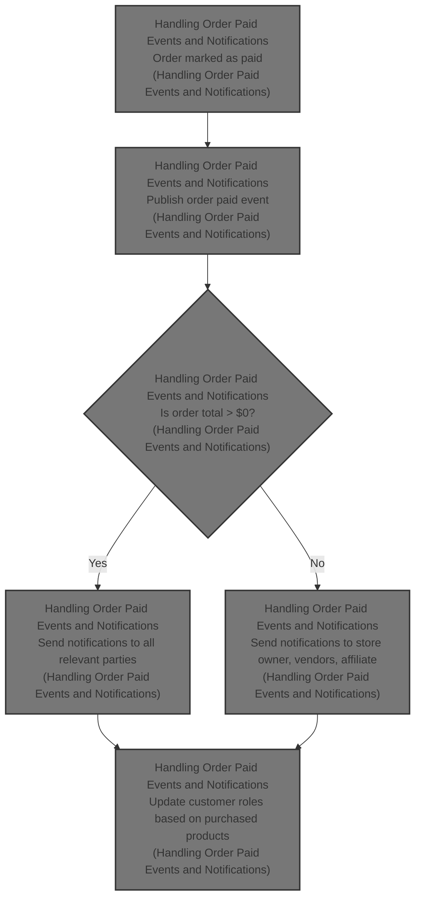

This document describes how the system processes a paid order by notifying all relevant parties and updating customer roles. When an order is marked as paid, notifications are sent to the customer (if the order total is greater than zero), store owner, vendors, and affiliate. Notification events are recorded for traceability, and customer roles are updated based on purchased products.



# Where is this flow used?

This flow is used multiple times in the codebase as represented in the following diagram:

(Note - these are only some of the entry points of this flow)

```mermaid
graph TD;
      81776b494118902aebc11353b391290437c8ca6ecc38af80b521d8afb5cc1d19(src/…/Controllers/PayPalCommercePublicController.cs::PayPalCommercePublicController.ApproveToken) --> 720061ee0f1a07553dd8f526ab568c043749310dffddcae9d8f1933721eeb16d(src/…/Factories/PayPalCommerceModelFactory.cs::PayPalCommerceModelFactory.PrepareOrderCompletedModelAsync)

720061ee0f1a07553dd8f526ab568c043749310dffddcae9d8f1933721eeb16d(src/…/Factories/PayPalCommerceModelFactory.cs::PayPalCommerceModelFactory.PrepareOrderCompletedModelAsync) --> 1164e74fa77e875d624c37ea113d022778742b7f0e10d44ef018b9a23b341c0b(src/…/Services/PayPalCommerceServiceManager.cs::PayPalCommerceServiceManager.PlaceOrderAsync)

720061ee0f1a07553dd8f526ab568c043749310dffddcae9d8f1933721eeb16d(src/…/Factories/PayPalCommerceModelFactory.cs::PayPalCommerceModelFactory.PrepareOrderCompletedModelAsync) --> dd50a277698b5ceaecb2156c0a4da60185fc5b5552e165bc8500e2a7b31f3db2(src/…/Services/PayPalCommerceServiceManager.cs::PayPalCommerceServiceManager.ConfirmOrderAsync)

1164e74fa77e875d624c37ea113d022778742b7f0e10d44ef018b9a23b341c0b(src/…/Services/PayPalCommerceServiceManager.cs::PayPalCommerceServiceManager.PlaceOrderAsync) --> 279ea30ea3c3f128b61ceca4550d25ec736b049c362f70d31fe2afb614d81825(src/…/Orders/OrderProcessingService.cs::OrderProcessingService.PlaceOrderAsync)

279ea30ea3c3f128b61ceca4550d25ec736b049c362f70d31fe2afb614d81825(src/…/Orders/OrderProcessingService.cs::OrderProcessingService.PlaceOrderAsync) --> add67c21703058d0d709840e971d2d03c5897e7e97829900f932799f306a3eaa(src/…/Orders/OrderProcessingService.cs::OrderProcessingService.ProcessOrderPaidAsync)

dd50a277698b5ceaecb2156c0a4da60185fc5b5552e165bc8500e2a7b31f3db2(src/…/Services/PayPalCommerceServiceManager.cs::PayPalCommerceServiceManager.ConfirmOrderAsync) --> 3fd7fd5bbc097de99dfd9b7c6a6f25b4ccd492e5bc79a93f589bbba2ce110ab0(src/…/Orders/OrderProcessingService.cs::OrderProcessingService.MarkOrderAsPaidAsync)

3fd7fd5bbc097de99dfd9b7c6a6f25b4ccd492e5bc79a93f589bbba2ce110ab0(src/…/Orders/OrderProcessingService.cs::OrderProcessingService.MarkOrderAsPaidAsync) --> add67c21703058d0d709840e971d2d03c5897e7e97829900f932799f306a3eaa(src/…/Orders/OrderProcessingService.cs::OrderProcessingService.ProcessOrderPaidAsync)

ee093853687538720ec9e4a1f225fb7b71b97d6e46daa52cbf62c27ac09a31a6(src/…/Controllers/PayPalCommercePublicController.cs::PayPalCommercePublicController.ConfirmOrderPost) --> 720061ee0f1a07553dd8f526ab568c043749310dffddcae9d8f1933721eeb16d(src/…/Factories/PayPalCommerceModelFactory.cs::PayPalCommerceModelFactory.PrepareOrderCompletedModelAsync)

1dcd4377393f79d843f85ebec341a304d3ccfb7a2a13c0a05c55875e4dd19f43(src/…/Controllers/PayPalCommercePublicController.cs::PayPalCommercePublicController.ApproveOrder) --> 720061ee0f1a07553dd8f526ab568c043749310dffddcae9d8f1933721eeb16d(src/…/Factories/PayPalCommerceModelFactory.cs::PayPalCommerceModelFactory.PrepareOrderCompletedModelAsync)

4050016b4173fe19f415fdba7c31851affea85e93ef23617f54264f5789eefe4(src/…/Controllers/CheckoutController.cs::CheckoutController.ConfirmOrder) --> 279ea30ea3c3f128b61ceca4550d25ec736b049c362f70d31fe2afb614d81825(src/…/Orders/OrderProcessingService.cs::OrderProcessingService.PlaceOrderAsync)

a8d40e6ac925726e3fba2dc0cb05aa6f1779beb492a9ca82b323d2d736803be5(src/…/Controllers/CheckoutController.cs::CheckoutController.OpcConfirmOrder) --> 279ea30ea3c3f128b61ceca4550d25ec736b049c362f70d31fe2afb614d81825(src/…/Orders/OrderProcessingService.cs::OrderProcessingService.PlaceOrderAsync)


classDef mainFlowStyle color:#000000,fill:#7CB9F4
classDef rootsStyle color:#000000,fill:#00FFF4
classDef Style1 color:#000000,fill:#00FFAA
classDef Style2 color:#000000,fill:#FFFF00
classDef Style3 color:#000000,fill:#AA7CB9

%% Swimm:
%% graph TD;
%%       81776b494118902aebc11353b391290437c8ca6ecc38af80b521d8afb5cc1d19(<SwmPath>[src/…/Controllers/PayPalCommercePublicController.cs](src/Plugins/Nop.Plugin.Payments.PayPalCommerce/Controllers/PayPalCommercePublicController.cs)</SwmPath>::PayPalCommercePublicController.ApproveToken) --> 720061ee0f1a07553dd8f526ab568c043749310dffddcae9d8f1933721eeb16d(<SwmPath>[src/…/Factories/PayPalCommerceModelFactory.cs](src/Plugins/Nop.Plugin.Payments.PayPalCommerce/Factories/PayPalCommerceModelFactory.cs)</SwmPath>::PayPalCommerceModelFactory.PrepareOrderCompletedModelAsync)
%% 
%% 720061ee0f1a07553dd8f526ab568c043749310dffddcae9d8f1933721eeb16d(<SwmPath>[src/…/Factories/PayPalCommerceModelFactory.cs](src/Plugins/Nop.Plugin.Payments.PayPalCommerce/Factories/PayPalCommerceModelFactory.cs)</SwmPath>::PayPalCommerceModelFactory.PrepareOrderCompletedModelAsync) --> 1164e74fa77e875d624c37ea113d022778742b7f0e10d44ef018b9a23b341c0b(<SwmPath>[src/…/Services/PayPalCommerceServiceManager.cs](src/Plugins/Nop.Plugin.Payments.PayPalCommerce/Services/PayPalCommerceServiceManager.cs)</SwmPath>::PayPalCommerceServiceManager.PlaceOrderAsync)
%% 
%% 720061ee0f1a07553dd8f526ab568c043749310dffddcae9d8f1933721eeb16d(<SwmPath>[src/…/Factories/PayPalCommerceModelFactory.cs](src/Plugins/Nop.Plugin.Payments.PayPalCommerce/Factories/PayPalCommerceModelFactory.cs)</SwmPath>::PayPalCommerceModelFactory.PrepareOrderCompletedModelAsync) --> dd50a277698b5ceaecb2156c0a4da60185fc5b5552e165bc8500e2a7b31f3db2(<SwmPath>[src/…/Services/PayPalCommerceServiceManager.cs](src/Plugins/Nop.Plugin.Payments.PayPalCommerce/Services/PayPalCommerceServiceManager.cs)</SwmPath>::PayPalCommerceServiceManager.ConfirmOrderAsync)
%% 
%% 1164e74fa77e875d624c37ea113d022778742b7f0e10d44ef018b9a23b341c0b(<SwmPath>[src/…/Services/PayPalCommerceServiceManager.cs](src/Plugins/Nop.Plugin.Payments.PayPalCommerce/Services/PayPalCommerceServiceManager.cs)</SwmPath>::PayPalCommerceServiceManager.PlaceOrderAsync) --> 279ea30ea3c3f128b61ceca4550d25ec736b049c362f70d31fe2afb614d81825(<SwmPath>[src/…/Orders/OrderProcessingService.cs](src/Libraries/Nop.Services/Orders/OrderProcessingService.cs)</SwmPath>::OrderProcessingService.PlaceOrderAsync)
%% 
%% 279ea30ea3c3f128b61ceca4550d25ec736b049c362f70d31fe2afb614d81825(<SwmPath>[src/…/Orders/OrderProcessingService.cs](src/Libraries/Nop.Services/Orders/OrderProcessingService.cs)</SwmPath>::OrderProcessingService.PlaceOrderAsync) --> add67c21703058d0d709840e971d2d03c5897e7e97829900f932799f306a3eaa(<SwmPath>[src/…/Orders/OrderProcessingService.cs](src/Libraries/Nop.Services/Orders/OrderProcessingService.cs)</SwmPath>::OrderProcessingService.ProcessOrderPaidAsync)
%% 
%% dd50a277698b5ceaecb2156c0a4da60185fc5b5552e165bc8500e2a7b31f3db2(<SwmPath>[src/…/Services/PayPalCommerceServiceManager.cs](src/Plugins/Nop.Plugin.Payments.PayPalCommerce/Services/PayPalCommerceServiceManager.cs)</SwmPath>::PayPalCommerceServiceManager.ConfirmOrderAsync) --> 3fd7fd5bbc097de99dfd9b7c6a6f25b4ccd492e5bc79a93f589bbba2ce110ab0(<SwmPath>[src/…/Orders/OrderProcessingService.cs](src/Libraries/Nop.Services/Orders/OrderProcessingService.cs)</SwmPath>::OrderProcessingService.MarkOrderAsPaidAsync)
%% 
%% 3fd7fd5bbc097de99dfd9b7c6a6f25b4ccd492e5bc79a93f589bbba2ce110ab0(<SwmPath>[src/…/Orders/OrderProcessingService.cs](src/Libraries/Nop.Services/Orders/OrderProcessingService.cs)</SwmPath>::OrderProcessingService.MarkOrderAsPaidAsync) --> add67c21703058d0d709840e971d2d03c5897e7e97829900f932799f306a3eaa(<SwmPath>[src/…/Orders/OrderProcessingService.cs](src/Libraries/Nop.Services/Orders/OrderProcessingService.cs)</SwmPath>::OrderProcessingService.ProcessOrderPaidAsync)
%% 
%% ee093853687538720ec9e4a1f225fb7b71b97d6e46daa52cbf62c27ac09a31a6(<SwmPath>[src/…/Controllers/PayPalCommercePublicController.cs](src/Plugins/Nop.Plugin.Payments.PayPalCommerce/Controllers/PayPalCommercePublicController.cs)</SwmPath>::PayPalCommercePublicController.ConfirmOrderPost) --> 720061ee0f1a07553dd8f526ab568c043749310dffddcae9d8f1933721eeb16d(<SwmPath>[src/…/Factories/PayPalCommerceModelFactory.cs](src/Plugins/Nop.Plugin.Payments.PayPalCommerce/Factories/PayPalCommerceModelFactory.cs)</SwmPath>::PayPalCommerceModelFactory.PrepareOrderCompletedModelAsync)
%% 
%% 1dcd4377393f79d843f85ebec341a304d3ccfb7a2a13c0a05c55875e4dd19f43(<SwmPath>[src/…/Controllers/PayPalCommercePublicController.cs](src/Plugins/Nop.Plugin.Payments.PayPalCommerce/Controllers/PayPalCommercePublicController.cs)</SwmPath>::PayPalCommercePublicController.ApproveOrder) --> 720061ee0f1a07553dd8f526ab568c043749310dffddcae9d8f1933721eeb16d(<SwmPath>[src/…/Factories/PayPalCommerceModelFactory.cs](src/Plugins/Nop.Plugin.Payments.PayPalCommerce/Factories/PayPalCommerceModelFactory.cs)</SwmPath>::PayPalCommerceModelFactory.PrepareOrderCompletedModelAsync)
%% 
%% 4050016b4173fe19f415fdba7c31851affea85e93ef23617f54264f5789eefe4(<SwmPath>[src/…/Controllers/CheckoutController.cs](src/Presentation/Nop.Web/Controllers/CheckoutController.cs)</SwmPath>::CheckoutController.ConfirmOrder) --> 279ea30ea3c3f128b61ceca4550d25ec736b049c362f70d31fe2afb614d81825(<SwmPath>[src/…/Orders/OrderProcessingService.cs](src/Libraries/Nop.Services/Orders/OrderProcessingService.cs)</SwmPath>::OrderProcessingService.PlaceOrderAsync)
%% 
%% a8d40e6ac925726e3fba2dc0cb05aa6f1779beb492a9ca82b323d2d736803be5(<SwmPath>[src/…/Controllers/CheckoutController.cs](src/Presentation/Nop.Web/Controllers/CheckoutController.cs)</SwmPath>::CheckoutController.OpcConfirmOrder) --> 279ea30ea3c3f128b61ceca4550d25ec736b049c362f70d31fe2afb614d81825(<SwmPath>[src/…/Orders/OrderProcessingService.cs](src/Libraries/Nop.Services/Orders/OrderProcessingService.cs)</SwmPath>::OrderProcessingService.PlaceOrderAsync)
%% 
%% 
%% classDef mainFlowStyle color:#000000,fill:#7CB9F4
%% classDef rootsStyle color:#000000,fill:#00FFF4
%% classDef Style1 color:#000000,fill:#00FFAA
%% classDef Style2 color:#000000,fill:#FFFF00
%% classDef Style3 color:#000000,fill:#AA7CB9
```



# Handling Order Paid Events and Notifications

```mermaid
%%{init: {"flowchart": {"defaultRenderer": "elk"}} }%%
flowchart TD
    node1["Order marked as paid"] --> node2["Publish order paid event"]
    click node1 openCode "src/Libraries/Nop.Services/Orders/OrderProcessingService.cs:1093:1095"
    click node2 openCode "src/Libraries/Nop.Services/Orders/OrderProcessingService.cs:1097:1097"
    node2 --> node3{"Is order total > $0?"}
    click node3 openCode "src/Libraries/Nop.Services/Orders/OrderProcessingService.cs:1100:1101"
    node3 -->|"Yes"| node4["Send paid order notification to customer"]
    click node4 openCode "src/Libraries/Nop.Services/Orders/OrderProcessingService.cs:1109:1110"
    node4 --> node5{"Was customer notification queued?"}
    click node5 openCode "src/Libraries/Nop.Services/Orders/OrderProcessingService.cs:1112:1112"
    node5 -->|"Yes"| node6["Record order note for customer notification"]
    click node6 openCode "src/Libraries/Nop.Services/Orders/OrderProcessingService.cs:1113:1113"
    node5 -->|"No"| node7["Send paid order notification to store owner"]
    node3 -->|"No"| node7
    click node7 openCode "src/Libraries/Nop.Services/Orders/OrderProcessingService.cs:1115:1115"
    node7 --> node8{"Was store owner notification queued?"}
    click node8 openCode "src/Libraries/Nop.Services/Orders/OrderProcessingService.cs:1116:1116"
    node8 -->|"Yes"| node9["Record order note for store owner notification"]
    click node9 openCode "src/Libraries/Nop.Services/Orders/OrderProcessingService.cs:1117:1117"
    node8 -->|"No"| node10["Process vendor notifications"]
    node9 --> node10
    
    subgraph loop1["For each vendor in order"]
        node10 --> node11["Send paid order notification to vendor"]
        click node11 openCode "src/Libraries/Nop.Services/Orders/OrderProcessingService.cs:1122:1122"
        node11 --> node12{"Was vendor notification queued?"}
        click node12 openCode "src/Libraries/Nop.Services/Orders/OrderProcessingService.cs:1124:1124"
        node12 -->|"Yes"| node13["Record order note for vendor notification"]
        click node13 openCode "src/Libraries/Nop.Services/Orders/OrderProcessingService.cs:1125:1125"
        node12 -->|"No"| node14["Next vendor"]
        node13 --> node14
    end
    node10 --> node15{"Is AffiliateId != 0?"}
    click node15 openCode "src/Libraries/Nop.Services/Orders/OrderProcessingService.cs:1128:1128"
    node15 -->|"Yes"| node16["Send paid order notification to affiliate"]
    click node16 openCode "src/Libraries/Nop.Services/Orders/OrderProcessingService.cs:1130:1131"
    node16 --> node17{"Was affiliate notification queued?"}
    click node17 openCode "src/Libraries/Nop.Services/Orders/OrderProcessingService.cs:1132:1132"
    node17 -->|"Yes"| node18["Record order note for affiliate notification"]
    click node18 openCode "src/Libraries/Nop.Services/Orders/OrderProcessingService.cs:1133:1133"
    node17 -->|"No"| node19["Update customer roles based on purchased products"]
    node15 -->|"No"| node19
    node18 --> node19["Update customer roles based on purchased products"]
    click node19 openCode "src/Libraries/Nop.Services/Orders/OrderProcessingService.cs:1138:1138"
classDef HeadingStyle fill:#777777,stroke:#333,stroke-width:2px;

%% Swimm:
%% %%{init: {"flowchart": {"defaultRenderer": "elk"}} }%%
%% flowchart TD
%%     node1["Order marked as paid"] --> node2["Publish order paid event"]
%%     click node1 openCode "<SwmPath>[src/…/Orders/OrderProcessingService.cs](src/Libraries/Nop.Services/Orders/OrderProcessingService.cs)</SwmPath>:1093:1095"
%%     click node2 openCode "<SwmPath>[src/…/Orders/OrderProcessingService.cs](src/Libraries/Nop.Services/Orders/OrderProcessingService.cs)</SwmPath>:1097:1097"
%%     node2 --> node3{"Is order total > $0?"}
%%     click node3 openCode "<SwmPath>[src/…/Orders/OrderProcessingService.cs](src/Libraries/Nop.Services/Orders/OrderProcessingService.cs)</SwmPath>:1100:1101"
%%     node3 -->|"Yes"| node4["Send paid order notification to customer"]
%%     click node4 openCode "<SwmPath>[src/…/Orders/OrderProcessingService.cs](src/Libraries/Nop.Services/Orders/OrderProcessingService.cs)</SwmPath>:1109:1110"
%%     node4 --> node5{"Was customer notification queued?"}
%%     click node5 openCode "<SwmPath>[src/…/Orders/OrderProcessingService.cs](src/Libraries/Nop.Services/Orders/OrderProcessingService.cs)</SwmPath>:1112:1112"
%%     node5 -->|"Yes"| node6["Record order note for customer notification"]
%%     click node6 openCode "<SwmPath>[src/…/Orders/OrderProcessingService.cs](src/Libraries/Nop.Services/Orders/OrderProcessingService.cs)</SwmPath>:1113:1113"
%%     node5 -->|"No"| node7["Send paid order notification to store owner"]
%%     node3 -->|"No"| node7
%%     click node7 openCode "<SwmPath>[src/…/Orders/OrderProcessingService.cs](src/Libraries/Nop.Services/Orders/OrderProcessingService.cs)</SwmPath>:1115:1115"
%%     node7 --> node8{"Was store owner notification queued?"}
%%     click node8 openCode "<SwmPath>[src/…/Orders/OrderProcessingService.cs](src/Libraries/Nop.Services/Orders/OrderProcessingService.cs)</SwmPath>:1116:1116"
%%     node8 -->|"Yes"| node9["Record order note for store owner notification"]
%%     click node9 openCode "<SwmPath>[src/…/Orders/OrderProcessingService.cs](src/Libraries/Nop.Services/Orders/OrderProcessingService.cs)</SwmPath>:1117:1117"
%%     node8 -->|"No"| node10["Process vendor notifications"]
%%     node9 --> node10
%%     
%%     subgraph loop1["For each vendor in order"]
%%         node10 --> node11["Send paid order notification to vendor"]
%%         click node11 openCode "<SwmPath>[src/…/Orders/OrderProcessingService.cs](src/Libraries/Nop.Services/Orders/OrderProcessingService.cs)</SwmPath>:1122:1122"
%%         node11 --> node12{"Was vendor notification queued?"}
%%         click node12 openCode "<SwmPath>[src/…/Orders/OrderProcessingService.cs](src/Libraries/Nop.Services/Orders/OrderProcessingService.cs)</SwmPath>:1124:1124"
%%         node12 -->|"Yes"| node13["Record order note for vendor notification"]
%%         click node13 openCode "<SwmPath>[src/…/Orders/OrderProcessingService.cs](src/Libraries/Nop.Services/Orders/OrderProcessingService.cs)</SwmPath>:1125:1125"
%%         node12 -->|"No"| node14["Next vendor"]
%%         node13 --> node14
%%     end
%%     node10 --> node15{"Is <SwmToken path="src/Libraries/Nop.Services/Orders/OrderProcessingService.cs" pos="1128:6:6" line-data="            if (order.AffiliateId != 0)">`AffiliateId`</SwmToken> != 0?"}
%%     click node15 openCode "<SwmPath>[src/…/Orders/OrderProcessingService.cs](src/Libraries/Nop.Services/Orders/OrderProcessingService.cs)</SwmPath>:1128:1128"
%%     node15 -->|"Yes"| node16["Send paid order notification to affiliate"]
%%     click node16 openCode "<SwmPath>[src/…/Orders/OrderProcessingService.cs](src/Libraries/Nop.Services/Orders/OrderProcessingService.cs)</SwmPath>:1130:1131"
%%     node16 --> node17{"Was affiliate notification queued?"}
%%     click node17 openCode "<SwmPath>[src/…/Orders/OrderProcessingService.cs](src/Libraries/Nop.Services/Orders/OrderProcessingService.cs)</SwmPath>:1132:1132"
%%     node17 -->|"Yes"| node18["Record order note for affiliate notification"]
%%     click node18 openCode "<SwmPath>[src/…/Orders/OrderProcessingService.cs](src/Libraries/Nop.Services/Orders/OrderProcessingService.cs)</SwmPath>:1133:1133"
%%     node17 -->|"No"| node19["Update customer roles based on purchased products"]
%%     node15 -->|"No"| node19
%%     node18 --> node19["Update customer roles based on purchased products"]
%%     click node19 openCode "<SwmPath>[src/…/Orders/OrderProcessingService.cs](src/Libraries/Nop.Services/Orders/OrderProcessingService.cs)</SwmPath>:1138:1138"
%% classDef HeadingStyle fill:#777777,stroke:#333,stroke-width:2px;
```



When an order is marked as paid, the system must notify all relevant stakeholders (customer, store owner, vendors, affiliate) via email, record the notification events for traceability, and update customer roles as appropriate. This ensures all parties are informed and the order's status is fully reflected in the system.

| Category        | Rule Name                             | Description                                                                                                                                                                                                                                                                             |
| --------------- | ------------------------------------- | --------------------------------------------------------------------------------------------------------------------------------------------------------------------------------------------------------------------------------------------------------------------------------------- |
| Data validation | Non-Zero Order Notification           | Paid order notifications must only be sent if the order total is greater than $0.                                                                                                                                                                                                       |
| Business logic  | Order Paid Event Publication          | When an order is marked as paid, an OrderPaid event must be published to notify other parts of the system.                                                                                                                                                                              |
| Business logic  | Customer Notification with Invoice    | A paid order notification must be sent to the customer using the billing address email, including a PDF invoice if configured.                                                                                                                                                          |
| Business logic  | Customer Notification Traceability    | If a customer notification is queued, an order note must be recorded with the queued email identifiers for traceability.                                                                                                                                                                |
| Business logic  | Store Owner Notification              | A paid order notification must be sent to the store owner for every paid order (including $0 orders).                                                                                                                                                                                   |
| Business logic  | Store Owner Notification Traceability | If a store owner notification is queued, an order note must be recorded with the queued email identifiers for traceability.                                                                                                                                                             |
| Business logic  | Vendor Notification                   | For each vendor involved in the order, a paid order notification must be sent to the vendor's email address.                                                                                                                                                                            |
| Business logic  | Vendor Notification Traceability      | If a vendor notification is queued, an order note must be recorded with the queued email identifiers for traceability.                                                                                                                                                                  |
| Business logic  | Affiliate Notification                | If the order has an affiliate (<SwmToken path="src/Libraries/Nop.Services/Orders/OrderProcessingService.cs" pos="1128:6:6" line-data="            if (order.AffiliateId != 0)">`AffiliateId`</SwmToken> != 0), a paid order notification must be sent to the affiliate's email address. |
| Business logic  | Affiliate Notification Traceability   | If an affiliate notification is queued, an order note must be recorded with the queued email identifiers for traceability.                                                                                                                                                              |
| Business logic  | Customer Role Update After Payment    | After all notifications are processed, customer roles must be updated based on the products purchased in the order.                                                                                                                                                                     |

<SwmSnippet path="/src/Libraries/Nop.Services/Orders/OrderProcessingService.cs" line="1092">

---

In <SwmToken path="src/Libraries/Nop.Services/Orders/OrderProcessingService.cs" pos="1092:9:9" line-data="    protected virtual async Task ProcessOrderPaidAsync(Order order)">`ProcessOrderPaidAsync`</SwmToken>, we start by raising an <SwmToken path="src/Libraries/Nop.Services/Orders/OrderProcessingService.cs" pos="1097:9:9" line-data="        await _eventPublisher.PublishAsync(new OrderPaidEvent(order));">`OrderPaidEvent`</SwmToken> to let other parts of the system know the order is paid. Then, if the order total isn't zero, we prep and send out notifications to the customer (with optional PDF invoice), store owner, vendors, and affiliate. The next step is calling into <SwmToken path="src/Libraries/Nop.Services/Messages/WorkflowMessageService.cs" pos="27:6:6" line-data="public partial class WorkflowMessageService : IWorkflowMessageService">`WorkflowMessageService`</SwmToken> to actually queue and send these emails, since that's where the notification logic lives.

```c#
    protected virtual async Task ProcessOrderPaidAsync(Order order)
    {
        ArgumentNullException.ThrowIfNull(order);

        //raise event
        await _eventPublisher.PublishAsync(new OrderPaidEvent(order));

        //order paid email notification
        if (order.OrderTotal != decimal.Zero)
        {
            //we should not send it for free ($0 total) orders?
            //remove this "if" statement if you want to send it in this case

            var orderPaidAttachmentFilePath = _orderSettings.AttachPdfInvoiceToOrderPaidEmail ?
                await _pdfService.SaveOrderPdfToDiskAsync(order) : null;
            var orderPaidAttachmentFileName = _orderSettings.AttachPdfInvoiceToOrderPaidEmail ?
                (string.Format(await _localizationService.GetResourceAsync("PDFInvoice.FileName"), order.CustomOrderNumber) + ".pdf") : null;
            var orderPaidCustomerNotificationQueuedEmailIds = await _workflowMessageService.SendOrderPaidCustomerNotificationAsync(order, order.CustomerLanguageId,
                orderPaidAttachmentFilePath, orderPaidAttachmentFileName);

```

---

</SwmSnippet>

<SwmSnippet path="/src/Libraries/Nop.Services/Messages/WorkflowMessageService.cs" line="774">

---

<SwmToken path="src/Libraries/Nop.Services/Messages/WorkflowMessageService.cs" pos="774:14:14" line-data="    public virtual async Task&lt;IList&lt;int&gt;&gt; SendOrderPaidCustomerNotificationAsync(Order order, int languageId,">`SendOrderPaidCustomerNotificationAsync`</SwmToken> grabs all active templates for the customer notification, builds up tokens with order, customer, and store info, and sends out emails for each template in parallel. The recipient is pulled from the billing address on the order.

```c#
    public virtual async Task<IList<int>> SendOrderPaidCustomerNotificationAsync(Order order, int languageId,
        string attachmentFilePath = null, string attachmentFileName = null)
    {
        ArgumentNullException.ThrowIfNull(order);

        var store = await _storeService.GetStoreByIdAsync(order.StoreId) ?? await _storeContext.GetCurrentStoreAsync();
        languageId = await EnsureLanguageIsActiveAsync(languageId, store.Id);

        var messageTemplates = await GetActiveMessageTemplatesAsync(MessageTemplateSystemNames.ORDER_PAID_CUSTOMER_NOTIFICATION, store.Id);
        if (!messageTemplates.Any())
            return new List<int>();

        //tokens
        var commonTokens = new List<Token>();
        await _messageTokenProvider.AddOrderTokensAsync(commonTokens, order, languageId);
        await _messageTokenProvider.AddCustomerTokensAsync(commonTokens, order.CustomerId);

        return await messageTemplates.SelectAwait(async messageTemplate =>
        {
            //email account
            var emailAccount = await GetEmailAccountOfMessageTemplateAsync(messageTemplate, languageId);

            var tokens = new List<Token>(commonTokens);
            await _messageTokenProvider.AddStoreTokensAsync(tokens, store, emailAccount, languageId);

            //event notification
            await _eventPublisher.MessageTokensAddedAsync(messageTemplate, tokens);

            var billingAddress = await _addressService.GetAddressByIdAsync(order.BillingAddressId);

            var toEmail = billingAddress.Email;
            var toName = $"{billingAddress.FirstName} {billingAddress.LastName}";

            return await SendNotificationAsync(messageTemplate, emailAccount, languageId, tokens, toEmail, toName,
                attachmentFilePath, attachmentFileName);
        }).ToListAsync();
    }
```

---

</SwmSnippet>

<SwmSnippet path="/src/Libraries/Nop.Services/Orders/OrderProcessingService.cs" line="1112">

---

Back in <SwmToken path="src/Libraries/Nop.Services/Orders/OrderProcessingService.cs" pos="1092:9:9" line-data="    protected virtual async Task ProcessOrderPaidAsync(Order order)">`ProcessOrderPaidAsync`</SwmToken>, after sending the customer notification, we log the queued email IDs for traceability. Next, we call into the message service again to notify the store owner, keeping all parties in the loop.

```c#
            if (orderPaidCustomerNotificationQueuedEmailIds.Any())
                await AddOrderNoteAsync(order, $"\"Order paid\" email (to customer) has been queued. Queued email identifiers: {string.Join(", ", orderPaidCustomerNotificationQueuedEmailIds)}.");

            var orderPaidStoreOwnerNotificationQueuedEmailIds = await _workflowMessageService.SendOrderPaidStoreOwnerNotificationAsync(order, _localizationSettings.DefaultAdminLanguageId);
```

---

</SwmSnippet>

<SwmSnippet path="/src/Libraries/Nop.Services/Messages/WorkflowMessageService.cs" line="680">

---

<SwmToken path="src/Libraries/Nop.Services/Messages/WorkflowMessageService.cs" pos="680:14:14" line-data="    public virtual async Task&lt;IList&lt;int&gt;&gt; SendOrderPaidStoreOwnerNotificationAsync(Order order, int languageId)">`SendOrderPaidStoreOwnerNotificationAsync`</SwmToken> gets the right store (by order or fallback), checks the language is valid, fetches all active store owner templates, builds tokens, and sends out notifications for each template in parallel. It also sets up reply-to details from the customer/order context.

```c#
    public virtual async Task<IList<int>> SendOrderPaidStoreOwnerNotificationAsync(Order order, int languageId)
    {
        ArgumentNullException.ThrowIfNull(order);

        var store = await _storeService.GetStoreByIdAsync(order.StoreId) ?? await _storeContext.GetCurrentStoreAsync();
        languageId = await EnsureLanguageIsActiveAsync(languageId, store.Id);

        var messageTemplates = await GetActiveMessageTemplatesAsync(MessageTemplateSystemNames.ORDER_PAID_STORE_OWNER_NOTIFICATION, store.Id);
        if (!messageTemplates.Any())
            return new List<int>();

        //tokens
        var commonTokens = new List<Token>();
        await _messageTokenProvider.AddOrderTokensAsync(commonTokens, order, languageId);
        await _messageTokenProvider.AddCustomerTokensAsync(commonTokens, order.CustomerId);

        return await messageTemplates.SelectAwait(async messageTemplate =>
        {
            //email account
            var emailAccount = await GetEmailAccountOfMessageTemplateAsync(messageTemplate, languageId);

            var tokens = new List<Token>(commonTokens);
            await _messageTokenProvider.AddStoreTokensAsync(tokens, store, emailAccount, languageId);

            //event notification
            await _eventPublisher.MessageTokensAddedAsync(messageTemplate, tokens);

            var (toEmail, toName) = await GetStoreOwnerNameAndEmailAsync(emailAccount);
            var (replyToEmail, replyToName) = await GetCustomerReplyToNameAndEmailAsync(messageTemplate, order);

            return await SendNotificationAsync(messageTemplate, emailAccount, languageId, tokens, toEmail, toName,
                replyToEmailAddress: replyToEmail, replyToName: replyToName);
        }).ToListAsync();
    }
```

---

</SwmSnippet>

<SwmSnippet path="/src/Libraries/Nop.Services/Orders/OrderProcessingService.cs" line="1116">

---

Back in <SwmToken path="src/Libraries/Nop.Services/Orders/OrderProcessingService.cs" pos="1092:9:9" line-data="    protected virtual async Task ProcessOrderPaidAsync(Order order)">`ProcessOrderPaidAsync`</SwmToken>, after logging the store owner notification, we get all vendors in the order and loop through them, sending each their own notification by calling the message service. This keeps each vendor in the loop about their part of the order.

```c#
            if (orderPaidStoreOwnerNotificationQueuedEmailIds.Any())
                await AddOrderNoteAsync(order, $"\"Order paid\" email (to store owner) has been queued. Queued email identifiers: {string.Join(", ", orderPaidStoreOwnerNotificationQueuedEmailIds)}.");

            var vendors = await GetVendorsInOrderAsync(order);
            foreach (var vendor in vendors)
            {
                var orderPaidVendorNotificationQueuedEmailIds = await _workflowMessageService.SendOrderPaidVendorNotificationAsync(order, vendor, _localizationSettings.DefaultAdminLanguageId);

                if (orderPaidVendorNotificationQueuedEmailIds.Any())
                    await AddOrderNoteAsync(order, $"\"Order paid\" email (to vendor) has been queued. Queued email identifiers: {string.Join(", ", orderPaidVendorNotificationQueuedEmailIds)}.");
            }

```

---

</SwmSnippet>

<SwmSnippet path="/src/Libraries/Nop.Services/Messages/WorkflowMessageService.cs" line="822">

---

<SwmToken path="src/Libraries/Nop.Services/Messages/WorkflowMessageService.cs" pos="822:14:14" line-data="    public virtual async Task&lt;IList&lt;int&gt;&gt; SendOrderPaidVendorNotificationAsync(Order order, Vendor vendor, int languageId)">`SendOrderPaidVendorNotificationAsync`</SwmToken> gets the store and language, fetches all active vendor notification templates, builds tokens with order, customer, and vendor info, and sends out emails to the vendor for each template in parallel.

```c#
    public virtual async Task<IList<int>> SendOrderPaidVendorNotificationAsync(Order order, Vendor vendor, int languageId)
    {
        ArgumentNullException.ThrowIfNull(order);

        ArgumentNullException.ThrowIfNull(vendor);

        var store = await _storeService.GetStoreByIdAsync(order.StoreId) ?? await _storeContext.GetCurrentStoreAsync();
        languageId = await EnsureLanguageIsActiveAsync(languageId, store.Id);

        var messageTemplates = await GetActiveMessageTemplatesAsync(MessageTemplateSystemNames.ORDER_PAID_VENDOR_NOTIFICATION, store.Id);
        if (!messageTemplates.Any())
            return new List<int>();

        //tokens
        var commonTokens = new List<Token>();
        await _messageTokenProvider.AddOrderTokensAsync(commonTokens, order, languageId, vendor.Id);
        await _messageTokenProvider.AddCustomerTokensAsync(commonTokens, order.CustomerId);

        return await messageTemplates.SelectAwait(async messageTemplate =>
        {
            //email account
            var emailAccount = await GetEmailAccountOfMessageTemplateAsync(messageTemplate, languageId);

            var tokens = new List<Token>(commonTokens);
            await _messageTokenProvider.AddStoreTokensAsync(tokens, store, emailAccount, languageId);

            //event notification
            await _eventPublisher.MessageTokensAddedAsync(messageTemplate, tokens);

            var toEmail = vendor.Email;
            var toName = vendor.Name;

            return await SendNotificationAsync(messageTemplate, emailAccount, languageId, tokens, toEmail, toName);
        }).ToListAsync();
    }
```

---

</SwmSnippet>

<SwmSnippet path="/src/Libraries/Nop.Services/Orders/OrderProcessingService.cs" line="1128">

---

Back in <SwmToken path="src/Libraries/Nop.Services/Orders/OrderProcessingService.cs" pos="1092:9:9" line-data="    protected virtual async Task ProcessOrderPaidAsync(Order order)">`ProcessOrderPaidAsync`</SwmToken>, after vendor notifications, we check if the order has an affiliate. If so, we call the message service to notify the affiliate and log the queued email IDs. This keeps affiliates in the loop only when relevant.

```c#
            if (order.AffiliateId != 0)
            {
                var orderPaidAffiliateNotificationQueuedEmailIds = await _workflowMessageService.SendOrderPaidAffiliateNotificationAsync(order,
                    _localizationSettings.DefaultAdminLanguageId);
                if (orderPaidAffiliateNotificationQueuedEmailIds.Any())
                    await AddOrderNoteAsync(order, $"\"Order paid\" email (to affiliate) has been queued. Queued email identifiers: {string.Join(", ", orderPaidAffiliateNotificationQueuedEmailIds)}.");
            }
        }

```

---

</SwmSnippet>

<SwmSnippet path="/src/Libraries/Nop.Services/Messages/WorkflowMessageService.cs" line="724">

---

<SwmToken path="src/Libraries/Nop.Services/Messages/WorkflowMessageService.cs" pos="724:14:14" line-data="    public virtual async Task&lt;IList&lt;int&gt;&gt; SendOrderPaidAffiliateNotificationAsync(Order order, int languageId)">`SendOrderPaidAffiliateNotificationAsync`</SwmToken> checks the affiliate exists, gets the store and language, fetches all active affiliate notification templates, builds tokens with order, customer, and store info, and sends out emails to the affiliate for each template in parallel.

```c#
    public virtual async Task<IList<int>> SendOrderPaidAffiliateNotificationAsync(Order order, int languageId)
    {
        ArgumentNullException.ThrowIfNull(order);

        var affiliate = await _affiliateService.GetAffiliateByIdAsync(order.AffiliateId);

        ArgumentNullException.ThrowIfNull(affiliate);

        var store = await _storeService.GetStoreByIdAsync(order.StoreId) ?? await _storeContext.GetCurrentStoreAsync();
        languageId = await EnsureLanguageIsActiveAsync(languageId, store.Id);

        var messageTemplates = await GetActiveMessageTemplatesAsync(MessageTemplateSystemNames.ORDER_PAID_AFFILIATE_NOTIFICATION, store.Id);
        if (!messageTemplates.Any())
            return new List<int>();

        //tokens
        var commonTokens = new List<Token>();
        await _messageTokenProvider.AddOrderTokensAsync(commonTokens, order, languageId);
        await _messageTokenProvider.AddCustomerTokensAsync(commonTokens, order.CustomerId);

        return await messageTemplates.SelectAwait(async messageTemplate =>
        {
            //email account
            var emailAccount = await GetEmailAccountOfMessageTemplateAsync(messageTemplate, languageId);

            var tokens = new List<Token>(commonTokens);
            await _messageTokenProvider.AddStoreTokensAsync(tokens, store, emailAccount, languageId);

            //event notification
            await _eventPublisher.MessageTokensAddedAsync(messageTemplate, tokens);

            var affiliateAddress = await _addressService.GetAddressByIdAsync(affiliate.AddressId);
            var toEmail = affiliateAddress.Email;
            var toName = $"{affiliateAddress.FirstName} {affiliateAddress.LastName}";

            return await SendNotificationAsync(messageTemplate, emailAccount, languageId, tokens, toEmail, toName);
        }).ToListAsync();
    }
```

---

</SwmSnippet>

<SwmSnippet path="/src/Libraries/Nop.Services/Orders/OrderProcessingService.cs" line="1137">

---

After all emails, we update customer roles for the order.

```c#
        //customer roles with "purchased with product" specified
        await ProcessCustomerRolesWithPurchasedProductSpecifiedAsync(order, true);
    }
```

---

</SwmSnippet>

&nbsp;

*This is an auto-generated document by Swimm 🌊 and has not yet been verified by a human*

<SwmMeta version="3.0.0" repo-id="Z2l0aHViJTNBJTNBY3NoYXJwLW5vcENvbW1lcmNlJTNBJTNBcmljYXJkb2xvcGV6Zw==" repo-name="csharp-nopCommerce"><sup>Powered by [Swimm](https://app.swimm.io/)</sup></SwmMeta>
