This document outlines how customers select and save their payment method during checkout. The flow resolves the customer context, validates the cart and checkout state, captures reward points usage, and saves the payment method before advancing the checkout process.

# Processing Payment Method Selection

```mermaid
%%{init: {"flowchart": {"defaultRenderer": "elk"}} }%%
flowchart TD
  node1["Customer selects payment method"] --> node2{"Checkout enabled?"}
  click node1 openCode "src/Presentation/Nop.Web/Controllers/CheckoutController.cs:1862:1866"
  node2 -->|"No"| node9["Show error: Checkout disabled"]
  click node2 openCode "src/Presentation/Nop.Web/Controllers/CheckoutController.cs:1867:1868"
  node2 -->|"Yes"| node3{"Cart not empty?"}
  click node3 openCode "src/Presentation/Nop.Web/Controllers/CheckoutController.cs:1874:1875"
  node3 -->|"No"| node10["Show error: Cart is empty"]
  node3 -->|"Yes"| node4{"One-page checkout enabled?"}
  click node4 openCode "src/Presentation/Nop.Web/Controllers/CheckoutController.cs:1877:1878"
  node4 -->|"No"| node11["Show error: One-page checkout disabled"]
  node4 -->|"Yes"| node5{"Anonymous checkout allowed for guest?"}
  click node5 openCode "src/Presentation/Nop.Web/Controllers/CheckoutController.cs:1880:1881"
  node5 -->|"No"| node12["Show error: Anonymous checkout not allowed"]
  node5 -->|"Yes"| node6{"Payment method selected?"}
  click node6 openCode "src/Presentation/Nop.Web/Controllers/CheckoutController.cs:1884:1885"
  node6 -->|"No"| node13["Show error: Payment method not selected"]
  node6 -->|"Yes"| node7{"Reward points enabled?"}
  click node7 openCode "src/Presentation/Nop.Web/Controllers/CheckoutController.cs:1888:1893"
  node7 -->|"Yes"| node14["Save reward points usage"]
  click node14 openCode "src/Presentation/Nop.Web/Controllers/CheckoutController.cs:1890:1893"
  node14 --> node8{"Payment workflow required?"}
  node7 -->|"No"| node8{"Payment workflow required?"}
  click node8 openCode "src/Presentation/Nop.Web/Controllers/CheckoutController.cs:1896:1897"
  node8 -->|"No"| node15["Prepare confirm order and show confirmation"]
  click node15 openCode "src/Presentation/Nop.Web/Controllers/CheckoutController.cs:1903:1912"
  node8 -->|"Yes"| node16{"Payment method plugin active?"}
  click node16 openCode "src/Presentation/Nop.Web/Controllers/CheckoutController.cs:1917:1918"
  node16 -->|"No"| node17["Show error: Payment method not active"]
  node16 -->|"Yes"| node18["Save selected payment method and proceed to next step"]
  click node18 openCode "src/Presentation/Nop.Web/Controllers/CheckoutController.cs:1921:1924"
classDef HeadingStyle fill:#777777,stroke:#333,stroke-width:2px;

%% Swimm:
%% %%{init: {"flowchart": {"defaultRenderer": "elk"}} }%%
%% flowchart TD
%%   node1["Customer selects payment method"] --> node2{"Checkout enabled?"}
%%   click node1 openCode "<SwmPath>[src/…/Controllers/CheckoutController.cs](src/Presentation/Nop.Web/Controllers/CheckoutController.cs)</SwmPath>:1862:1866"
%%   node2 -->|"No"| node9["Show error: Checkout disabled"]
%%   click node2 openCode "<SwmPath>[src/…/Controllers/CheckoutController.cs](src/Presentation/Nop.Web/Controllers/CheckoutController.cs)</SwmPath>:1867:1868"
%%   node2 -->|"Yes"| node3{"Cart not empty?"}
%%   click node3 openCode "<SwmPath>[src/…/Controllers/CheckoutController.cs](src/Presentation/Nop.Web/Controllers/CheckoutController.cs)</SwmPath>:1874:1875"
%%   node3 -->|"No"| node10["Show error: Cart is empty"]
%%   node3 -->|"Yes"| node4{"One-page checkout enabled?"}
%%   click node4 openCode "<SwmPath>[src/…/Controllers/CheckoutController.cs](src/Presentation/Nop.Web/Controllers/CheckoutController.cs)</SwmPath>:1877:1878"
%%   node4 -->|"No"| node11["Show error: One-page checkout disabled"]
%%   node4 -->|"Yes"| node5{"Anonymous checkout allowed for guest?"}
%%   click node5 openCode "<SwmPath>[src/…/Controllers/CheckoutController.cs](src/Presentation/Nop.Web/Controllers/CheckoutController.cs)</SwmPath>:1880:1881"
%%   node5 -->|"No"| node12["Show error: Anonymous checkout not allowed"]
%%   node5 -->|"Yes"| node6{"Payment method selected?"}
%%   click node6 openCode "<SwmPath>[src/…/Controllers/CheckoutController.cs](src/Presentation/Nop.Web/Controllers/CheckoutController.cs)</SwmPath>:1884:1885"
%%   node6 -->|"No"| node13["Show error: Payment method not selected"]
%%   node6 -->|"Yes"| node7{"Reward points enabled?"}
%%   click node7 openCode "<SwmPath>[src/…/Controllers/CheckoutController.cs](src/Presentation/Nop.Web/Controllers/CheckoutController.cs)</SwmPath>:1888:1893"
%%   node7 -->|"Yes"| node14["Save reward points usage"]
%%   click node14 openCode "<SwmPath>[src/…/Controllers/CheckoutController.cs](src/Presentation/Nop.Web/Controllers/CheckoutController.cs)</SwmPath>:1890:1893"
%%   node14 --> node8{"Payment workflow required?"}
%%   node7 -->|"No"| node8{"Payment workflow required?"}
%%   click node8 openCode "<SwmPath>[src/…/Controllers/CheckoutController.cs](src/Presentation/Nop.Web/Controllers/CheckoutController.cs)</SwmPath>:1896:1897"
%%   node8 -->|"No"| node15["Prepare confirm order and show confirmation"]
%%   click node15 openCode "<SwmPath>[src/…/Controllers/CheckoutController.cs](src/Presentation/Nop.Web/Controllers/CheckoutController.cs)</SwmPath>:1903:1912"
%%   node8 -->|"Yes"| node16{"Payment method plugin active?"}
%%   click node16 openCode "<SwmPath>[src/…/Controllers/CheckoutController.cs](src/Presentation/Nop.Web/Controllers/CheckoutController.cs)</SwmPath>:1917:1918"
%%   node16 -->|"No"| node17["Show error: Payment method not active"]
%%   node16 -->|"Yes"| node18["Save selected payment method and proceed to next step"]
%%   click node18 openCode "<SwmPath>[src/…/Controllers/CheckoutController.cs](src/Presentation/Nop.Web/Controllers/CheckoutController.cs)</SwmPath>:1921:1924"
%% classDef HeadingStyle fill:#777777,stroke:#333,stroke-width:2px;
```



This section governs the business rules for validating and processing a customer's payment method selection during checkout. It ensures that all preconditions for payment are met, appropriate permissions are checked, and the correct next step is triggered based on the customer's cart and payment status.

| Category        | Rule Name                         | Description                                                                                                                                                                           |
| --------------- | --------------------------------- | ------------------------------------------------------------------------------------------------------------------------------------------------------------------------------------- |
| Data validation | Checkout Disabled Restriction     | If checkout is disabled for the store, the customer cannot proceed with payment method selection and must be shown an error message indicating that checkout is disabled.             |
| Data validation | Empty Cart Restriction            | If the customer's shopping cart is empty, the customer cannot proceed with payment method selection and must be shown an error message indicating that the cart is empty.             |
| Data validation | One-Page Checkout Requirement     | If one-page checkout is not enabled, the customer cannot proceed with payment method selection and must be shown an error message indicating that one-page checkout is disabled.      |
| Data validation | Anonymous Checkout Permission     | If the customer is a guest and anonymous checkout is not allowed, the customer cannot proceed and must be shown an error message indicating that anonymous checkout is not permitted. |
| Data validation | Payment Method Selection Required | If no payment method is selected by the customer, the process cannot continue and an error message must be shown indicating that a payment method must be selected.                   |
| Data validation | Active Payment Plugin Enforcement | If a payment method is selected, but the corresponding payment plugin is not active, the customer must be shown an error message indicating that the payment method is not available. |
| Business logic  | Reward Points Usage Capture       | If reward points are enabled, the customer's choice to use or not use reward points during checkout must be saved for the current transaction.                                        |
| Business logic  | No Payment Required Flow          | If payment is not required for the order (e.g., total is zero), the system must skip the payment workflow and proceed directly to order confirmation.                                 |
| Business logic  | Save Payment Method and Proceed   | If all validations pass and the payment method is active, the selected payment method must be saved for the customer and the checkout process must proceed to the next step.          |

<SwmSnippet path="/src/Presentation/Nop.Web/Controllers/CheckoutController.cs" line="1862">

---

<SwmToken path="src/Presentation/Nop.Web/Controllers/CheckoutController.cs" pos="1862:12:12" line-data="    public virtual async Task&lt;IActionResult&gt; OpcSavePaymentMethod(string paymentmethod, CheckoutPaymentMethodModel model)">`OpcSavePaymentMethod`</SwmToken> kicks off the payment method selection during checkout. It validates the checkout state, fetches the current customer and their cart, checks permissions, and handles reward points. We need to call <SwmToken path="src/Presentation/Nop.Web.Framework/WebWorkContext.cs" pos="27:6:6" line-data="public partial class WebWorkContext : IWorkContext">`WebWorkContext`</SwmToken> next to get the current customer context, which is required for all cart and payment operations that follow.

```c#
    public virtual async Task<IActionResult> OpcSavePaymentMethod(string paymentmethod, CheckoutPaymentMethodModel model)
    {
        try
        {
            //validation
            if (_orderSettings.CheckoutDisabled)
                throw new Exception(await _localizationService.GetResourceAsync("Checkout.Disabled"));

            var customer = await _workContext.GetCurrentCustomerAsync();
            var store = await _storeContext.GetCurrentStoreAsync();
            var cart = await _shoppingCartService.GetShoppingCartAsync(customer, ShoppingCartType.ShoppingCart, store.Id);

            if (!cart.Any())
                throw new Exception("Your cart is empty");

            if (!_orderSettings.OnePageCheckoutEnabled)
                throw new Exception("One page checkout is disabled");

            if (await _customerService.IsGuestAsync(customer) && !_orderSettings.AnonymousCheckoutAllowed)
                throw new Exception("Anonymous checkout is not allowed");

            //payment method 
            if (string.IsNullOrEmpty(paymentmethod))
                throw new Exception("Selected payment method can't be parsed");

            //reward points
            if (_rewardPointsSettings.Enabled)
            {
                await _genericAttributeService.SaveAttributeAsync(customer,
                    NopCustomerDefaults.UseRewardPointsDuringCheckoutAttribute, model.UseRewardPoints,
                    store.Id);
            }

            //Check whether payment workflow is required
            var isPaymentWorkflowRequired = await _orderProcessingService.IsPaymentWorkflowRequiredAsync(cart);
            if (!isPaymentWorkflowRequired)
            {
                //payment is not required
                await _genericAttributeService.SaveAttributeAsync<string>(customer,
                    NopCustomerDefaults.SelectedPaymentMethodAttribute, null, store.Id);

                var confirmOrderModel = await _checkoutModelFactory.PrepareConfirmOrderModelAsync(cart);
                return Json(new
                {
                    update_section = new UpdateSectionJsonModel
                    {
                        name = "confirm-order",
                        html = await RenderPartialViewToStringAsync("OpcConfirmOrder", confirmOrderModel)
                    },
                    goto_section = "confirm_order"
                });
            }

            var paymentMethodInst = await _paymentPluginManager
                .LoadPluginBySystemNameAsync(paymentmethod, customer, store.Id);
            if (!_paymentPluginManager.IsPluginActive(paymentMethodInst))
                throw new Exception("Selected payment method can't be parsed");

            //save
            await _genericAttributeService.SaveAttributeAsync(customer,
                NopCustomerDefaults.SelectedPaymentMethodAttribute, paymentmethod, store.Id);

            return await OpcLoadStepAfterPaymentMethod(paymentMethodInst, cart);
        }
        catch (Exception exc)
        {
            await _logger.WarningAsync(exc.Message, exc, await _workContext.GetCurrentCustomerAsync());
            return Json(new { error = 1, message = exc.Message });
        }
    }
```

---

</SwmSnippet>

# Resolving Customer Context

```mermaid
%%{init: {"flowchart": {"defaultRenderer": "elk"}} }%%
flowchart TD
    node1{"Is there a cached customer?"}
    click node1 openCode "src/Presentation/Nop.Web.Framework/WebWorkContext.cs:199:200"
    node1 -->|"Yes"| node2["Return cached customer"]
    click node2 openCode "src/Presentation/Nop.Web.Framework/WebWorkContext.cs:200:201"
    node1 -->|"No"| node3{"Is request from background task?"}
    click node3 openCode "src/Presentation/Nop.Web.Framework/WebWorkContext.cs:217:223"
    node3 -->|"Yes"| node4["Use background task customer"]
    click node4 openCode "src/Presentation/Nop.Web.Framework/WebWorkContext.cs:222:223"
    node3 -->|"No"| node5{"Is customer valid? (active, not deleted, no re-login)"}
    click node5 openCode "src/Presentation/Nop.Web.Framework/WebWorkContext.cs:225:226"
    node5 -->|"No"| node6{"Is request from search engine?"}
    click node6 openCode "src/Presentation/Nop.Web.Framework/WebWorkContext.cs:228:230"
    node6 -->|"Yes"| node7["Use search engine customer"]
    click node7 openCode "src/Presentation/Nop.Web.Framework/WebWorkContext.cs:229:230"
    node6 -->|"No"| node8{"Is there an authenticated user?"}
    click node8 openCode "src/Presentation/Nop.Web.Framework/WebWorkContext.cs:235:236"
    node8 -->|"Yes"| node9["Use authenticated customer"]
    click node9 openCode "src/Presentation/Nop.Web.Framework/WebWorkContext.cs:235:236"
    node8 -->|"No"| node10{"Is guest customer found by cookie?"}
    click node10 openCode "src/Presentation/Nop.Web.Framework/WebWorkContext.cs:260:267"
    node10 -->|"Yes"| node11["Use guest customer from cookie"]
    click node11 openCode "src/Presentation/Nop.Web.Framework/WebWorkContext.cs:264:267"
    node10 -->|"No"| node12["Create new guest customer"]
    click node12 openCode "src/Presentation/Nop.Web.Framework/WebWorkContext.cs:273:274"
    node5 -->|"Yes"| node13{"Is impersonation required?"}
    click node13 openCode "src/Presentation/Nop.Web.Framework/WebWorkContext.cs:241:253"
    node13 -->|"Yes"| node14["Use impersonated customer"]
    click node14 openCode "src/Presentation/Nop.Web.Framework/WebWorkContext.cs:245:253"
    node13 -->|"No"| node15["Use valid customer"]
    click node15 openCode "src/Presentation/Nop.Web.Framework/WebWorkContext.cs:238:239"
    node4 --> node16["Return current customer"]
    node7 --> node16
    node9 --> node16
    node11 --> node16
    node12 --> node16
    node14 --> node16
    node15 --> node16
    click node16 openCode "src/Presentation/Nop.Web.Framework/WebWorkContext.cs:204:205"
classDef HeadingStyle fill:#777777,stroke:#333,stroke-width:2px;

%% Swimm:
%% %%{init: {"flowchart": {"defaultRenderer": "elk"}} }%%
%% flowchart TD
%%     node1{"Is there a cached customer?"}
%%     click node1 openCode "<SwmPath>[src/…/Nop.Web.Framework/WebWorkContext.cs](src/Presentation/Nop.Web.Framework/WebWorkContext.cs)</SwmPath>:199:200"
%%     node1 -->|"Yes"| node2["Return cached customer"]
%%     click node2 openCode "<SwmPath>[src/…/Nop.Web.Framework/WebWorkContext.cs](src/Presentation/Nop.Web.Framework/WebWorkContext.cs)</SwmPath>:200:201"
%%     node1 -->|"No"| node3{"Is request from background task?"}
%%     click node3 openCode "<SwmPath>[src/…/Nop.Web.Framework/WebWorkContext.cs](src/Presentation/Nop.Web.Framework/WebWorkContext.cs)</SwmPath>:217:223"
%%     node3 -->|"Yes"| node4["Use background task customer"]
%%     click node4 openCode "<SwmPath>[src/…/Nop.Web.Framework/WebWorkContext.cs](src/Presentation/Nop.Web.Framework/WebWorkContext.cs)</SwmPath>:222:223"
%%     node3 -->|"No"| node5{"Is customer valid? (active, not deleted, no re-login)"}
%%     click node5 openCode "<SwmPath>[src/…/Nop.Web.Framework/WebWorkContext.cs](src/Presentation/Nop.Web.Framework/WebWorkContext.cs)</SwmPath>:225:226"
%%     node5 -->|"No"| node6{"Is request from search engine?"}
%%     click node6 openCode "<SwmPath>[src/…/Nop.Web.Framework/WebWorkContext.cs](src/Presentation/Nop.Web.Framework/WebWorkContext.cs)</SwmPath>:228:230"
%%     node6 -->|"Yes"| node7["Use search engine customer"]
%%     click node7 openCode "<SwmPath>[src/…/Nop.Web.Framework/WebWorkContext.cs](src/Presentation/Nop.Web.Framework/WebWorkContext.cs)</SwmPath>:229:230"
%%     node6 -->|"No"| node8{"Is there an authenticated user?"}
%%     click node8 openCode "<SwmPath>[src/…/Nop.Web.Framework/WebWorkContext.cs](src/Presentation/Nop.Web.Framework/WebWorkContext.cs)</SwmPath>:235:236"
%%     node8 -->|"Yes"| node9["Use authenticated customer"]
%%     click node9 openCode "<SwmPath>[src/…/Nop.Web.Framework/WebWorkContext.cs](src/Presentation/Nop.Web.Framework/WebWorkContext.cs)</SwmPath>:235:236"
%%     node8 -->|"No"| node10{"Is guest customer found by cookie?"}
%%     click node10 openCode "<SwmPath>[src/…/Nop.Web.Framework/WebWorkContext.cs](src/Presentation/Nop.Web.Framework/WebWorkContext.cs)</SwmPath>:260:267"
%%     node10 -->|"Yes"| node11["Use guest customer from cookie"]
%%     click node11 openCode "<SwmPath>[src/…/Nop.Web.Framework/WebWorkContext.cs](src/Presentation/Nop.Web.Framework/WebWorkContext.cs)</SwmPath>:264:267"
%%     node10 -->|"No"| node12["Create new guest customer"]
%%     click node12 openCode "<SwmPath>[src/…/Nop.Web.Framework/WebWorkContext.cs](src/Presentation/Nop.Web.Framework/WebWorkContext.cs)</SwmPath>:273:274"
%%     node5 -->|"Yes"| node13{"Is impersonation required?"}
%%     click node13 openCode "<SwmPath>[src/…/Nop.Web.Framework/WebWorkContext.cs](src/Presentation/Nop.Web.Framework/WebWorkContext.cs)</SwmPath>:241:253"
%%     node13 -->|"Yes"| node14["Use impersonated customer"]
%%     click node14 openCode "<SwmPath>[src/…/Nop.Web.Framework/WebWorkContext.cs](src/Presentation/Nop.Web.Framework/WebWorkContext.cs)</SwmPath>:245:253"
%%     node13 -->|"No"| node15["Use valid customer"]
%%     click node15 openCode "<SwmPath>[src/…/Nop.Web.Framework/WebWorkContext.cs](src/Presentation/Nop.Web.Framework/WebWorkContext.cs)</SwmPath>:238:239"
%%     node4 --> node16["Return current customer"]
%%     node7 --> node16
%%     node9 --> node16
%%     node11 --> node16
%%     node12 --> node16
%%     node14 --> node16
%%     node15 --> node16
%%     click node16 openCode "<SwmPath>[src/…/Nop.Web.Framework/WebWorkContext.cs](src/Presentation/Nop.Web.Framework/WebWorkContext.cs)</SwmPath>:204:205"
%% classDef HeadingStyle fill:#777777,stroke:#333,stroke-width:2px;
```



This section is responsible for resolving and providing the correct customer context for each request in the nopCommerce platform. It ensures that every operation is associated with a valid customer, handling various scenarios such as background tasks, search engine requests, authenticated users, impersonation, and guest users.

| Category       | Rule Name                           | Description                                                                                                                                                                                                                                                                                                                                                                   |
| -------------- | ----------------------------------- | ----------------------------------------------------------------------------------------------------------------------------------------------------------------------------------------------------------------------------------------------------------------------------------------------------------------------------------------------------------------------------- |
| Business logic | Cached customer preference          | If a cached customer exists for the current session, use the cached customer as the context for the request.                                                                                                                                                                                                                                                                  |
| Business logic | Background task customer assignment | If the request is initiated by a background task, assign the <SwmToken path="src/Presentation/Nop.Web.Framework/WebWorkContext.cs" pos="221:10:12" line-data="                //in this case return built-in customer record for background task">`built-in`</SwmToken> background task customer as the context.                                                              |
| Business logic | Search engine customer assignment   | If the customer is not valid (deleted, inactive, or requires re-login), and the request is from a search engine, assign the <SwmToken path="src/Presentation/Nop.Web.Framework/WebWorkContext.cs" pos="221:10:12" line-data="                //in this case return built-in customer record for background task">`built-in`</SwmToken> search engine customer as the context. |
| Business logic | Authenticated customer fallback     | If the customer is not valid and the request is not from a search engine, attempt to assign an authenticated customer if available.                                                                                                                                                                                                                                           |
| Business logic | Impersonation handling              | If the resolved customer is valid and impersonation is required, use the impersonated customer as the context and retain the original customer for reference.                                                                                                                                                                                                                 |
| Business logic | Guest customer by cookie            | If no valid customer is found, attempt to retrieve a guest customer using a cookie. If the cookie matches a non-registered customer, use that customer as the context.                                                                                                                                                                                                        |
| Business logic | Guest customer creation             | If no valid customer is found by any other means, create a new guest customer and assign it as the context.                                                                                                                                                                                                                                                                   |
| Business logic | Customer context persistence        | Once a valid customer is resolved, set a cookie to persist the customer identity and cache the customer for the session.                                                                                                                                                                                                                                                      |

<SwmSnippet path="/src/Presentation/Nop.Web.Framework/WebWorkContext.cs" line="196">

---

<SwmToken path="src/Presentation/Nop.Web.Framework/WebWorkContext.cs" pos="196:12:12" line-data="    public virtual async Task&lt;Customer&gt; GetCurrentCustomerAsync()">`GetCurrentCustomerAsync`</SwmToken> either returns the cached customer or triggers the full context resolution if needed.

```c#
    public virtual async Task<Customer> GetCurrentCustomerAsync()
    {
        //whether there is a cached value
        if (_cachedCustomer != null)
            return _cachedCustomer;

        await SetCurrentCustomerAsync();

        return _cachedCustomer;
    }
```

---

</SwmSnippet>

<SwmSnippet path="/src/Presentation/Nop.Web.Framework/WebWorkContext.cs" line="212">

---

<SwmToken path="src/Presentation/Nop.Web.Framework/WebWorkContext.cs" pos="212:9:9" line-data="    public virtual async Task SetCurrentCustomerAsync(Customer customer = null)">`SetCurrentCustomerAsync`</SwmToken> figures out who the current customer is by checking for background tasks, search engines, authenticated users, impersonation, guest cookies, and finally creates a new guest if needed. It sets a cookie and caches the customer for the session. This layered approach covers all possible request types so every operation has a valid customer context.

```c#
    public virtual async Task SetCurrentCustomerAsync(Customer customer = null)
    {
        if (customer == null)
        {
            //check whether request is made by a background (schedule) task
            if (_httpContextAccessor.HttpContext?.Request
                    ?.Path.Equals(new PathString($"/{NopTaskDefaults.ScheduleTaskPath}"), StringComparison.InvariantCultureIgnoreCase)
                ?? true)
            {
                //in this case return built-in customer record for background task
                customer = await _customerService.GetOrCreateBackgroundTaskUserAsync();
            }

            if (customer == null || customer.Deleted || !customer.Active || customer.RequireReLogin)
            {
                //check whether request is made by a search engine, in this case return built-in customer record for search engines
                if (_userAgentHelper.IsSearchEngine())
                    customer = await _customerService.GetOrCreateSearchEngineUserAsync();
            }

            if (customer == null || customer.Deleted || !customer.Active || customer.RequireReLogin)
            {
                //try to get registered user
                customer = await _authenticationService.GetAuthenticatedCustomerAsync();
            }

            if (customer != null && !customer.Deleted && customer.Active && !customer.RequireReLogin)
            {
                //get impersonate user if required
                var impersonatedCustomerId = await _genericAttributeService
                    .GetAttributeAsync<int?>(customer, NopCustomerDefaults.ImpersonatedCustomerIdAttribute);
                if (impersonatedCustomerId.HasValue && impersonatedCustomerId.Value > 0)
                {
                    var impersonatedCustomer = await _customerService.GetCustomerByIdAsync(impersonatedCustomerId.Value);
                    if (impersonatedCustomer != null && !impersonatedCustomer.Deleted &&
                        impersonatedCustomer.Active &&
                        !impersonatedCustomer.RequireReLogin)
                    {
                        //set impersonated customer
                        _originalCustomerIfImpersonated = customer;
                        customer = impersonatedCustomer;
                    }
                }
            }

            if (customer == null || customer.Deleted || !customer.Active || customer.RequireReLogin)
            {
                //get guest customer
                var customerCookie = GetCustomerCookie();
                if (Guid.TryParse(customerCookie, out var customerGuid))
                {
                    //get customer from cookie (should not be registered)
                    var customerByCookie = await _customerService.GetCustomerByGuidAsync(customerGuid);
                    if (customerByCookie != null && !await _customerService.IsRegisteredAsync(customerByCookie))
                        customer = customerByCookie;
                }
            }

            if (customer == null || customer.Deleted || !customer.Active || customer.RequireReLogin)
            {
                //create guest if not exists
                customer = await _customerService.InsertGuestCustomerAsync();
            }
        }

        if (!customer.Deleted && customer.Active && !customer.RequireReLogin)
        {
            //set customer cookie
            SetCustomerCookie(customer.CustomerGuid);

            //cache the found customer
            _cachedCustomer = customer;
        }
    }
```

---

</SwmSnippet>

&nbsp;

*This is an auto-generated document by Swimm 🌊 and has not yet been verified by a human*

<SwmMeta version="3.0.0" repo-id="Z2l0aHViJTNBJTNBY3NoYXJwLW5vcENvbW1lcmNlJTNBJTNBcmljYXJkb2xvcGV6Zw==" repo-name="csharp-nopCommerce"><sup>Powered by [Swimm](https://app.swimm.io/)</sup></SwmMeta>
