This document describes how a user's request to view their shopping cart is processed. The system checks permissions, determines the correct customer and store context, loads the relevant cart, and returns a view tailored to the user.

# Checking Cart Access and Loading Context

This section ensures that only authorized users can access the shopping cart and that the cart loaded corresponds to the correct customer and store context.

| Category        | Rule Name                           | Description                                                                                                                                                              |
| --------------- | ----------------------------------- | ------------------------------------------------------------------------------------------------------------------------------------------------------------------------ |
| Data validation | Shopping cart access control        | Access to the shopping cart is only allowed for users who have the required permission. If the user does not have permission, they are redirected to the homepage.       |
| Business logic  | Customer and store context matching | The shopping cart loaded must correspond to the current customer and the current store context, ensuring that each user sees only their own cart for the specific store. |

<SwmSnippet path="/src/Presentation/Nop.Web/Controllers/ShoppingCartController.cs" line="1203">

---

In <SwmToken path="src/Presentation/Nop.Web/Controllers/ShoppingCartController.cs" pos="1203:12:12" line-data="    public virtual async Task&lt;IActionResult&gt; Cart()">`Cart`</SwmToken>, we start by checking if the user has permission to access the shopping cart, then get the current store and customer context. We need to call <SwmToken path="src/Presentation/Nop.Web.Framework/WebWorkContext.cs" pos="27:6:6" line-data="public partial class WebWorkContext : IWorkContext">`WebWorkContext`</SwmToken> next to figure out who the current customer is, so we can load the right cart for them.

```c#
    public virtual async Task<IActionResult> Cart()
    {
        if (!await _permissionService.AuthorizeAsync(StandardPermission.PublicStore.ENABLE_SHOPPING_CART))
            return RedirectToRoute(NopRouteNames.General.HOMEPAGE);

        var store = await _storeContext.GetCurrentStoreAsync();
        var cart = await _shoppingCartService.GetShoppingCartAsync(await _workContext.GetCurrentCustomerAsync(), ShoppingCartType.ShoppingCart, store.Id);
```

---

</SwmSnippet>

## Resolving the Customer Context

```mermaid
%%{init: {"flowchart": {"defaultRenderer": "elk"}} }%%
flowchart TD
  node1{"Is there a cached customer?"}
  click node1 openCode "src/Presentation/Nop.Web.Framework/WebWorkContext.cs:199:200"
  node1 -->|"Yes"| node2["Return cached customer"]
  click node2 openCode "src/Presentation/Nop.Web.Framework/WebWorkContext.cs:200:200"
  node1 -->|"No"| node3{"Request type?"}
  click node3 openCode "src/Presentation/Nop.Web.Framework/WebWorkContext.cs:217:218"
  node3 -->|"Background task"| node4["Get or create background task customer"]
  click node4 openCode "src/Presentation/Nop.Web.Framework/WebWorkContext.cs:222:222"
  node4 --> node5{"Is customer valid?"}
  click node5 openCode "src/Presentation/Nop.Web.Framework/WebWorkContext.cs:225:225"
  node5 -->|"Yes"| node13["Cache and return customer"]
  click node13 openCode "src/Presentation/Nop.Web.Framework/WebWorkContext.cs:283:284"
  node5 -->|"No"| node6{"Is request from search engine?"}
  click node6 openCode "src/Presentation/Nop.Web.Framework/WebWorkContext.cs:228:229"
  node6 -->|"Yes"| node7["Get or create search engine customer"]
  click node7 openCode "src/Presentation/Nop.Web.Framework/WebWorkContext.cs:229:229"
  node7 --> node8{"Is customer valid?"}
  click node8 openCode "src/Presentation/Nop.Web.Framework/WebWorkContext.cs:232:232"
  node8 -->|"Yes"| node13
  node8 -->|"No"| node9["Get authenticated customer"]
  click node9 openCode "src/Presentation/Nop.Web.Framework/WebWorkContext.cs:235:235"
  node9 --> node10{"Is customer valid?"}
  click node10 openCode "src/Presentation/Nop.Web.Framework/WebWorkContext.cs:238:238"
  node10 -->|"Yes"| node11{"Is impersonation required?"}
  click node11 openCode "src/Presentation/Nop.Web.Framework/WebWorkContext.cs:243:243"
  node11 -->|"Yes"| node12["Return impersonated customer"]
  click node12 openCode "src/Presentation/Nop.Web.Framework/WebWorkContext.cs:245:253"
  node11 -->|"No"| node13
  node10 -->|"No"| node14{"Is there a guest customer from cookie?"}
  click node14 openCode "src/Presentation/Nop.Web.Framework/WebWorkContext.cs:260:267"
  node14 -->|"Yes"| node15["Return guest customer from cookie"]
  click node15 openCode "src/Presentation/Nop.Web.Framework/WebWorkContext.cs:264:266"
  node14 -->|"No"| node16["Create and return new guest customer"]
  click node16 openCode "src/Presentation/Nop.Web.Framework/WebWorkContext.cs:273:273"

classDef HeadingStyle fill:#777777,stroke:#333,stroke-width:2px;

%% Swimm:
%% %%{init: {"flowchart": {"defaultRenderer": "elk"}} }%%
%% flowchart TD
%%   node1{"Is there a cached customer?"}
%%   click node1 openCode "<SwmPath>[src/…/Nop.Web.Framework/WebWorkContext.cs](src/Presentation/Nop.Web.Framework/WebWorkContext.cs)</SwmPath>:199:200"
%%   node1 -->|"Yes"| node2["Return cached customer"]
%%   click node2 openCode "<SwmPath>[src/…/Nop.Web.Framework/WebWorkContext.cs](src/Presentation/Nop.Web.Framework/WebWorkContext.cs)</SwmPath>:200:200"
%%   node1 -->|"No"| node3{"Request type?"}
%%   click node3 openCode "<SwmPath>[src/…/Nop.Web.Framework/WebWorkContext.cs](src/Presentation/Nop.Web.Framework/WebWorkContext.cs)</SwmPath>:217:218"
%%   node3 -->|"Background task"| node4["Get or create background task customer"]
%%   click node4 openCode "<SwmPath>[src/…/Nop.Web.Framework/WebWorkContext.cs](src/Presentation/Nop.Web.Framework/WebWorkContext.cs)</SwmPath>:222:222"
%%   node4 --> node5{"Is customer valid?"}
%%   click node5 openCode "<SwmPath>[src/…/Nop.Web.Framework/WebWorkContext.cs](src/Presentation/Nop.Web.Framework/WebWorkContext.cs)</SwmPath>:225:225"
%%   node5 -->|"Yes"| node13["Cache and return customer"]
%%   click node13 openCode "<SwmPath>[src/…/Nop.Web.Framework/WebWorkContext.cs](src/Presentation/Nop.Web.Framework/WebWorkContext.cs)</SwmPath>:283:284"
%%   node5 -->|"No"| node6{"Is request from search engine?"}
%%   click node6 openCode "<SwmPath>[src/…/Nop.Web.Framework/WebWorkContext.cs](src/Presentation/Nop.Web.Framework/WebWorkContext.cs)</SwmPath>:228:229"
%%   node6 -->|"Yes"| node7["Get or create search engine customer"]
%%   click node7 openCode "<SwmPath>[src/…/Nop.Web.Framework/WebWorkContext.cs](src/Presentation/Nop.Web.Framework/WebWorkContext.cs)</SwmPath>:229:229"
%%   node7 --> node8{"Is customer valid?"}
%%   click node8 openCode "<SwmPath>[src/…/Nop.Web.Framework/WebWorkContext.cs](src/Presentation/Nop.Web.Framework/WebWorkContext.cs)</SwmPath>:232:232"
%%   node8 -->|"Yes"| node13
%%   node8 -->|"No"| node9["Get authenticated customer"]
%%   click node9 openCode "<SwmPath>[src/…/Nop.Web.Framework/WebWorkContext.cs](src/Presentation/Nop.Web.Framework/WebWorkContext.cs)</SwmPath>:235:235"
%%   node9 --> node10{"Is customer valid?"}
%%   click node10 openCode "<SwmPath>[src/…/Nop.Web.Framework/WebWorkContext.cs](src/Presentation/Nop.Web.Framework/WebWorkContext.cs)</SwmPath>:238:238"
%%   node10 -->|"Yes"| node11{"Is impersonation required?"}
%%   click node11 openCode "<SwmPath>[src/…/Nop.Web.Framework/WebWorkContext.cs](src/Presentation/Nop.Web.Framework/WebWorkContext.cs)</SwmPath>:243:243"
%%   node11 -->|"Yes"| node12["Return impersonated customer"]
%%   click node12 openCode "<SwmPath>[src/…/Nop.Web.Framework/WebWorkContext.cs](src/Presentation/Nop.Web.Framework/WebWorkContext.cs)</SwmPath>:245:253"
%%   node11 -->|"No"| node13
%%   node10 -->|"No"| node14{"Is there a guest customer from cookie?"}
%%   click node14 openCode "<SwmPath>[src/…/Nop.Web.Framework/WebWorkContext.cs](src/Presentation/Nop.Web.Framework/WebWorkContext.cs)</SwmPath>:260:267"
%%   node14 -->|"Yes"| node15["Return guest customer from cookie"]
%%   click node15 openCode "<SwmPath>[src/…/Nop.Web.Framework/WebWorkContext.cs](src/Presentation/Nop.Web.Framework/WebWorkContext.cs)</SwmPath>:264:266"
%%   node14 -->|"No"| node16["Create and return new guest customer"]
%%   click node16 openCode "<SwmPath>[src/…/Nop.Web.Framework/WebWorkContext.cs](src/Presentation/Nop.Web.Framework/WebWorkContext.cs)</SwmPath>:273:273"
%% 
%% classDef HeadingStyle fill:#777777,stroke:#333,stroke-width:2px;
```



This section ensures that every request in nopCommerce is associated with a valid customer context, which is essential for personalization, cart management, and security. The logic covers all possible request types and user states, guaranteeing that the system always knows which customer is interacting with it.

| Category        | Rule Name                         | Description                                                                                                                                                                                |
| --------------- | --------------------------------- | ------------------------------------------------------------------------------------------------------------------------------------------------------------------------------------------ |
| Data validation | Authenticated customer validation | If an authenticated customer is found and is valid (not deleted, active, and does not require re-login), that customer must be used for the request.                                       |
| Data validation | Customer validity requirements    | Only customers who are not deleted, are active, and do not require re-login can be used as the current customer for the request.                                                           |
| Business logic  | Cached customer reuse             | If a customer is already cached for the current request, that customer must be used for all subsequent operations in the same request.                                                     |
| Business logic  | Background task customer context  | If the request is identified as a background task, a special background task customer must be used to represent the context.                                                               |
| Business logic  | Search engine customer context    | If the request is from a search engine, a dedicated search engine customer must be used to represent the context.                                                                          |
| Business logic  | Impersonation handling            | If impersonation is active for the authenticated customer, the impersonated customer must be used for the request, but the original customer must be remembered for auditing and security. |
| Business logic  | Guest customer from cookie        | If no valid customer is found, but a guest customer cookie exists and refers to a non-registered, valid customer, that customer must be used for the request.                              |
| Business logic  | Create new guest customer         | If no valid customer is found by any other means, a new guest customer must be created and used for the request.                                                                           |
| Business logic  | Set customer cookie               | Once a valid customer is determined, a cookie must be set to persist the customer context across future requests.                                                                          |
| Business logic  | Cache resolved customer           | Once a valid customer is determined, that customer must be cached for the duration of the request to ensure consistent context and performance.                                            |

<SwmSnippet path="/src/Presentation/Nop.Web.Framework/WebWorkContext.cs" line="196">

---

<SwmToken path="src/Presentation/Nop.Web.Framework/WebWorkContext.cs" pos="196:12:12" line-data="    public virtual async Task&lt;Customer&gt; GetCurrentCustomerAsync()">`GetCurrentCustomerAsync`</SwmToken> checks if we already have a customer cached for this request. If not, it calls <SwmToken path="src/Presentation/Nop.Web.Framework/WebWorkContext.cs" pos="202:3:3" line-data="        await SetCurrentCustomerAsync();">`SetCurrentCustomerAsync`</SwmToken> to figure out who the customer is and caches the result. This step is needed so we always know which customer is making the request, which affects everything from cart contents to personalization.

```c#
    public virtual async Task<Customer> GetCurrentCustomerAsync()
    {
        //whether there is a cached value
        if (_cachedCustomer != null)
            return _cachedCustomer;

        await SetCurrentCustomerAsync();

        return _cachedCustomer;
    }
```

---

</SwmSnippet>

<SwmSnippet path="/src/Presentation/Nop.Web.Framework/WebWorkContext.cs" line="212">

---

<SwmToken path="src/Presentation/Nop.Web.Framework/WebWorkContext.cs" pos="212:9:9" line-data="    public virtual async Task SetCurrentCustomerAsync(Customer customer = null)">`SetCurrentCustomerAsync`</SwmToken> runs through a bunch of checks to figure out who the customer is: background task, search engine, authenticated user, impersonation, guest from cookie, or creates a new guest. If impersonation is active, it switches context but remembers the original user. Once it has a valid customer, it sets a cookie and caches the customer for the session.

```c#
    public virtual async Task SetCurrentCustomerAsync(Customer customer = null)
    {
        if (customer == null)
        {
            //check whether request is made by a background (schedule) task
            if (_httpContextAccessor.HttpContext?.Request
                    ?.Path.Equals(new PathString($"/{NopTaskDefaults.ScheduleTaskPath}"), StringComparison.InvariantCultureIgnoreCase)
                ?? true)
            {
                //in this case return built-in customer record for background task
                customer = await _customerService.GetOrCreateBackgroundTaskUserAsync();
            }

            if (customer == null || customer.Deleted || !customer.Active || customer.RequireReLogin)
            {
                //check whether request is made by a search engine, in this case return built-in customer record for search engines
                if (_userAgentHelper.IsSearchEngine())
                    customer = await _customerService.GetOrCreateSearchEngineUserAsync();
            }

            if (customer == null || customer.Deleted || !customer.Active || customer.RequireReLogin)
            {
                //try to get registered user
                customer = await _authenticationService.GetAuthenticatedCustomerAsync();
            }

            if (customer != null && !customer.Deleted && customer.Active && !customer.RequireReLogin)
            {
                //get impersonate user if required
                var impersonatedCustomerId = await _genericAttributeService
                    .GetAttributeAsync<int?>(customer, NopCustomerDefaults.ImpersonatedCustomerIdAttribute);
                if (impersonatedCustomerId.HasValue && impersonatedCustomerId.Value > 0)
                {
                    var impersonatedCustomer = await _customerService.GetCustomerByIdAsync(impersonatedCustomerId.Value);
                    if (impersonatedCustomer != null && !impersonatedCustomer.Deleted &&
                        impersonatedCustomer.Active &&
                        !impersonatedCustomer.RequireReLogin)
                    {
                        //set impersonated customer
                        _originalCustomerIfImpersonated = customer;
                        customer = impersonatedCustomer;
                    }
                }
            }

            if (customer == null || customer.Deleted || !customer.Active || customer.RequireReLogin)
            {
                //get guest customer
                var customerCookie = GetCustomerCookie();
                if (Guid.TryParse(customerCookie, out var customerGuid))
                {
                    //get customer from cookie (should not be registered)
                    var customerByCookie = await _customerService.GetCustomerByGuidAsync(customerGuid);
                    if (customerByCookie != null && !await _customerService.IsRegisteredAsync(customerByCookie))
                        customer = customerByCookie;
                }
            }

            if (customer == null || customer.Deleted || !customer.Active || customer.RequireReLogin)
            {
                //create guest if not exists
                customer = await _customerService.InsertGuestCustomerAsync();
            }
        }

        if (!customer.Deleted && customer.Active && !customer.RequireReLogin)
        {
            //set customer cookie
            SetCustomerCookie(customer.CustomerGuid);

            //cache the found customer
            _cachedCustomer = customer;
        }
    }
```

---

</SwmSnippet>

## Building and Returning the Cart View

<SwmSnippet path="/src/Presentation/Nop.Web/Controllers/ShoppingCartController.cs" line="1210">

---

Back in ShoppingCartController.Cart, now that we've got the customer context from <SwmToken path="src/Presentation/Nop.Web.Framework/WebWorkContext.cs" pos="27:6:6" line-data="public partial class WebWorkContext : IWorkContext">`WebWorkContext`</SwmToken>, we use it to fetch the right cart and build the <SwmToken path="src/Presentation/Nop.Web/Controllers/ShoppingCartController.cs" pos="1210:9:9" line-data="        var model = new ShoppingCartModel();">`ShoppingCartModel`</SwmToken>. The model factory prepares the data, and then we return the view for the user.

```c#
        var model = new ShoppingCartModel();
        model = await _shoppingCartModelFactory.PrepareShoppingCartModelAsync(model, cart);
        return View(model);
    }
```

---

</SwmSnippet>

&nbsp;

*This is an auto-generated document by Swimm 🌊 and has not yet been verified by a human*

<SwmMeta version="3.0.0" repo-id="Z2l0aHViJTNBJTNBY3NoYXJwLW5vcENvbW1lcmNlJTNBJTNBcmljYXJkb2xvcGV6Zw==" repo-name="csharp-nopCommerce"><sup>Powered by [Swimm](https://app.swimm.io/)</sup></SwmMeta>
